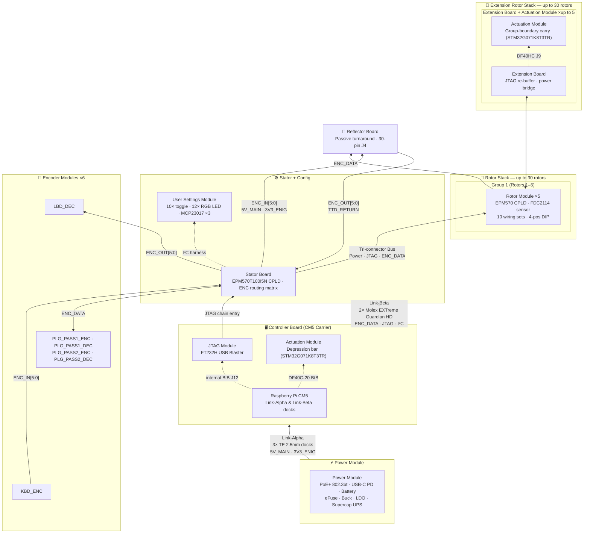

# Enigma-NG Board Overview

**Status:** In Review
**Project:** Enigma-NG
**Author:** Izzyonstage & GitHub Copilot
**Version:** v.0.1.0
**Last Updated:** 2026-05-15

## 1. Overview

The Enigma-NG system uses a modular, museum-grade architecture built around a fixed Controller
motherboard and two removable service modules: the Power Module and the Stator.

The `design/Standards/Global_Routing_Spec.md` applies to all boards except where a board-level design
spec explicitly records an exemption.

### 1.1 System Interconnect Diagram

> **Note:** The Extension Rotor Stack block is shown in simplified form pending resolution of the
> `extension-mechanical-usage` architecture review. Once that topology is finalised, both this
> diagram and `README.md` will be updated to show the full Groups 2–6 detail.

## 2. Power Rail Glossary

- **3V3_ENIG**: Provided by the Power Module `TPS75733KTTRG3` LDO. Powers all CPLDs, JTAG interface,
  I2C logic, rotor stack, and Controller digital I/O.
- **5V_MAIN**: Provided by the Power Module dual-buck stage. Powers the CM5 main supplies and the 5V
  system bus.
- **GND**: Common power and signal ground reference.
- **GND_CHASSIS**: Safety earth / EMI reference plane.
- **PWR_GD**: Direct PM -> Controller rail-health signal from the MCP121T supervisor.

Only the Power Module implements the intentional `GND` ↔ `GND_CHASSIS` bond.

## 3. Telemetry Sensor Responsibility

- Power Module INA219 (`0x40`): monitors `5V_MAIN`
- Stator INA219 (`0x45`): monitors rotor-stack `3V3_ENIG`
- Power Module PCA9534A (`0x3F`): virtualises PM status lines and SW1 RGB runtime control

## 4. I2C Bus Map

- `I2C1` (`SCL`/`SDA`) originates on the Controller and fans out in parallel:
  - Controller -> Power Module over `J3`
  - Controller -> Stator over `J5`
  - Stator -> User Settings Module over `J13`
  - `0x09`: LTC3350 supercap charger / monitor (Power Module)
  - `0x0B`: Smart Battery / SMBus monitor (Power Module)
  - `0x20`: MCP23017 U6 (Stator ENC monitoring)
  - `0x21`: MCP23017 U7 (Stator virtual keypress / SOURCE_SEL / SYS_RESET_N)
  - `0x22`: MCP23017 U8 (Stator CPLD config output driver)
  - `0x23`: MCP23017 U1 (User Settings Module switch input)
  - `0x24`: MCP23017 U2 (User Settings Module Bank 1 LED controller)
  - `0x25`: MCP23017 U3 (User Settings Module Bank 2 LED controller)
  - `0x28`: STUSB4500 USB PD controller (Power Module)
  - `0x3F`: PCA9534APWR PM-local GPIO expander (Power Module)
  - `0x40`: INA219 (Power Module)
  - `0x45`: INA219 (Stator)

## 5. System Architecture & Status

| Board Name | Role | Stackup | Status |
| :--- | :--- | :--- | :--- |
| **Actuation Module** | Daughterboard; STM32G071K8T3TR MCU; provides motor/solenoid actuation control; mounts on Controller Board via 20-pin 0.4mm Hirose BtB connector (DF40C plug on AM, DF40HC receptacle on CTL J11) | 4-Layer / 2oz | **In Review** |
| **Controller Board** | Fixed motherboard; CM5 host; external RJ45, Ethernet ESD/magnetics, PoE front-end, HDMI, USB 3.0, and service docks for PM + Stator | 6-Layer / 2oz | **In Review** |
| **Encoder Module** | Dual-use Keyboard / Plugboard / Lampboard logic using a single Intel MAX II EPM570T100I5N CPLD per board with role selected by programming | 4-Layer / 2oz | **In Review** |
| **Extension Board** | Re-buffers TCK/TMS between 5-rotor groups; forwards/reinjects clean power and bridges `TTD_RETURN` between stacks | 4-Layer / 2oz | **Draft** |
| **JTAG Module** | Internal FT232H-based hardware programmer | 4-Layer / 2oz | **In Review** |
| **Power Module** | Removable power-conditioning / UPS cartridge with supercaps, eFuse, OR-ing, USB-C input, battery input, and PM-local status expander | 6-Layer / 2oz | **In Review** |
| **Reflector Board** | Mandatory terminating turnaround board for the rotor stack return path | 4-Layer / 2oz | **In Review** |
| **Rotor Module** | Smart encryption units (30x) with MAX II EPM570T100I5N CPLDs | 4-Layer / 2oz | **In Review** |
| **User Settings Module** | Panel-mount switch and RGB LED configuration interface on the shared Stator `I2C-1` bus | 4-Layer / 2oz | **In Review** |
| **Stator Board** | Removable vertical daughterboard; rotor-stack backplane and CPLD routing hub | 4-Layer / 2oz | **In Review** |

## 6. Notes

- The Controller ↔ Power Module dock uses three TE 10-position 2.5mm connectors.
- The Controller ↔ Stator dock uses two Molex EXTreme Guardian HD hybrid connectors.
- Rotor / Extension / Reflector interconnects use Samtec Edge-Rate connectors.
- All external I/O is grouped on the Controller side of the enclosure.
