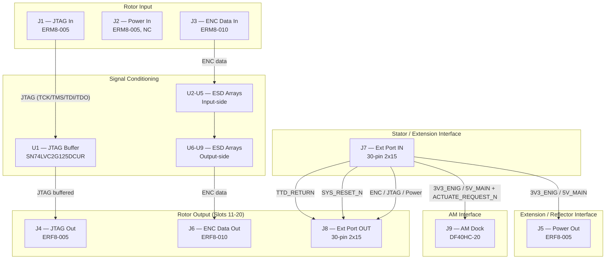

# Extension Board (V1.0) Design Specification

**Status:** Draft
**Project:** Enigma-NG
**Author:** Izzyonstage & GitHub Copilot
**Version:** v.0.1.0
**Associated Hardware Revision:** Rev A
**Last Updated:** 2026-05-12

## 1. Overview

The Extension Board acts as a mid-stack JTAG signal repeater, power injection point, and
group-boundary actuation host between 5-rotor sub-groups in extended rotor configurations. It
buffers TCK and TMS drive signals, bridges the reflector-boundary service bus between groups, and
hosts one shared Actuation Module (AM) so a local carry / notch event can trigger the next 5-rotor
group without Controller-side live servo control.

* **Role:** Mechanical anchor and Power Injection for 5-rotor groups.
* **Capacity:** Up to x5 Extension boards in a full 30-rotor build (Rev A power budget). Rev A
  prototype validates with 1 Extension board (10 rotors). Minimum configuration requires 0 Extensions
  (5 rotors: Stator → [5 Rotors] → Reflector). Each Extension board adds one further group of 5
  rotors. The 30-rotor / 5-extension limit is a power budget constraint - the architecture is
  theoretically scalable beyond 30 rotors with increased power.

### Functional & Design Requirements

#### Functional Requirements

| ID | Functional Requirement | Notes | Satisfied By / Cross-Ref |
| :--- | :--- | :--- | :--- |
| FR-EXT-01 | Act as a JTAG signal repeater between rotor sub-groups in extended stacks | Restores TCK/TMS drive strength mid-chain; up to x5 units in system | §2 Connectivity; BOM U1 (SN74LVC2G125DCUR) |
| FR-EXT-02 | Buffer TCK and TMS signals to compensate for capacitive loading of upstream rotors | Dual-channel buffer preserves timing margins | §2 Connectivity; BOM U1 (SN74LVC2G125DCUR), C6 (100nF bypass) |
| FR-EXT-03 | Pass 3V3_ENIG power and encoder data bus transparently between rotor groups | Power: J7 → J5 (J2 power pins NC); ENC data: J3/J6 pass-through | §2 Connectivity; BOM J5 (ERF8-005), J3, J6 (ERM8/ERF8-010) |
| FR-EXT-04 | Connect on the input side to a Stator or upstream rotor group | J1-J3 (ERM8 male input headers) | §2 Connectivity; BOM J1-J3 (ERM8-005/010) |
| FR-EXT-05 | Connect on the output side to a downstream rotor group | J4-J6 (ERF8 female output sockets) | §2 Connectivity; BOM J4-J6 (ERF8-005/010) |
| FR-EXT-06 | Host one Actuation Module to regenerate an Extension-boundary carry event into one local servo step | J9 = single 20-pin DF40HC(3.5) AM host dock; non-homing switch (or CM5 GPIO) asserts `ACTUATE_REQUEST_N` into the AM | §2 Connectivity; BOM J9 |
| FR-EXT-07 | Protect rotor-facing BtB connectors (J1/J3 in, J4/J6 out) from ESD during live rotor swap | TVS/ESD arrays on all 4 rotor-facing connectors per DEC-048 | §5 Thermal & ESD; BOM U2-U9 |

#### Design Requirements

| ID | Design Requirement | Specification | Satisfied By / Cross-Ref |
| :--- | :--- | :--- | :--- |
| DR-EXT-01 | PCB stackup | Stackup per `design/Standards/Global_Routing_Spec.md §2.3.1` | §4 PCB Fabrication & Stackup |
| DR-EXT-02 | Input connectors | J1 = ERM8-005 (JTAG in), J2 = ERM8-005 (Power in), J3 = ERM8-010 (ENC in) | §2 Connectivity; BOM J1-J3 |
| DR-EXT-03 | Output connectors | J4 = ERF8-005 (JTAG out), J5 = ERF8-005 (Power out), J6 = ERF8-010 (ENC out) | §2 Connectivity; BOM J4-J6 |
| DR-EXT-04 | JTAG buffer | U1 = SN74LVC2G125DCUR (dual-channel; TCK and TMS only; TDI passes unbuffered) | §2 Connectivity; BOM U1 (SN74LVC2G125DCUR) |
| DR-EXT-05 | Buffer output pin assignment | TCK → J4 pin 2; TMS → J4 pin 4 (per DEC-018 pinout) | §2 Connectivity; Design_Log.md DEC-018 |
| DR-EXT-06 | Buffer bypass capacitor | C6 = 100 nF 0402; placement per GRS §3.2 bypass capacitor proximity requirements | §4 PCB Fabrication & Stackup; BOM C6 (100nF X7R) |
| DR-EXT-07 | System quantity | Up to x5 Extension boards per system (Rev A power budget); Rev A prototype uses x1 | §1 Overview; System_Architecture.md |
| DR-EXT-08 | Extension Port connector family | J7/J8 = Adam Tech 2BHR-30-VUA 30-pin 2x15 shrouded headers. Per DEC-053 | §2 Connectivity; BOM J7, J8 |
| DR-EXT-09 | Actuation Module host dock | J9 = Hirose DF40HC(3.5)-20DS-0.4V(51) receptacle (20-pin, 0.4mm pitch, 3.5mm stacking height); host-side mating connector for AM J1 (DF40C-20DP-0.4V(51)); carries `5V_MAIN`, `3V3_ENIG`, `ACTUATE_REQUEST_N`, and `GND` | §2 Connectivity; BOM J9; `design/Standards/Global_Routing_Spec.md §7.1` |
| DR-EXT-10 | Actuation Module host envelope | The Extension area beneath the installed AM shall be a no-component placement zone except for J9 and four M2.5x3.5mm SMT standoffs (MH5-MH8, 9774035151R) and the copper / vias needed to route J9; standoff placement shall follow the pattern defined in `AM Design_Spec.md DR-AM-03`; MH5-MH8 positions shall mirror the AM mounting hole pattern; MH5-MH8 pads shall be connected to `GND`; do not crowd the module with nearby tall parts or enclosure walls that would trap heat or obstruct service access. **PCB layout for J9 and MH5-MH8 cannot be finalised until AM schematic capture and PCB layout are complete.** | §2 Connectivity; `Board_Layout.md` |
| DR-EXT-11 | 5V_MAIN entry decoupling bank | C7-C11 (5x 10µF X7R 25V 0805) shall be placed at the 5V_MAIN entry point (J7 pins 1-2 and 29-30) using a star/spoke topology matching the 3V3_ENIG entry bank (C1-C5); both rails must be locally decoupled at the Extension Port entry | §2 Connectivity; §5 Thermal & ESD; BOM C7-C11 |
| DR-EXT-12 | ESD protection - rotor-facing BtB connectors | U2-U5 (J1/J3 in) + U6-U9 (J4/J6 out); 8x TPD4E05U06QDQARQ1 within 3mm of mating edge per DEC-048 | §5 Thermal & ESD; BOM U2-U9 |
| DR-EXT-13 | 3V3_ENIG entry decoupling bank | C1-C5 (5x 10µF X7R 25V 0805) shall be placed at the 3V3_ENIG entry point (J7 pins 3-4 and 27-28) using a star/spoke topology per `design/Standards/Global_Routing_Spec.md §3`; both supply rails must be locally decoupled at the Extension Port entry | §2 Connectivity; BOM C1-C5 |
| DR-EXT-14 | Mounting holes | MH1–MH4 shall be M3 PTH (Ø3.2 mm drill) mounting holes (KiCAD built-in `MountingHole` footprint; no purchasable BOM component), bonded to `GND_CHASSIS` per `design/Standards/Global_Routing_Spec.md §4`. Placement follows GRS §4.3 Pattern B (D-shaped board): MH1 bottom-left corner, MH2 bottom-right corner, MH3 board-centre, MH4 top-centre arc midpoint — all at 7 mm inset from nearest edge. Exact XY coordinates TBD at PCB layout. | §2 Connectivity; `design/Standards/Global_Routing_Spec.md §4.3` |

### Component Block Diagram

## 2. Connectivity

* **Extension Port (J7 IN / J8 OUT):** 30-pin 2x15 shrouded box header.
  > **Connector Definition Owner:** `Stator/Board_Layout.md - J10`.
  > This board uses the mating connector on both J7 and J8 (Adam Tech 2BHR-30-VUA - see BOM).
  > Authoritative pinout per DEC-053: `5V_MAIN` on pins 1-2 and 29-30, `3V3_ENIG` on pins 3-4 and 27-28,
  > `ENC_OUT_REF[5:0]` on pins 7-12, `ENC_IN_REF[5:0]` on pins 19-24, `SYS_RESET_N` on pin 15,
  > `TTD_RETURN` on pin 16, GND guard pairs on pins 5-6, 13-14, 17-18, 25-26.
  > **Per DEC-043 then DEC-053:** The Extension Port was first widened from 16-pin to 20-pin (DEC-043)
  > and then from 20-pin to 30-pin (DEC-053) to resolve a power current budget violation.
* **Rotor Interface Connectors(3 per rotor-facing side x 2 sides = 6 connectors total):**
  The Extension board provides ERM8 male headers on the **input side** (J1-J3, plugging into the
  previous rotor group's last rotor J4/J5/J6 ERF8 output sockets) and ERF8 female sockets on the
  **output side** (J4-J6, receiving the next rotor group's first rotor J1/J2/J3 ERM8 male headers).

  > **Connector Definition Owner:** `Rotor/Design_Spec.md §3.4`.
  > This board uses ERM8 male headers on the input side and ERF8 female sockets on the output side:

  | Ref | Side | Signal Group | Type | MPN |
  | --- | ---- | ------------ | ---- | --- |
  | J1 | Input (plugs into previous group's last rotor J4) | JTAG | ERM8-005 (10-pin, 0.8mm pitch, **male**) | ERM8-005-05.0-S-DV-K-TR |
  | J2 | Input (plugs into previous group's last rotor J5) | Power (3V3_ENIG x 5, GND x 5) - **power pins NC on this board** | ERM8-005 (10-pin, 0.8mm pitch, **male**) | ERM8-005-05.0-S-DV-K-TR |
  | J3 | Input (plugs into previous group's last rotor J6) | ENC Data (ENC_IN/ENC_OUT + GND) | ERM8-010 (20-pin, 0.8mm pitch, **male**) | ERM8-010-05.0-S-DV-K-TR |
  | J4 | Output (receives next group's first rotor J1) | JTAG | ERF8-005 (10-pin, 0.8mm pitch, female) | ERF8-005-05.0-S-DV-K-TR |
  | J5 | Output (receives next group's first rotor J2) | Power (3V3_ENIG x 5, GND x 5) | ERF8-005 (10-pin, 0.8mm pitch, female) | ERF8-005-05.0-S-DV-K-TR |
  | J6 | Output (receives next group's first rotor J3) | ENC Data (ENC_IN/ENC_OUT + GND) | ERF8-010 (20-pin, 0.8mm pitch, female) | ERF8-010-05.0-S-DV-K-TR |

  > **J2 power pins (3V3_ENIG and GND) are not connected to the board power plane.** J2 is present
  > for mechanical engagement with the upstream rotor group only. The Extension board's sole power
  > entry is J7 (Extension Port IN; `3V3_ENIG` on pins 3-4 and 27-28, `5V_MAIN` on pins 1-2 and 29-30,
  > and GND returns on pins 5-6, 13-14, 17-18, 25-26). This prevents a parallel power
  > path / ground loop between the rotor daisy-chain and the Extension Port ribbon. C1-C5 (10µF x 5,
  > star/spoke) decouple `3V3_ENIG` at the J7 power entry. C7-C11 (10µF x 5, star/spoke) decouple
  > `5V_MAIN` at the J7 power entry (pins 1-2 and 29-30), providing equivalent bulk buffering for both supply
  > rails. `3V3_ENIG` is passed to the downstream rotor group via J5 (driven from J7), while `5V_MAIN`
  > is used locally for the Extension-mounted Actuation Module and **forwarded to J8 pins 1-2 and 29-30** for
  > the next Extension board in chain.

  **Note:** The ERM8/ERF8 0.8mm pitch is physically incompatible with 2.54mm connectors - label distinctly on silkscreen.
  Connector part numbers: ERM8-005 = Mouser 200-ERM8005050SDVKTR / DigiKey 612-ERM8-005-05.0-S-DV-K-TRCT-ND / JLCPCB C3649741;
  ERM8-010 = Mouser 200-ERM8010050SDVKTR / DigiKey SAM8610CT-ND / JLCPCB C374877;
  ERF8-005 = Mouser 200-ERF8005050SDVKTR / DigiKey SAM13517CT-ND / JLCPCB C7273978;
  ERF8-010 = Mouser 200-ERF8010050SDVKTR / DigiKey SAM8618CT-ND / JLCPCB C3646170.

* **JTAG Signal Buffering:** The Extension board provides JTAG re-buffering for the 5-rotor group
  connected to its output side (J4-J6). A **74LVC2G125** dual-channel 3-state buffer (U1) buffers the
  **TCK and TMS** lines, providing a fresh drive from the Extension board's 3V3_ENIG rail:
  * TCK buffer output → J4 pin **2** (TCK) and broadcast to all 5 rotors in the output group.
  * TMS buffer output → J4 pin **4** (TMS) and broadcast.
  * Buffer enable (OE#): tied to GND permanently (always enabled).
    > **By design — OE# tie to GND:** OE# is active-low on the SN74LVC2G125; outputs are enabled when
    > OE# is LOW and disabled when HIGH. Permanent GND tie is intentional to always enable the buffer.
    > Power-up transient behaviour (outputs active from ~1.65 V VCC rising) is a known, accepted design
    > decision at 10 MHz TCK with EPM570T input clamping. Confirmed by TI SN74LVC2G125 datasheet:
    > "1Y = 1A and 2Y = 2A when their corresponding OE input is LOW." Future reviews must not flag this
    > as an error — the GND tie is deliberate, not a default that should be replaced with a pull-up.
  * Part: SN74LVC2G125DCUR (TI, VSSOP-8) - Mouser 595-SN74LVC2G125DCUR,
    DigiKey 296-SN74LVC2G125DCURCT-ND, JLCPCB C21404.
  * At 5 rotors per group connected via BtB (ERM8/ERF8), signal integrity analysis confirms this
    buffer interval is sufficient: 5 rotors x EPM570T100I5N input capacitance (≈6pF) + connector capacitance
    ≈ 30-40pF total load; well within the 50ns half-period at 10MHz TCK.
* **GND_CHASSIS Single-Point Bond:** Per `design/Standards/Global_Routing_Spec.md §5`, the
  Extension board implements a local `GND_CHASSIS` net tied to its mounting holes and any
  deliberate enclosure-contact features, but it does **not** implement a local GND-to-GND_CHASSIS
  bond. J7/J8 pin 16 remains signal/power return only; the system's only galvanic GND ↔
  GND_CHASSIS bond is on the Power Module at the common power-entry point immediately before the
  eFuse.
* **Power Injection:** Receives `3V3_ENIG`, `5V_MAIN`, and return capacity via Extension Port to
  prevent voltage sag across long stacks and to power the local Actuation Module.
* Decoupling and bulk entry capacitor requirements per `design/Standards/Global_Routing_Spec.md §3`.
* **JTAG TTD_RETURN / TDI:** TTD_RETURN (TDO chain return) is carried passively via Extension Port
  pin 16. TDI passes unbuffered board-to-board via BtB throughout the rotor stack - no series
  resistors are placed at each BtB hop. The JTAG chain terminates at the Reflector (R1 22 Ω
  end-of-chain damping). TTD_RETURN then returns from the Reflector to the Stator via the
  dedicated Reflector J4 → Stator J10 ribbon cable. The 75 Ω series resistors on the Stator
  (R7-R12, R27-R32, R33-R38) and Encoder boards (R6) are for the **encoder ribbon cable ports**
  (J4-J9) only -
  they are NOT placed on the BtB rotor stack interface. See
  `design/Electronics/JTAG_Module/JTAG_Integrity.md` and DEC-016.
  TCK and TMS are actively re-buffered by U1 (see JTAG Signal Buffering above).
* **SYS_RESET_N:** Received via Extension Port pin 15; broadcast to all local rotor CPLDs in this group.
* **Actuation Module host dock:** The Extension provides a single host socket for one shared
  Actuation Module.
  > **Connector Definition Owner:** `AM Design_Spec.md §3.1`.
  > This board provides the mating receptacle (J9). Full connector pinout is defined and owned by
  > the Actuation Module. Net connections from this board to the mounted AM:
  >
  > | EXT Net | AM Net |
  > | --- | --- |
  > | `5V_MAIN` | `5V_MAIN` |
  > | `3V3_ENIG` | `3V3_ENIG` |
  > | `GND` | `GND` |
  > | `ACTUATE_REQUEST_N` | `ACTUATE_REQUEST_N` |
  >
  > `ACTUATE_REQUEST_N` is sourced from the non-homing switch on this board or from the CM5 on
  > the Controller Board. Held HIGH by the STM32G071K8T3TR internal GPIO pull-up; no external
  > pull-up fitted.
  >
  > **⚠ PCB Layout Dependency:** J9 and MH5-MH8 positions cannot be finalised until AM schematic
  > capture and PCB layout are complete. MH5-MH8 shall mirror `AM Design_Spec.md DR-AM-03` and
  > connect to `GND`.
* **J9** - single 20-pin Hirose DF40HC(3.5)-20DS-0.4V(51) AM host socket (stacking height = 3.5mm)
* **Polarity enforcement:** The DF40 connector body is polarity-free (Note 4 in Hirose datasheet);
  asymmetric placement of MH5-MH8 standoffs (per `AM Design_Spec.md DR-AM-03`) is mandatory to
  enforce a single valid mating orientation. A silkscreen pin-1 marker is required on both boards
  (per `design/Standards/Global_Routing_Spec.md §7.1`).
* **MH5-MH8** - four M2.5x3.5mm SMT standoffs (9774035151R); positions mirror `AM Design_Spec.md
  DR-AM-03`; pads connected to `GND`; no-component placement zone (except J9, MH5-MH8, and routing)
* **Cross-ref:** For interconnect pinouts on power (3V3_ENIG/GND), `ENC_OUT_REF` / `ENC_IN_REF`, and
  JTAG TTD_RETURN lines used for reflector loopback/plugboard mapping, See:
  * `Stator/Design_Spec.md`
  * `Reflector/Design_Spec.md`

## 3. Branding

* **Identity:** 2oz Copper / Inverted White Data Plate (V1.0 traceability).

## 4. PCB Fabrication & Stackup

* **Stackup:** 4-layer standard per `design/Standards/Global_Routing_Spec.md §2.3.1`.
* **Finish:** ENIG (Gold) for connector surfaces.
* **Aesthetics:** Dark Green Solder Mask; Typewriter font (ALL-CAPS GERMAN).
* **JTAG Trace Width Rule:** The Extension board carries only the **TTD_RETURN** signal on its J7/J8 pass-through path
  (TCK, TMS, and TDI travel to the rotor stack via Stator J1-J3, not via the Extension Port). TTD_RETURN traces on L1 shall be routed at **0.1425 mm (5.61 mil)**
  over the L2 GND plane, targeting **50 Ω controlled impedance** per `design/Standards/Global_Routing_Spec.md §2.3.1`. See
  `design/Electronics/JTAG_Module/JTAG_Integrity.md` and DEC-016.
* **U1 Bypass:** C6 (100nF) shall be placed per GRS §3.2 bypass capacitor proximity requirements.

## 5. Thermal & ESD

* **Thermal:** No active cooling required on the Extension board. U1 (SN74LVC2G125DCUR) is the
  only active IC; it dissipates <10mW and requires no heatsinking. C6 (0.1µF X7R 0402) provides
  the mandatory local bypass. All other components are passive.

  > ⚠️ **U1 must never be removed.** The Extension board actively re-buffers TCK and TMS for
  > every 5-rotor group. Without U1, signal integrity in long rotor stacks will fail.
  > See FR-EXT-01, DR-EXT-04/05/06.
* **ESD - rotor-facing connectors (TVS required):**
  J1/J3 (input side, ERM8 male) and J4/J6 (output side, ERF8 female) are exposed to operator handling during live rotor
  insertion and removal. Both sides of every hot-swap BtB interface are protected per DEC-045 and DEC-048:
  * **U2** - 1x TPD4E05U06QDQARQ1 on J1 (JTAG in); channels: TCK, TMS, TTD, SYS_RESET_N.
  * **U3, U4, U5** - 3x TPD4E05U06QDQARQ1 on J3 (ENC in); 12 channels: ENC_IN[5:0] + ENC_OUT[5:0].
  * **U6** - 1x TPD4E05U06QDQARQ1 on J4 (JTAG out); channels: TCK, TMS, TTD, SYS_RESET_N.
  * **U7, U8, U9** - 3x TPD4E05U06QDQARQ1 on J6 (ENC out); 12 channels: ENC_IN[5:0] + ENC_OUT[5:0].
  Per DEC-045, all Samtec ERM8/ERF8 rotor-facing connectors require TPD4E05U06QDQARQ1 arrays.
  All arrays shall be placed within 3mm of their respective connector mating edge on L1.
  > **Note:** TTD is the system-level net name for the inter-rotor JTAG data link; it
  > appears as TDI on the input device pin and TDO on the output device pin, but TTD is used
  > consistently at connector level across all boards for cross-board net-name continuity. This is
  > by design — future reviewers must not flag TTD as an undefined signal or suggest substituting TDI.
* **ESD - all other connectors (no TVS required):**
  * J2 (Power in, ERM8-005) and J5 (Power out, ERF8-005): power rail (3V3_ENIG / GND) only - no signal protection required (explicitly outside DEC-048 scope - power-only rails, no signal data).
  * J7, J8 (Extension Port ribbons, 2BHR-30-VUA): internal IDC connectors; not accessible during live rotor swap.
  * J9 (AM service dock, DF40HC(3.5)-20DS): service-only; not operator-swapped under live conditions (explicitly outside DEC-048 scope).
  Per `design/Standards/Global_Routing_Spec.md §9`.

## 6. Bill of Materials

| RefDes | Specification | MPN | Manufacturer | DigiKey PN | Mouser PN | JLCPCB PN | Alt Supplier + PN | Notes | Footprint Available | Footprint Downloaded | Qty |
| --- | --- | --- | --- | --- | --- | --- | --- | --- | --- | --- | --- |
| C1-C5, C7-C11 | 10µF X7R 25V 0805 | CL21B106KAYQNNE | Samsung | 1276-CL21B106KAYQNNECT-ND | 187-CL21B106KAYQNNE | C3039694 | - | - | Yes | ✔ | 10 |
| C6 | 100nF X7R 50V 0402 | CL05B104KB5NNNC | Samsung | 1276-CL05B104KB5NNNCCT-ND | 187-CL05B104KB5NNNC | C960916 | - | - | Yes | Pending | 1 |
| J1, J2 | 10-pin 2x5 0.8mm male SMT | ERM8-005-05.0-S-DV-K-TR | Samtec | 612-ERM8-005-05.0-S-DV-K-TRCT-ND | 200-ERM8005050SDVKTR | C3649741 | - | - | Yes | Pending | 2 |
| J3 | 20-pin 2x10 0.8mm male SMT | ERM8-010-05.0-S-DV-K-TR | Samtec | SAM8610CT-ND | 200-ERM8010050SDVKTR | C374877 | - | - | Yes | Pending | 1 |
| J4, J5 | 10-pin 2x5 0.8mm female SMT | ERF8-005-05.0-S-DV-K-TR | Samtec | SAM13517CT-ND | 200-ERF8005050SDVKTR | C7273978 | - | - | Yes | ✔ | 2 |
| J9 | 20-pin 0.4mm pitch BtB receptacle 3.5mm stack | DF40HC(3.5)-20DS-0.4V(51) | Hirose | 26-DF40HC(3.5)-20DS-0.4V(51)CT-ND | 798-DF40HC3520DS04V5 | C3644774 | - | - | Yes | ✔ | 1 |
| MH5-MH8 | M2.5x3.5mm SMT standoff | 9774035151R | Wurth Elektronik | 732-9774035151RCT-ND | 710-9774035151R | C22367582 | - | - | Yes | ✔ | 4 |
| J6 | 20-pin 2x10 0.8mm female SMT | ERF8-010-05.0-S-DV-K-TR | Samtec | SAM8618CT-ND | 200-ERF8010050SDVKTR | C3646170 | - | - | Yes | Pending | 1 |
| J7, J8 | 30-pin 2x15 2.54mm shrouded box THT | 2BHR-30-VUA | Adam Tech | 2057-2BHR-30-VUA-ND | 737-2BHR-30-VUA | C17346400 | - | Per DEC-053 | Yes | Pending | 2 |
| U1 | Dual 3-state buffer VSSOP-8 | SN74LVC2G125DCUR | Texas Instruments | 296-SN74LVC2G125DCURCT-ND | 595-SN74LVC2G125DCUR | C21404 | - | - | Yes | ✔ | 1 |
| U2-U9 | 4-ch bidirectional ESD array USON-10 | TPD4E05U06QDQARQ1 | Texas Instruments | 296-40696-1-ND | 595-PD4E05U06QDQARQ1 | C81353 | - | - | Yes | Pending | 8 |
