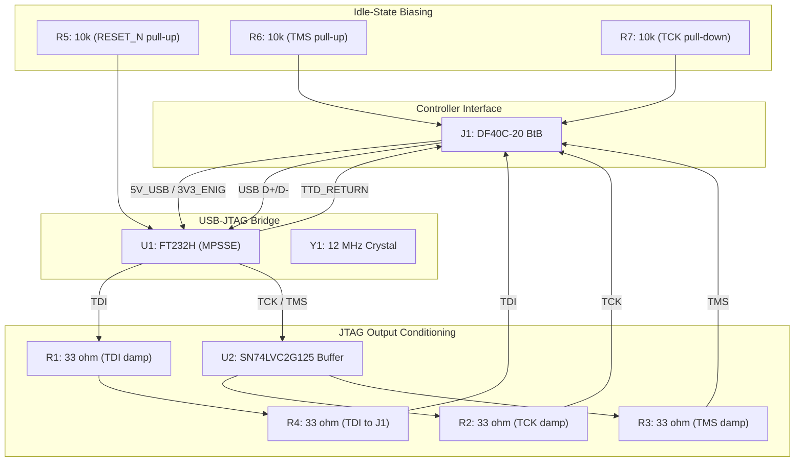

# JTAG Module (V1.0) Design Specification

**Status:** In Review
**Project:** Enigma-NG
**Author:** Izzyonstage & GitHub Copilot
**Version:** v.0.1.0
**Associated Hardware Revision:** Rev A
**Last Updated:** 2026-05-15

## 1. Overview

A high-speed USB-to-JTAG bridge module that allows the CM5 to natively program the 30-rotor CPLDs and the 6 I/O CPLDs and 1 Mapping CPLD.
This module replicates the functionality of an **Intel (Altera) USB Blaster II** on a tiny daughterboard.

### Functional & Design Requirements

#### Functional Requirements

| ID | Functional Requirement | Notes | Satisfied By / Cross-Ref |
| :--- | :--- | :--- | :--- |
| FR-JM-01 | Provide a USB-to-JTAG programming interface for all 37 CPLDs in the system | 1 Stator + 6 Encoder + 30 Rotor CPLDs | §2 Core Logic; BOM U1 (FT232H) |
| FR-JM-02 | Generate series-damped drive signals suitable for the controlled-impedance JTAG chain, and interface with the CM5 via USB 2.0 for JTAG programming software control | U2 buffers TCK/TMS; 33 Ω source termination at all JTAG outputs (R2/R3 after U2 buffer, R1 at FT232H TDI, R4 before J1 TDI pin); presented as FTDI JTAG device to OpenOCD via libftdi; no custom driver required | §3 Interface & Wiring; §6 Electrical Requirements; BOM J1 (DF40C-20 BtB connector), U1 (FT232H), U2, R1, R2, R3, R4 |

#### Design Requirements

| ID | Design Requirement | Specification | Satisfied By / Cross-Ref |
| :--- | :--- | :--- | :--- |
| DR-JM-01 | PCB stackup | Inverted stackup per `design/Standards/Global_Routing_Spec.md §2.3.2` | §5 PCB Fabrication & Stackup |
| DR-JM-02 | USB-to-JTAG bridge | FTDI FT232H (U1) in MPSSE mode | §2 Core Logic; BOM U1 (FT232HL LQFP-48) |
| DR-JM-03 | TDI series damping at FT232H | R1 = 33 Ω 0402 at FT232H TDI output | §6 Electrical Requirements; BOM R1 |
| DR-JM-04 | JTAG chain device count | 37 devices total (1 Stator CPLD + 6 Encoder CPLDs + 30 Rotor CPLDs) | §2 Core Logic; BOM U1 (FT232H) |
| DR-JM-05 | USB interface | USB 2.0 Full Speed via CM5 internal USB port; D+/D- route via J1 DF40C-20 BtB connector | §3 Interface & Wiring; BOM J1 (DF40C-20DP), Y1 (12MHz crystal) |
| DR-JM-06 | Power source | 5V_USB and 3V3_ENIG from Controller Board via J1 DF40C-20 BtB connector; FT232H self-powered USB mode | §6 Electrical Requirements |
| DR-JM-07 | Board-to-Board connector | J1 = Hirose DF40C-20DP-0.4V(51) 20-pin 0.4mm pitch BtB plug (bottom-centre of board; R1 on outer/bottom edge) | §3 Interface & Wiring; BOM J1 |
| DR-JM-08 | GND_CHASSIS exemption | M2.5 NPTH clearance holes. Electrical connection: GND (not GND_CHASSIS). Per DEC-057 daughterboard exception. | §3 Interface & Wiring |
| DR-JM-09 | Bulk cap exception | JM exempt from 5x bulk entry bank rule; C1-C4, C6-C9 = 8x 100nF per-IC decoupling (one per FT232H supply pin: VCCA, VCORE, VCCD, VCCIOx3, VPLL, VPHY) + C5 = 4.7µF 5V_USB entry filter | §6 Electrical Requirements; BOM C1-C9; GRS §3 |
| DR-JM-10 | JTAG buffer | U2 = SN74LVC2G125DCUR (VSSOP-8) dual-channel buffer for TCK and TMS; placed between FT232H and J1 connector | §6 Electrical Requirements; BOM U2; DEC-024 |
| DR-JM-11 | TCK series damping after buffer | R2 = 33 Ω 0402 after U2 TCK output, before J1 pin C1R1 (TCK) | §6 Electrical Requirements; BOM R2; DEC-024 |
| DR-JM-12 | TMS series damping after buffer | R3 = 33 Ω 0402 after U2 TMS output, before J1 pin C2R2 (TMS) | §6 Electrical Requirements; BOM R3; DEC-024 |
| DR-JM-13 | TDI series damping before J1 | R4 = 33 Ω 0402 before J1 pin C10R1 (TDI) | §6 Electrical Requirements; BOM R4; DEC-024 |
| DR-JM-14 | TMS pull-up near J1 | R6 = 10 kΩ 0402 pull-up from TMS to 3V3_ENIG near J1 connector; idle-state TAP control | §6 Electrical Requirements; BOM R6 |
| DR-JM-15 | TCK pull-down near J1 | R7 = 10 kΩ 0402 pull-down from TCK to GND near J1 connector; idle-state TAP control | §6 Electrical Requirements; BOM R7 |
| DR-JM-16 | FT232H RESET_N pull-up | R5 = 10 kΩ 0402 pull-up from FT232H RESET_N (FT232H pin 34; IC datasheet designates this pin as RESET#; renamed RESET_N per project convention) to 3V3_ENIG; holds RESET_N deasserted (HIGH) during normal operation per FTDI application note AN_108; absence of pull-up risks chip latching in reset | §6 Electrical Requirements; BOM R5 |
| DR-JM-17 | JTAG buffer VCC bypass | C12 = 100nF X7R 0402 bypass capacitor shall be placed on the VCC supply of U2 (SN74LVC2G125DCUR) within 0.5mm of the VCC pin; 1OE and 2OE (active-low output enables) are permanently tied to GND, keeping both buffer channels always enabled | §6 Electrical Requirements; BOM C12 |
| DR-JM-18 | Mounting holes | JM mounting holes MH1–MH4 shall be NPTH M2.5 holes with a GND annular ring. Conductive standoffs connect to GND only (not GND_CHASSIS), per DEC-057 daughterboard exception. No purchasable BOM component — mounting hardware is owned by and specified in the Controller Board BOM (MH9–MH12, 9774035151R). See `design/Standards/Global_Routing_Spec.md §4` for module mounting hole rules. | §4 Aesthetics & Mounting; DEC-057; DEC-058 |
| DR-JM-19 | BtB connector placement and orientation | J1 (DF40C-20DP) shall be placed at **bottom-centre** of the JM board (positional keying — cannot accidentally mate with AM location on CTL). R1 of J1 shall be on the outer (bottom) edge. When mounted on the CTL, R1 shall face the LINK-BETA connector (J4/J5) to minimise JTAG trace lengths to the Stator. Orientation is enforced by the asymmetric MH1–MH4 pattern and silkscreen pin-1 markers (DF40 is mechanically polarity-free per Hirose Note 4). | §3 Interface & Wiring; §4 Aesthetics & Mounting; `design/Standards/Global_Routing_Spec.md §7.1` |
| DR-JM-20 | No-component zone — underside | A minimum 1.0mm component-free zone shall be maintained on the underside (L4 face) of the JM, measured from the board outline. This ensures clearance above the CTL board when the JM is mounted as a hat. | §4 Aesthetics & Mounting; DEC-058 |

### Component Block Diagram



## 2. Core Logic

* **Role:** Converts the CM5's USB 2.0 signals into standard JTAG signalling (TCK, TMS, TDI, TDO) commands.
* **Bridge IC:** [FT232H datasheet](design/Datasheets/FT232H-datasheet.md) - High-Speed USB 2.0 to MPSSE.
* **Function:** Dedicated JTAG programmer for the global chain (30x Rotor CPLDs + 6x Encoder CPLDs + 1x Stator CPLD).
* **Configuration:** 12MHz crystal-controlled for stable JTAG programming via the CM5. See DEC-022.
* **Software Stack:** `ftdi_sio` kernel module for USB enumeration; `OpenOCD` with `libftdi` for JTAG/MPSSE
  operation (no custom driver required). CM5 enumerates the FT232H on Linux boot via `ftdi_sio`.

## 3. Interface & Wiring

### J1 — DF40C-20 Board-to-Board Connector (20-Pin, 0.4mm Pitch)

* **Type:** Hirose DF40C-20DP-0.4V(51) — 20-pin 0.4mm pitch BtB plug
* **Purpose:** Single board-to-board interface providing system power (5V_USB + 3V3_ENIG from CTL),
  USB 2.0 data path to CM5 (D+/D-), and JTAG output signals (TCK, TMS, TDI, TDO) — all in one connector.
* **Physical location:** Bottom-centre of board; R1 on outer (bottom) edge; faces toward CTL LINK-BETA connector (J4/J5) when mounted.
* **Mating Part (Controller J12):** Hirose DF40HC(3.5)-20DS-0.4V(51) — 3.5mm stack height BtB receptacle. See `Controller/Design_Spec.md §8.3`.
* **Stack height:** 3.5mm (matching AM dock — same standoffs, 9774035151R, held in CTL BOM MH9–MH12).
* **Polarity enforcement:** The DF40 connector body is polarity-free (Note 4 in Hirose datasheet);
  asymmetric placement of MH1–MH4 mounting holes (per DR-JM-18) is mandatory to enforce a single
  valid mating orientation. A silkscreen pin-1 marker is required on both boards (per
  `design/Standards/Global_Routing_Spec.md §7.1`).

#### J1 Pinout (20-pin DF40C)

```text
        C1     C2     C3     C4     C5     C6     C7     C8     C9           C10
  R1:   TCK    GND    GND    5V_U   GND    GND    3V3    GND    GND          TDI
  R2:   GND    TMS    GND    GND    USB+   USB-   GND    GND    TTD_RETURN   GND
```

| Pin   | Signal     | Direction  | Description                                     |
| :---- | :--------- | :--------- | :---------------------------------------------- |
| C1R1  | TCK        | JM → CTL   | JTAG Clock (buffered via U2, 33Ω via R2)        |
| C2R1  | GND        | —          | Ground                                          |
| C3R1  | GND        | —          | Ground                                          |
| C4R1  | 5V_USB     | CTL → JM   | 5V USB power (from CTL TPS2065C rail)           |
| C5R1  | GND        | —          | Ground                                          |
| C6R1  | GND        | —          | Ground                                          |
| C7R1  | 3V3_ENIG   | CTL → JM   | 3.3V logic rail (JTAG signal reference)         |
| C8R1  | GND        | —          | Ground                                          |
| C9R1  | GND        | —          | Ground                                          |
| C10R1 | TDI        | JM → CTL   | JTAG Data In (33Ω via R4, then R1 at FT232H)    |
| C1R2  | GND        | —          | Ground                                          |
| C2R2  | TMS        | JM → CTL   | JTAG Mode Select (buffered via U2, 33Ω via R3)  |
| C3R2  | GND        | —          | Ground                                          |
| C4R2  | GND        | —          | Ground                                          |
| C5R2  | USB+       | Bidir      | USB 2.0 D+ to CM5                               |
| C6R2  | USB−       | Bidir      | USB 2.0 D− to CM5                               |
| C7R2  | GND        | —          | Ground                                          |
| C8R2  | GND        | —          | Ground                                          |
| C9R2  | TTD_RETURN | CTL → JM   | JTAG Data Out (return)                          |
| C10R2 | GND        | —          | Ground                                          |

> **No external connectors:** The JM has no external connectors. USB is entirely internal via J1 (DF40C-20 BtB connector).
> No USB-C connector exists on the JM. CC pins are irrelevant (USB 2.0 only).
>
> See `design/Electronics/JTAG_Module/Board_Layout.md` for connector placement and layout details (§3 J1 DF40 BtB Connector).

### FT232H JTAG Signal Mapping (MPSSE Mode)

* AD0 → **TCK** (Clock)
* AD1 → **TDI** (Data In)
* AD2 → **TDO** (Data Out)
* AD3 → **TMS** (State Machine)

### Voltage

3.3V logic level (VCCIO = 3V3_ENIG). FT232H VCC = 5V_USB. 5V-tolerant I/O.

### GND_CHASSIS Single-Point Bond

Per `design/Standards/Global_Routing_Spec.md §5`, the JM is exempt from the local
`GND_CHASSIS` requirement because it is a board-mounted daughterboard that does **not** connect
directly to the enclosure. Its mounting holes / conductive standoffs therefore tie to **GND**
only, not to a standalone `GND_CHASSIS` net. The system's only galvanic GND ↔ GND_CHASSIS bond
remains on the Power Module at the common power-entry point immediately before the eFuse.

## 4. Aesthetics & Mounting

* **Visibility:** Completely hidden internally.
* **Mounting:** Small **4-layer** PCB (DEC-017) mounted as a hat on the Controller Board via conductive
  standoffs. As a non-chassis-connected daughterboard, its mounting holes tie to **GND** only.
  The M2.5 standoffs used to attach the JM to the CTL are specified and sourced in the
  **Controller Board BOM** (MH9–MH12, 9774035151R). See `design/Electronics/Controller/Design_Spec.md`,
  DEC-057 (standoff ownership rule), and DEC-058 for the JM upgrade decision.
  Mounting hole positions (MH1–MH4) are defined relative to the JM board edge; final CTL board
  locations are deferred to PCB layout. See `design/Standards/Global_Routing_Spec.md §4` for module
  mounting hole specification rules.

## 5. PCB Fabrication & Stackup

Inverted 4-layer stackup per `design/Standards/Global_Routing_Spec.md §2.3.2`.
Physical properties: see `design/Production/JLCPCB_Manufacturing.md §1.1`. For JTAG CI trace width compliance, see `Board_Layout.md §6.1`.

## 6. Electrical Requirements

* **Power Architecture:**
  * FT232H VCC = **5V_USB** (5V) via J1 DF40 Pin C4R1 - from the Controller Board's TPS2065C-protected
    USB power rail (same current-limited rail as the USB 3.0 ports, 1.6A limit).
  * FT232H VCCIO = **3V3_ENIG** (3.3V) via J1 DF40 Pin C7R1 - sets JTAG signal voltage to match
    CPLD I/O logic levels (same role as CM5 GPIO reference voltage).
  * FT232H VBUS pin tied to **5V_USB** (always-on; USB connection to CM5 is internal - no VBUS monitoring needed).
  * USB connection is **entirely internal**: D+ and D- travel from FT232H via J1 DF40 connector (C5R2/C6R2)
    through the Controller Board PCB directly to the CM5 USB 2.0 port. No USB-C connector on the JM.
  * FT232H operates in **self-powered USB mode** - power from system (5V_USB), not from USB host.
  * CM5 enumerates the FT232H when Linux boots and ftdi_sio loads; no JM-side power sequencing required.
  * Controller TPS2065C is the upstream current limiter; no additional current limiter on JM.
* **Bulk Capacitor Exception:** The JM is exempt from the standard 5x bulk entry bank rule. The Controller
  Board upstream provides a fully-bypassed power rail. Per-IC decoupling per FT232H datasheet: C1-C4, C6-C9
  = 8x 100nF (one per FT232H supply pin: VCCA, VCORE, VCCD, VCCIOx3, VPLL, VPHY) plus a single 4.7µF
  entry filter (C5) on 5V_USB.
* **FT232H RESET_N Biasing:** R5 (10kΩ) pulls FT232H RESET_N (pin 34) to 3V3_ENIG, ensuring the chip
  remains deasserted (RESET_N HIGH = normal operation) at all times during normal use. RESET_N is active-low;
  if left floating the pin may latch LOW and prevent the FT232H from operating. An external pull-up is
  required per FTDI application note AN_108 when RESET_N is not driven by the host (see DR-JM-16).
  `RESET_N` is a board-local net name scoped to JM; it does not conflict with the system-level
  `SYS_RESET_N` net, which is driven by the Stator CPLD and distributed across inter-board connectors.
  Separate KiCAD projects are used per board, so these net names remain naturally isolated at capture time.
* **Clocking:** Dedicated 12MHz SMD crystal (Y1) for the FT232H reference clock. The FT232H internal PLL requires 12MHz; CM5 GPCLK
  option was considered and rejected - see DEC-022. Note: package corrected from SMD-3225 to SMD-5032 per CTS 435 datasheet. KiCAD footprint adapted from the unofficial
  Crystal_SMD_5032-4Pin symbol in KiCAD 10.0; 3D model approximated from the 2-pin 5032 STEP. Crystal load capacitors C10-C11 (33pF C0G) set the 20pF crystal load capacitance.
  **Load cap calculation:** The crystal specifies C_L = 20pF. Two equal load caps in series give C_series = C/2; adding PCB stray
  capacitance (C_stray ≈ 3-4pF, from PCB traces and FT232H XTIN input capacitance) yields:
  C_L = C/2 + C_stray = 33/2 + 3.5 ≈ 16.5 + 3.5 = **20pF ✔**
  33pF C0G is therefore the correct value. Do not change to 15pF (which would give C_L ≈ 7.5 + 3.5 = 11pF, far below spec).
* **JTAG Signal Integrity:**
  * **R1 (33Ω):** Series termination on FT232H TDI output, placed within 2mm of the FT232H TDI pin.
    TDI drives only the first CPLD in the chain (single load) - source termination at the FT232H pin
    provides matched drive (FT232H output ≈ 20Ω + R1 33Ω ≈ 53Ω) for the board-to-board path.
    Per DEC-016 intra-board/BtB termination rule. See `design/Electronics/JTAG_Module/JTAG_Integrity.md`.
  * **R4 (33Ω):** Series damping on TDI signal (not buffered) before J1 (TDI pin, C10R1). Combined with R1 at FT232H, provides damping at both ends of the FT232H-to-J1 TDI path.
  * **U2 (SN74LVC2G125DCUR, VSSOP-8):** Dual-channel 3-state buffer placed between the FT232H and
    J1 connector (JTAG OUTPUT side), buffering TCK and TMS for the 37-device JTAG chain load. TDI is not
    buffered - FT232H TDI drives only the first device in the chain directly. 1OE and 2OE (active-low
    output enables) are permanently tied to GND, keeping both buffer channels always enabled.
  * **R2 (33Ω):** Series damping on U2 TCK output, placed within 2mm of the U2 output pin, before
    J1 DF40 connector (TCK pin, C1R1). Source impedance after U2: U2_out (≈15Ω) + R2 (33Ω) ≈ 48Ω - matched
    to 50Ω BtB trace impedance per DEC-024.
  * **R3 (33Ω):** Series damping on U2 TMS output - same function as R2 (TCK). Placed before J1 (TMS pin, C2R2).
  * **Pull Resistors:** TMS 10kΩ pull-up (R6) and TCK 10kΩ pull-down (R7) near J1 connector to hold JTAG TAP in defined state
    when idle (see §5 and JTAG best-practice note in `design/Electronics/JTAG_Module/JTAG_Integrity.md`).
  * **Trace Width Rule:** All JTAG signal traces on L2 (signal layer) shall be routed at **0.1478 mm (5.82 mil)** over the L1 GND reference plane,
    targeting **50 Ω controlled impedance** per `design/Standards/Global_Routing_Spec.md §2.3.2` (inner stripline). See DEC-016.

> **Signal Integrity note (JM as complete JTAG master):** The JM hosts all JTAG buffering and
> termination for the system. U2 buffers TCK and TMS for the 37-device chain load. Series damping
> (R2-R4) at 33 Ω matches the BtB trace impedance (50 Ω) per DEC-016. The Controller `J5` ↔ Stator
> `J12` logic dock is a direct board-to-board connection (no cable) - 33 Ω applies throughout (not
> the 75 Ω cable-driving rule).
> The Controller board routes JTAG lines as pass-through without active components. See DEC-024.
>
## 7. Thermal & ESD

* **Thermal:** Low-power debug board; no thermal management required.
* **ESD:** No TVS/ESD protection required — J1 (DF40C-20 BtB connector) is an internal board-to-board connector with no user access, per `design/Standards/Global_Routing_Spec.md §9`.

---

## 8. Bill of Materials

<!-- markdownlint-disable MD013 MD055 MD056 -->
| RefDes | Specification | MPN | Manufacturer | DigiKey PN | Mouser PN | JLCPCB PN | Alt Supplier + PN | Notes | Footprint Available | Footprint Downloaded | Qty |
| --- | --- | --- | --- | --- | --- | --- | --- | --- | --- | --- | --- |
| C1-C4, C6-C9, C12 | 100nF X7R 50V 0402 | CL05B104KB5NNNC | Samsung | 1276-CL05B104KB5NNNCCT-ND | 187-CL05B104KB5NNNC | C960916 | - | - | Yes | ✔ | 9 |
| C5 | 4.7µF X7R 50V 1210 | CGA6P3X7R1H475K250AD | TDK | 445-10040-1-ND | 810-CGA6P3X7R1H475KD | C3877549 | - | - | Yes | ✔ | 1 |
| C10-C11 | 33pF C0G/NP0 crystal load 0402 | C0402C330J5GAUTO | Kemet | 399-12979-1-ND | 80-C0402C330J5GAUTO | C2169327 | - | - | Yes | ✔ | 2 |
| J1 | 20-pin 0.4mm pitch BtB plug (bottom-centre of board) | DF40C-20DP-0.4V(51) | Hirose | H11618CT-ND | 798-DF40C20DP0.4V51 | C424637 | - | see DR-JM-19, DEC-058 | Yes | ✔ | 1 |
| R1-R4 | 33Ω 1% 0402 | ERJ-2RKF33R0X | Panasonic | P33.0LCT-ND | 667-ERJ-2RKF33R0X | C278594 | - | see DEC-016; see DEC-024 | Yes | ✔ | 4 |
| R5-R7 | 10kΩ 1% 0402 | ERJ-2RKF1002X | Panasonic | P10.0KLCT-ND | 667-ERJ-2RKF1002X | C191123 | - | - | Yes | ✔ | 3 |
| U1 | USB 2.0 to MPSSE bridge LQFP-48 | FT232HL-REEL | FTDI Chip | 768-1101-1-ND | 895-FT232HL-REEL | C51997 | - | - | Yes | ✔ | 1 |
| U2 | Dual 3-state buffer VSSOP-8 | SN74LVC2G125DCUR | Texas Instruments | 296-SN74LVC2G125DCURCT-ND | 595-SN74LVC2G125DCUR | C21404 | - | - | Yes | ✔ | 1 |
| Y1 | 12MHz 20pF ±20ppm crystal SMD-5032 (5.0×3.2×1.1mm) | 435F12012IET | CTS | 110-435F12012IETTR-ND | 774-435F12012IET | C19766404 (Extended) | - | see DEC-022 | Yes* | Yes* | 1 |
<!-- markdownlint-enable MD013 MD055 MD056 -->
