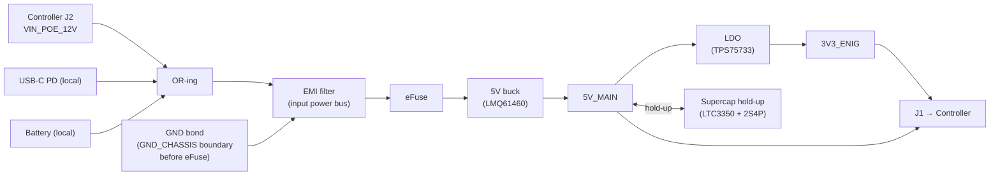
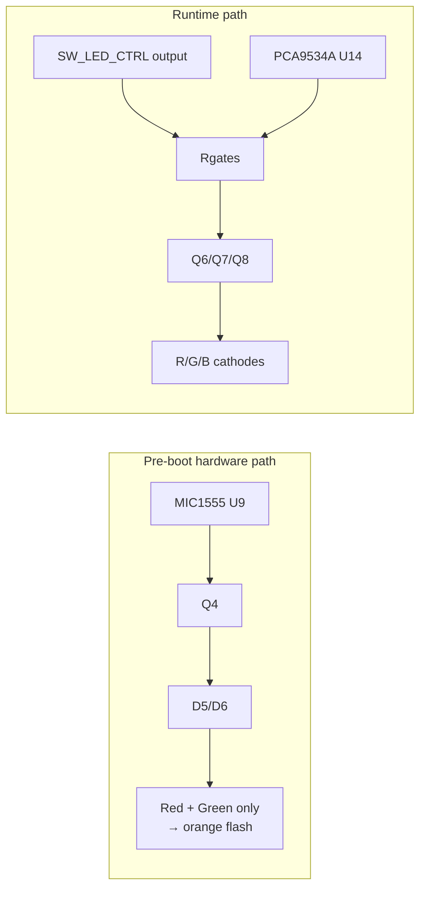

# Power Module: Board Layout Visualisations

**Status:** In Review
**Project:** Enigma-NG
**Author:** Izzyonstage & GitHub Copilot
**Version:** v.0.1.0
**Associated Hardware Revision:** Rev A
**Last Updated:** 2026-04-20

---

## 1. Functional Role

The Power Module is a removable power cartridge that:

- accepts **local USB-C PD input**
- accepts **local smart-battery input**
- accepts a **regulated PoE-derived auxiliary feed** from the Controller
- ORs / filters / protects those inputs
- generates `5V_MAIN` and `3V3_ENIG`
- provides supercap-backed hold-up and direct `PWR_BUT_N` / `PWR_GD` support

The RJ45, Ethernet ESD, magnetics, and PoE PD / ACF front-end live on the Controller.

---

## 2. Edge / Bulkhead Zones

```text
TOP VIEW

 Rear / external face (top):   [USB-C] [BATT]
 Front / internal face (bottom): [J1] [J2] [J3]

 USB-C   battery
 local   local

 J1      J2        J3
 regulated rails   PoE aux   low-speed control
 to Controller     from Ctrl to Controller
```

**J1 — Main Regulated Rails** (TE `1123684-7`, PM side):

| Allocation | Notes |
| :--- | :--- |
| `3 x 5V_MAIN` | Primary regulated 5V output from PM to Controller |
| `2 x 3V3_ENIG` | Clean logic rail from PM LDO to Controller |
| `5 x GND` | Shared return path |

**J2 — PoE Auxiliary Feed** (TE `1123684-7`, PM side):

| Allocation | Notes |
| :--- | :--- |
| `3 x VIN_POE_12V` | Regulated PoE-derived auxiliary feed from Controller PoE front-end into PM OR-ing stage |
| `7 x GND` | Shared return path |

**J3 — Low-Speed Control / Telemetry** (TE `1123684-7`, PM side):

| Signal | Direction | Notes |
| :--- | :--- | :--- |
| `I2C_SDA` | Bidir | Shared PM telemetry and PM-local GPIO-expander bus |
| `I2C_SCL` | Bidir | Shared PM telemetry and PM-local GPIO-expander bus |
| `PM_IO_INT_N` | PM -> CTRL | Active-low interrupt from PM `PCA9534APWR` |
| `PWR_GD` | PM -> CTRL | Direct rail-health telemetry from MCP121T |
| `ROTOR_EN_N` | CTRL -> PM | Direct 3V3_ENIG LDO enable control |
| `PWR_BUT_N` | PM -> CTRL | Direct CM5 PMIC power-button path |
| `LED_PWR_N` | CTRL -> PM | Direct CM5 power-state indication for SW2 hardware LED logic |
| `3 x GND` | - | Guards / return path |

All three dock connectors use the same TE family:

- Controller side: `1-1674231-1`
- Power Module side: `1123684-7`

**J_SW1 / J_SW2 — Panel Switch Spade-Tab Terminals** (Keystone 1211, 2.8 mm PCB male Quick-Fit THT):

Each switch panel connector is broken out as six individual Keystone 1211 PCB spade-tab terminals (one
THT hole per terminal, 1.3 mm drill, 2.8 mm tab width). The Centre-Bottom NC contact of each switch is
not wired; no Keystone 1211 terminal is fitted at that position.

| RefDes | Physical Position | Switch Function | Used On |
| :--- | :--- | :--- | :--- |
| `J_SW1_1` / `J_SW2_1` | Left-Top | `LED(G)` — Green LED cathode | SW1, SW2 |
| `J_SW1_2` / `J_SW2_2` | Left-Bottom | `LED(R)` — Red LED cathode | SW1, SW2 |
| `J_SW1_3` / `J_SW2_3` | Centre-Top | `COM` — Switch common | SW1, SW2 |
| `J_SW1_4` / `J_SW2_4` | Centre-Middle | `NO` — Normally Open contact | SW1, SW2 |
| `J_SW1_5` / `J_SW2_5` | Right-Top | `LED(B)` — Blue LED cathode | SW1, SW2 |
| `J_SW1_6` / `J_SW2_6` | Right-Bottom | `C_LED` — LED anode common | SW1, SW2 |

---

## 3. Power Flow



The PM remains the sole board that bonds `GND` to `GND_CHASSIS` at the clean/dirty boundary before the
eFuse.

---

## 4. SW1 RGB Control Block



- **D5 / D6** isolate the hardware boot path on the **red and green channels only**
- **blue** is runtime-only and is not part of the hardware flash path
- **Q6 / Q7 / Q8** are the full runtime RGB low-side sink stages
- **U14 (`PCA9534APWR`, 0x3F)** handles:
  - inputs: `POE_STAT`, `SYS_FAULT`, `BATT_PRES_N`, `USB_STAT`
  - outputs: `SW_LED_R`, `SW_LED_G`, `SW_LED_B`, `SW_LED_CTRL`

`PWR_GD`, `ROTOR_EN_N`, `PWR_BUT_N`, and `LED_PWR_N` remain direct signals on J3.

**SW1 / SW2 Pin-to-Net Wiring:**

*SW1 (Adafruit 4660 — latching eFuse enable switch):*

| RefDes | Switch Pin | Net | Description |
| :--- | :--- | :--- | :--- |
| `J_SW1_1` | `LED(G)` | `SW_LED_G` | Q7 low-side sink; runtime control via U14 |
| `J_SW1_2` | `LED(R)` | `SW_LED_R` | Q6 low-side sink; also pre-boot hardware path via D5/D6 |
| `J_SW1_3` | `COM` | `SW1_EN` node | eFuse EN node; closed = EN LOW = eFuse disabled |
| `J_SW1_4` | `NO` | `GND` | Switch pulls EN LOW when latched; eFuse off while SW1 closed |
| `J_SW1_5` | `LED(B)` | `SW_LED_B` | Q8 low-side sink; runtime-only (no hardware boot path) |
| `J_SW1_6` | `C_LED` | `5V_MAIN` (via R13–R15) | LED anode common; current-limiting resistors |

*SW2 (Adafruit 3350 — momentary CM5 power button):*

| RefDes | Switch Pin | Net | Description |
| :--- | :--- | :--- | :--- |
| `J_SW2_1` | `LED(G)` | `SW2_LED_G` | Q9 low-side sink; driven by buffered `LED_PWR_N` (CM5 powered = GREEN) |
| `J_SW2_2` | `LED(R)` | `SW2_LED_R` | Q10 low-side sink; gated 1 Hz blink via U9 and U17 AND gate (shutdown in progress = RED) |
| `J_SW2_3` | `COM` | `GND` | Switch common |
| `J_SW2_4` | `NO` | `PWR_BUT_N` | Momentary press pulls `PWR_BUT_N` LOW → CM5 PMIC power-key event |
| `J_SW2_5` | `LED(B)` | NC | Blue channel not used on SW2; tab fitted, wire not connected in harness |
| `J_SW2_6` | `C_LED` | `5V_MAIN` (via R_LED) | LED anode common; current-limiting resistors |

---

## 5. Major Placement Areas

```text
 ______________________________________________________________________
| [ USB-C ] [ BATT ]                                                   |
|----------------------------------------------------------------------|
| [ OR-ing FETs / controllers ]  [ EMI filters ]  [ TPS259804 eFuse ]  |
|----------------------------------------------------------------------|
| [ dual 5V buck ] [ TPS75733 ] [ U14 PM expander ] [ supervisor ]     |
|----------------------------------------------------------------------|
| [ LTC3350 ] [ supercap bank 2S4P ] [ switch spade tabs / test pads ] |
|----------------------------------------------------------------------|
| [ J1 ][ J2 ][ J3 ]                                                   |
|______________________________________________________________________|
```

Rear / top edge features (`USB-C`, `BATT`) form the user-accessible external face. Front / bottom edge
features (`J1` / `J2` / `J3`) face inward toward the assembled machine and can be positioned to suit
service clearance rather than blind-mate dual-board insertion constraints.

---

## 6. Notes for Schematic / PCB Capture

1. Keep the `VIN_POE_12V` path electrically separate from the local USB-C and battery entries until the
   intended OR-ing node.
2. Keep `PM_IO_INT_N` routed as a clean low-speed logic net back to the Controller.
3. Apply the common RGB sink-stage pattern from `design/Standards/Global_Routing_Spec.md §3.1`
   to the PM runtime RGB path (`Q6` / `Q7` / `Q8`). The PM-specific pre-boot hardware flash path
   remains a local exception: red + green only through `Q4` and `D5` / `D6`; blue stays runtime-only.
4. Route `LED_PWR_N` from `J3` only into the local SW2 hardware-indicator logic; do not place it on the
   PM I2C expander. The SW2 red/green sink stages and shutdown latch remain fully local to the PM.

---

## 7. Mounting Holes

Per DR-PM-15 and `design/Standards/Global_Routing_Spec.md §4`:

| Designator | Position | Specification |
| :--- | :--- | :--- |
| MH1 | Corner (TBD at PCB layout) | Ø3.2 mm PTH; ENIG annular ring; net: `GND_CHASSIS` |
| MH2 | Corner (TBD at PCB layout) | Ø3.2 mm PTH; ENIG annular ring; net: `GND_CHASSIS` |
| MH3 | Corner (TBD at PCB layout) | Ø3.2 mm PTH; ENIG annular ring; net: `GND_CHASSIS` |
| MH4 | Corner (TBD at PCB layout) | Ø3.2 mm PTH; ENIG annular ring; net: `GND_CHASSIS` |

No BOM entry required — MH1–MH4 are plain chassis mounting holes with no purchasable components.
Exact XY coordinates and corner assignments are TBD at PCB layout stage.

### Cross-references

| Source | Note |
| :--- | :--- |
| `design/Electronics/Power_Module/Design_Spec.md DR-PM-15` | Design requirement — 4x M3 PTH chassis mounting holes |
| `design/Standards/Global_Routing_Spec.md §4` | Mechanical grounding rules; GND_CHASSIS net |
