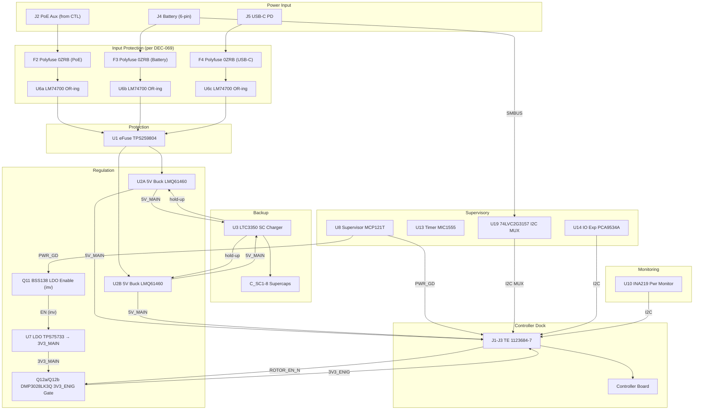

# Power Module (V1.0) Design Specification

**Status:** In Review
**Project:** Enigma-NG
**Author:** Izzyonstage & GitHub Copilot
**Version:** v.0.1.0
**Associated Hardware Revision:** Rev A
**Last Updated:** 2026-05-19

## 1. Overview

This Power Module is a custom power board that is independently shielded and protected to ensure all power sources are filtered, controlled and monitored.
It provides the basis of the clean power rails into the controller board and other peripheral boards.
It produces 3 power rails from a common ~12V input source. These power rails are:

* **5V_MAIN** Providing up to 12A for powering the CM5 module (dual-phase interleaved LMQ61460AFSQRJRRQ1).
* **3V3_MAIN** Always-on 3.3V internal rail generated by the TPS75733 LDO (U7); enabled by Q11 (BSS138) after `PWR_GD` fires.
  Powers PM-internal logic (TPS25751, M24512-RDW6TP, U19 MUX, pull-ups). Not exported to the Controller.
* **3V3_ENIG** Gated 3.3V output rail for CPLDs, USB-JTAG VCCIO, I2C logic, status indicator logic, and the full rotor stack.
  Derived from `3V3_MAIN` via Q12a/Q12b (DMP3028LK3Q-13 parallel P-FET gate switch); enabled when CM5 asserts `ROTOR_EN_N` LOW.
  `3V3_ENIG` crosses to the Controller Board via dock connector `J1`.

**NOTE:** The **3V3_ENIG** rail is the unified 3.3V rail supplying CPLDs, USB-JTAG logic/VCCIO, and low-voltage control/telemetry domains across the Enigma-NG system.
It is sequenced on only after CM5 has fully booted and explicitly enables the rotor stack. **3V3_MAIN** is the PM-internal supply and is not directly exported.

* **Controller Dock:** The Power Module docks into the Controller through three TE 10-position
  connectors: `J1` (regulated rails), `J2` (regulated PoE-derived auxiliary feed), and `J3`
  (low-speed control / telemetry).
  * **Provided to Controller:** `5V_MAIN`, `3V3_ENIG`, PM telemetry, `PWR_GD`, and `PWR_BUT_N`.
  * **Received from Controller:** `VIN_POE_12V`, `I2C-1`, `PM_IO_INT_N` return path, `ROTOR_EN_N`, and `LED_PWR_N`.
  * **Cross-ref:** See `Controller/Design_Spec.md` and `Controller/Board_Layout.md` for the active dock allocation.
  * **Reference datasheets:** [`TE-1123684-7-datasheet.md`](../../Datasheets/TE-1123684-7-datasheet.md),
    [`TE-1-1674231-1-datasheet.md`](../../Datasheets/TE-1-1674231-1-datasheet.md)

### Functional & Design Requirements

#### Functional Requirements

| ID | Functional Requirement | Notes | Satisfied By / Cross-Ref |
| :--- | :--- | :--- | :--- |
| FR-PM-01 | Accept a regulated PoE-derived auxiliary feed from the Controller plus local USB-C and battery inputs, then generate regulated 5V and 3.3V system rails | PM is the system power-conditioning / UPS cartridge | §2 Power & UPS Hub; BOM J2, J4, J5, U2A/U2B, U7 |
| FR-PM-02 | Maintain system power for ≥33.5 s after mains/PoE loss | Provides controlled-shutdown window for the CM5 OS | §2 Power & UPS Hub; BOM U3 (LTC3350), C_SC1-8 (supercaps) |
| FR-PM-03 | Assert PWR_GD (active-HIGH) to CM5 while 5V_MAIN ≥ 4.5V; deassert LOW when 5V_MAIN drops below threshold | Rail-health telemetry exported on `PWR_GD`; does not initiate shutdown directly | §5 Protection & Logic; BOM U8 (MCP121T-450E) |
| FR-PM-04 | Distribute `5V_MAIN` and `3V3_ENIG` to the Controller Board and expose the retained direct PM handshakes | Via `J1` (rails) and `J3` (low-speed control / telemetry) | §2 Power & UPS Hub; BOM J1-J3 |
| FR-PM-05 | Monitor 5V_MAIN output voltage and current and report via I2C | Runtime health telemetry for the primary CM5 supply rail; downstream rails are monitored elsewhere in the system where specified | §3 Telemetry & Power Management; BOM R5, R6 (I2C pull-ups), U10 (INA219 at 0x40), R16 (10mΩ shunt) |
| FR-PM-06 | Protect downstream circuitry from overcurrent, overvoltage, and inrush | Hardware protection independent of software | §5 Protection & Logic; BOM U1 (TPS25980 eFuse), R1-R3 |
| FR-PM-07 | Automatically pulse CM5 PWR_BUT_N LOW for 3 seconds when LTC3350 enters backup mode (primary power lost), initiating a hardware-guaranteed graceful OS shutdown without firmware polling | Ensures graceful shutdown within the 33.5 s hold-up window regardless of OS state | §3 Power Sequencing; §5 Protection & Logic; BOM U13 (MIC1555 monostable), Q5, R21, R22, C36, C40 |
| FR-PM-08 | Provide manual CM5 power button (SW2) wired to PWR_BUT_N, enabling graceful power-on after OS shutdown while system power remains available | Allows CM5 restart without a full power cycle; replaces incorrect GLOBAL_EN hard-reset approach | §3 Power Sequencing; BOM SW2, R22 |
| FR-PM-09 | Virtualise non-critical PM status lines and runtime SW1 RGB control through a PM-local I²C expander | Inputs: `POE_STAT`, `SYS_FAULT`, `BATT_PRES_N`, `USB_STAT`; Outputs: `SW_LED_R`, `SW_LED_G`, `SW_LED_B`, `SW_LED_CTRL` | §3 Telemetry & Power Management; BOM U14 (`PCA9534APWR`) |

#### Design Requirements

| ID | Design Requirement | Specification | Satisfied By / Cross-Ref |
| :--- | :--- | :--- | :--- |
| DR-PM-01 | Input supply | `VIN_POE_12V` regulated auxiliary feed from Controller PoE front-end, local USB-C PD input, and local smart-battery input | §5 Protection & Logic; BOM J2, J4, J5 |
| DR-PM-02 | 5V_MAIN rail | 5.0 V ±2%, ≥5 A continuous; exported to Controller via grouped `J1` contacts | §2 Power & UPS Hub; BOM U2A/U2B (LMQ61460AFSQRJRRQ1) |
| DR-PM-03 | 3V3_ENIG rail | 3.3 V ±3%, ≤3.0 A maximum (TPS75733 LDO hard limit) | §5 Protection & Logic; BOM U7 (TPS75733) |
| DR-PM-04 | Buck converter | Dual-phase interleaved LMQ61460AFSQRJRRQ1 pair | §2 Power & UPS Hub; BOM U2A/U2B (LMQ61460AFSQRJRRQ1) |
| DR-PM-05 | LDO | TPS75733 (3.3 V, 3.0 A, TO-263 (KTT) 5-pin 10.16x15.24 mm) | §5 Protection & Logic; BOM U7 (TPS75733) |
| DR-PM-06 | eFuse | TPS259804ONRGER, 7 A trip current (R_ILIM = ERA-3VEB2100V, 210 Ω, 0.1% thin-film), OVLO = 16.9 V (silicon-fixed), UVLO ≈ 10.786 V at eFuse EN_UVLO pin (≈ 11 V source, recalculated from 232 kΩ to compensate for F2/F3/F4 polyfuse series drop - see DEC-069) | §5 Protection & Logic; BOM U1 (TPS259804ONRGER), R1 (226kΩ ERJ-3EKF2263V), R2 (28.7kΩ), R3 (210Ω) |
| DR-PM-07 | Supercapacitor bank | 8x 25 F / 2.7 V in 2S4P configuration = 50 F effective at 5.4 V | §2 Power & UPS Hub; BOM U3 (LTC3350), C_SC1-8 |
| DR-PM-08 | Backup activation threshold | 4.812 V (R11 = 30.1 kΩ, E96 0.1% thin-film - see DEC-030) - fires 312 mV before MCP121T 4.50 V threshold, providing ≥4 LTC3350 cycles at 400 kHz for backup switchover | §5 Protection & Logic; BOM R11 (30.1kΩ), R12 (10.0kΩ) |
| DR-PM-09 | Holdup duration | ≥33.5 s at 15 W load (CM5 typical 5V x 3A) | §2 Power & UPS Hub; BOM C_SC1-8 (25F/2.7V), U3 (LTC3350) |
| DR-PM-10 | 5V_MAIN backup bulk capacitor | C14 + C15: 2x Samsung CL32B226KAJNNNE in parallel = 44µF at 25V X7R 1210 - holds 5V_MAIN above backup threshold (4.812V) for ≥4 LTC3350 cycles at 400 kHz during backup switchover at 3A load | §5 Protection & Logic; BOM C14, C15 - see DEC-030 |
| DR-PM-11 | LTC3350 RT frequency-setting resistor | R23: 133 kΩ (E96, nearest to 133.75 kΩ) to GND - sets LTC3350 switching frequency to 402 kHz ≈ 400 kHz target (vs default 200 kHz with RT=INTVCC); required to achieve ≥4 cycles within 10.2µs backup switchover window. Formula: fSW(kHz) = 53,500 / RT(kΩ) → 53,500 / 133 = 402 kHz. Max rated fSW = 1 MHz (RT = 53.6 kΩ). Package: 0603 thick-film. | §5 Protection & Logic; BOM R23 (133kΩ, ERJ-PC3B1333V) - see DEC-030, DEC-073 |
| DR-PM-12 | Controller dock connectors | `J1/J2/J3` = TE `1123684-7` 10-position 2.5mm plugs mating with Controller `1-1674231-1` receptacles | BOM J1-J3 |
| DR-PM-13 | PCB stackup | Stackup per `design/Standards/Global_Routing_Spec.md §2.3.3` | §1 PCB Architecture |
| DR-PM-14 | Per-IC bypass capacitors | All ICs shall have a dedicated 100nF X7R 50V 0402 bypass capacitor on each VCC/VCCIO/VCC_IO pin, placed within 1mm of the IC per `design/Standards/Global_Routing_Spec.md §3.2`. BOM: C26-C30, C31-C37, C41-C48, C50, C56. C57 and C58 are Pi-filter HF shunt capacitors for FB1 (single-point GND bond ferrite bead) and shall be placed within 2mm of the FB1 ferrite bead pads; they are not per-IC bypass capacitors and are excluded from this requirement. | BOM C26-C30, C31-C37, C41-C48, C50, C56; C57/C58 see Pi-filter placement note |
| DR-PM-15 | Mounting holes | MH1-MH4 shall be M3 PTH (Ø3.2 mm drill) mounting holes bonded to `GND_CHASSIS` per `design/Standards/Global_Routing_Spec.md §4`. Placement follows GRS §4.3 Pattern A (rectangular board): MH1 bottom-left, MH2 bottom-right, MH3 top-right, MH4 top-left - all at 7 mm inset from both nearest edges. No purchasable BOM entry - plain chassis mounting holes; no components to fit. Exact XY positions TBD at PCB layout. | §1 PCB Architecture (Mounting Holes); `design/Standards/Global_Routing_Spec.md §4.3`; `design/Electronics/Power_Module/Board_Layout.md §7` |
| DR-PM-16 | Pre-OR-ing per-input bulk capacitors | Each of the three power inputs shall have a tight parallel cluster of 3× Samsung CL32B226KAJNNNE (22µF X7R 25V 1210) placed adjacent to the corresponding LM74700 OR-ing controller ANODE pin (C59-C67, 9 caps total). Three-cap banks use a tight parallel cluster to minimise loop inductance; the GRS §3 five-cap star formation does not apply to three-cap banks. Voltage derating: 25V rated at 11-16.9V = 1.5-2.3×. See DEC-068. | BOM C59-C67; DEC-068 |
| DR-PM-17 | 5V_MAIN output bulk capacitor bank | A bank of 5× Samsung CL21B106KAYQNNE (10µF X7R 25V 0805) shall be placed adjacent to the J1 dock connector 5V_MAIN output pins (C68-C72). Placement and purpose are distinct from C14/C15 (LTC3350 backup-switchover energy storage per DEC-030). Voltage derating: 25V rated at 5V = 5×. See DEC-068. | BOM C68-C72; DEC-068; DEC-030 |
| DR-PM-18 | 3V3_ENIG output bulk capacitor bank | A bank of 5× Samsung CL21B106KAYQNNE (10µF X7R 25V 0805) shall be placed adjacent to the J1 dock connector 3V3_ENIG output pins (C73-C77). Placement and purpose are distinct from C23 (TPS75733 LDO minimum-stability capacitor). Voltage derating: 25V rated at 3.3V = 7.6×. See DEC-068. | BOM C73-C77; DEC-068 |
| DR-PM-19 | Per-input polyfuse protection | Each of the three power inputs (VIN_POE_12V, USB-C, Battery) shall have a Bel Fuse 0ZRB0600FF1A (6 A hold / 12 A trip, THT, AEC-Q200 qualified, ≤40 mΩ hold resistance) placed series upstream of the corresponding LM74700 OR-ing controller. F2 = VIN_POE_12V path, F3 = Battery path, F4 = USB-C path. Required for CE/UKCA compliance. F1 (AC72ABD) is the battery-cell thermal cutoff (non-PCB, welded to cell tabs) and is unaffected. See DEC-069. | BOM F2, F3, F4 (0ZRB0600FF1A); DEC-069 |
| DR-PM-20 | TPS25751 PD profile EEPROM | U18 (M24512-RDW6TP, 64 KB SO8N) shall be connected on the U4 I2Cc bus (I2Cc_SCL ↔ U18 SCL, I2Cc_SDA ↔ U18 SDA) at I²C address 0x50 (E2=E1=E0=GND per M24512 datasheet DS6520 §2.3/Table 3, page 9). R47/R48 (4.7 kΩ to 3V3_MAIN) are the I2Cc SCL/SDA pull-ups (TPS25751 §8.3.11 requires external pull-ups to VCCIO). U18 WC pin shall be tied to GND (writes always enabled; programming is controlled via TPS25751 I2Ct protocol). C78 (100 nF, 50V X7R 0402) required on U18 VCC per DS6520 §2.6.1 (page 4). | BOM U18, R47, R48, C78; DEC-075; [TPS25751 datasheet §8.3.11, Table 8-4](../../Datasheets/tps25751-datasheet.md); [M24512 datasheet DS6520 §2.3/Table 3, §2.6.1](../../Datasheets/STM-M24512-RDW6TP-datasheet.md) |
| DR-PM-21 | TPS25751 I2Ct field-programming interface | The I2Ct bus shall be switched via U19 (74LVC2G3157DP-Q10J dual SPDT I2C MUX). Both U19 nS pins are tied to `PROG_EN_N` (J4 pin 6, active-LOW with 10 kΩ pull-up to 3V3_MAIN). **nS=HIGH (normal operation):** U19 routes J4 SMBUS (I2Ct) → I2C-1 (SmartBattery path). **nS=LOW (programming mode):** U19 routes J4 SMBUS (I2Ct) → TPS25751 I2Ct port (0x20) for NVM profile update. R49/R50 (4.7 kΩ to 3V3_MAIN) are the I2Ct SCL/SDA pull-ups. **J6 is removed.** Programming is performed by fitting a PROG_EN_N assertion wire to J4 pin 6 per Maintenance_Guide.md §5. **Power-up safety (verified):** U19 VCC is supplied by 3V3_MAIN. Before 3V3_MAIN is available (startup steps 1-5), U19 is unpowered (VCC=0). Per 74LVC2G3157-Q100 datasheet Table 10, analog switch channels present high impedance at VCC=0 (no gate-drive path; switch transistors off); nS input leakage is ±1 μA max. The break-before-make switching characteristic prevents any momentary cross-connection during VCC ramp. No SMBUS traffic originates from J4 or the CM5 before 3V3_MAIN is available, so no inadvertent routing to TPS25751 I2Ct can occur. This power-up behaviour is confirmed safe and requires no additional protection components. | BOM U19, J4 (pin 6), R49, R50; DEC-076; [TPS25751 datasheet §8.3.11, Tables 8-4/8-5](../../Datasheets/tps25751-datasheet.md); [74LVC2G3157-Q100 datasheet Table 10](../../Datasheets/Nexperia-74LVC2G3157_Q100-datasheet.md); [Maintenance_Guide.md §5](../../Guides/Maintenance_Guide.md) |
| DR-PM-22 | TPS25751 ADCIN startup configuration | ADCIN1 shall be tied directly to 3V3_MAIN (decoded value 7, DIV = 0.9061-1.0) and ADCIN2 shall be tied directly to GND (decoded value 0, DIV = 0-0.0228). This selects **SafeMode** startup (source-only mode, loads PD configuration from EEPROM U18 on boot - recommended when EEPROM is present per TPS25751 §8.3.6 Table 8-6) with I2Ct address Index #1 = 0x20. No resistor dividers required - direct ties to 3V3_MAIN and GND respectively. | BOM U4 (ADCIN1/ADCIN2 net assignments); DEC-075; [TPS25751 datasheet §8.3.6, Tables 8-2/8-5/8-6](../../Datasheets/tps25751-datasheet.md) |
| DR-PM-23 | ROTOR_EN_N PM-side default-HIGH pull-up | A 10kΩ pull-up resistor (R52, ERJ-3EKF1002V) shall be fitted from `ROTOR_EN_N` to `3V3_MAIN` on the PM PCB. This ensures Q12a/Q12b (P-FET gate switch) remain OFF and `3V3_ENIG` stays de-energised during CM5 boot (between 3V3_MAIN availability and CM5 GPIO assertion). The PM shall not depend on any Controller-side pull-up for this default-safe state. The Controller Board SHALL NOT carry a pull-up on `ROTOR_EN_N` - it is an Output-only CM5 GPIO signal. | BOM R52; DEC-076 |
| DR-PM-24 | 3V3_MAIN rail isolation - external connectors | The `3V3_MAIN` rail is a PM-internal supply only and SHALL NOT appear on any external connector. Specifically: `J1` carries `5V_MAIN` and `3V3_ENIG` only; `J2` carries `VIN_POE_12V` and GND only; `J3` carries control/telemetry signals (`I2C_SDA`, `I2C_SCL`, `PM_IO_INT_N`, `PWR_GD`, `ROTOR_EN_N`, `PWR_BUT_N`, `LED_PWR_N`, GND) only; `J4` carries battery interface signals (VBAT, GND, `BATT_PRES_N`, SMBUS SDA/SCL, `PROG_EN_N`) only; `J5` carries USB-C VBUS/GND/CC only. `3V3_MAIN` consumers are internal PM ICs: U4 (TPS25751), U18 (M24512-RDW6TP), U19 (74LVC2G3157 MUX), R47-R50 pull-ups, R51 (PROG_EN_N pull-up), and R52 (ROTOR_EN_N pull-up). **Validation:** net-list audit at schematic freeze shall confirm zero `3V3_MAIN` net connections on J1-J5 pads. | BOM U4, U18, U19, R47-R52; DEC-076 |

### Component Block Diagram



## 2. Design
>
> **NOTE:** All global rules defined in the Global_Routing_Spec.md should be applied to this design.
>
> **EXCEPTION - GRS §3 Bulk-Entry Capacitor Banks:** The Power Module is the **rail source** - it
> generates `5V_MAIN` and `3V3_ENIG` from the battery/PoE input. GRS §3 bulk-entry bank requirements
> apply to boards that **receive** externally-generated rails, not to the board that generates them.
> The PM's input-filter bulk capacitors (C1-C13, C14/C15) fulfil the equivalent energy-storage role on
> the raw input side. The GRS §3 bulk-entry check is therefore **exempt** for this board.
>
> **NOTE - DEC-068 Output Banks:** C59-C67 (pre-OR-ing per-input bulk), C68-C72 (5V_MAIN J1 output
> bulk), and C73-C77 (3V3_ENIG J1 output bulk) are PM-side source-quality design requirements
> (DEC-068), not GRS §3 compliance items.
>
### 1. PCB Architecture

* **Stackup:** 6-layer per `design/Standards/Global_Routing_Spec.md §2.3.3`.
  JLCPCB Controlled Impedance service is **not required** for the Power Module - this is a
  power-dominated board with no high-speed differential pairs requiring TDR-verified widths.
* **Substrate:** High-Tg FR4 for thermal stability.
* **Finish:** ENIG (Gold) for all user-touch points and thermal pads.
* **Enclosure:** ≥30mm internal clearance Aluminium "Power Can" with internal compression ribs
  (≥30mm required above PCB surface to clear ADCR-T02R7SA256MB supercap bodies at 27.0mm max height + assembly margin).
* **Thermal:** Cross-Hatched Exposed ENIG "Thermal Halos" (2mm offset) at mesh intersections.
  * **Vias:** Type VII (Epoxy-filled & Capped) Hexagonal Thermal Via Matrix.
* **Supercap Block:** 2x4 arrangement (8 cells, 20mm centre-to-centre pitch, 3.5mm air gap between cells
  at max body diameter 16.5mm). Block footprint ≈ 41mm x 77mm. THT through-holes: 7.5mm lead pitch
  (±0.5mm), 1.0mm recommended drill diameter (0.8mm lead diameter).
  The 3.0mm gap is a 'No-Fly Zone' for all PCB traces on L1-L6 (enclosure rib clearway).
  * **Rib Clearway ENIG Bond:** Solder mask is opened in the 3.0mm rib clearway gap on L1 (top copper),
    connected to GND_CHASSIS. Minimum strip width 1.5mm x full rib contact depth. The aluminium enclosure
    rib makes direct electrical contact via a conductive elastomer gasket strip (≤3mm wide, self-adhesive;
    part selected at mechanical design phase). Supercap bodies are wrapped in minimum 2-mil (50µm) polyimide
    (Kapton) tape before installation to prevent shorts with the metal ribs. Combined with the GND_CHASSIS
    copper pour in the shadow zone (§1 keepout rule), this creates a near-complete Faraday cage around the
    supercap block. See DEC-020.
* **Routing Keep-out:** 41mm x 81mm shadow zone on L1-L6 beneath the Supercap Block - only GND_CHASSIS copper and Type VII thermal vias permitted within this zone.

#### Mounting Holes

| Designators | Count | Size | Type | Net | BOM Entry |
| :--- | :--- | :--- | :--- | :--- | :--- |
| MH1-MH4 | 4 | M3 (3.2 mm drill) | PTH | `GND_CHASSIS` | None - plain chassis mounting holes; no components to fit (per GRS §4 and DR-PM-15) |

#### Net Name Conventions

The following table maps vendor and schematic signal names to the project-standard net identifiers used
in design documentation and PCB net lists. These signals are the direct PM handshakes exposed on `J3`.

| Device | Vendor / Schematic Pin | Project Net Name | Active State | Signal Description |
| :--- | :--- | :--- | :--- | :--- |
| MCP121T-450E (U8) | `~RESET` | `PWR_GD` | Active-LOW open-drain released HIGH via pull-up = power good | Rail-health output; released HIGH when `5V_MAIN` ≥ 4.5 V; held LOW during startup or fault |
| Q12a/Q12b DMP3028LK3Q-13 (gate) | Gate | `ROTOR_EN_N` | Active-LOW (LOW = P-FET on = 3V3_ENIG enabled) | 3V3_ENIG gate switch - CM5 drives LOW to enable rotor stack; HIGH = 3V3_ENIG off. Source=3V3_MAIN, Drain=3V3_ENIG. Both devices in parallel; both gates tied to ROTOR_EN_N. R52 (10kΩ to 3V3_MAIN) on PM provides default-HIGH hold; CTL carries no pull-up on this signal (DR-PM-23). |
| SW2 contact (Adafruit 3350) | `NO` (Normally Open) | `PWR_BUT_N` | Active-LOW | CM5 PMIC power button; pulled LOW on press or by MIC1555 (U13) one-shot on backup-mode trigger |
| CM5 pin 95 (via `J3`) | `LED_PWR_N` | `LED_PWR_N` | Active-LOW | CM5 power-on indicator; LOW = CM5 powered. Drives PM SW2 hardware indicator logic; does not route through U14 |
| LTC3350 (U3) | `/INTB` (pin 13, active-LOW open-drain) | `LTC_INTB_N` | Active-LOW | LTC3350 interrupt - asserts LOW when supercap backup mode activates or a monitored fault condition is detected |

### 2. Power & UPS Hub

* **Storage:** LTC3350-managed supercap bank - 8x Abracon ADCR-T02R7SA256MB (25F/2.7V, THT radial can, 16.0mm dia x 25.0mm height) in 2S4P configuration on 5V_MAIN bus. Total: 50F at 5.4V. Hold-up
  energy: 503J (≥33.5 seconds at 15W CM5 shutdown load). Supercap manager: LTC3350 (QFN-38, 5x7mm), handles charging, cell balancing, and hold-up switchover.
* **PoE Auxiliary Interface:** `J2` receives the regulated PoE-derived auxiliary feed
  (`VIN_POE_12V` + `GND`) from the Controller. The Controller hosts the RJ45, Ethernet ESD, and
  PoE PD / ACF front-end.
* **Battery Interface:** J4 - 6-pin Locking Micro-Fit (Molex 0436500619 - vertical THT, gold contacts, board lock).

  | Pin | Signal | Direction | Description |
  | :---: | :--- | :--- | :--- |
  | 1 | `VBATT+` | Battery -> PM | 14.4V nominal battery positive |
  | 2 | `SMBUS_SCL` | Bidirectional | SMBus clock; local ESD protection fitted |
  | 3 | `SMBUS_SDA` | Bidirectional | SMBus data; local ESD protection fitted |
  | 4 | `BATT_PRES_N` | Battery -> PM | Battery auxiliary / thermistor detect (active-LOW: 300Ω ±5% T-pin to GND when battery present) |
  | 5 | `VBATT-` | Battery -> PM | Battery negative / return |
  | 6 | `PROG_EN_N` | External -> PM | TPS25751 I2Ct programming enable (active-LOW; 10 kΩ pull-up to 3V3_MAIN on PM; drive LOW to enable U19 I2C MUX programming path; NC on standard battery cable) |
  
  * **BMS Charge Voltage:** Smart Battery BMS must be configured for a maximum charge voltage of **4.1V/cell (16.4V total for 4S)**. This provides a ≥0.5V margin to the TPS25980 eFuse 16.9V OVLO
  threshold, preventing nuisance latch-off at full charge. BMS configurations using 4.2V/cell (16.8V) are not compatible without OVLO re-specification.
  * **Candidate replacement path:** a military / NetWarrior-style Glenair or ODU receptacle plus a
    small PM-side interposer board is now being investigated as a possible replacement for the Molex
    part. See `Millitary_Battery_Connection_Option.md`. This remains **pending** confirmation of the
    6-pin contact map, cable availability, and interposer mechanics. The `Y` keying for the chosen
    Glenair candidate is already verified as the standard battery keying intended to prevent mating
    with data-only ports on standard in-service devices. ODU offers a compatible alternative socket
    matching the Glenair form; supplier responses are pending.
* **Presence Logic:** Pin 4 (`BATT_PRES_N`) is pulled to **3V3_ENIG** via 10kΩ resistor (R4). For the selected Accutronics / Inspired Energy N205-family battery, the battery `T` pin presents
  **300Ω ±5% to `VBATT-`**, which is treated directly as battery-present.
  * Logic HIGH: Battery Disconnected.
  * Logic LOW: Battery Detected.
  * Other battery families that do not expose a compatible auxiliary / thermistor pin must be adapted externally rather than changing the PM base pinout.
* **Protection:** TPD1E10B06DYARQ1 TVS diode on the Presence line plus a dedicated 2-channel TVS array on the SMBus lines to protect the battery interface during insertion.
* **Stabilizer:** Solder-mask opening "KLEBER-ZONE" for RTV Silicone adhesive.
* **Indicators:** Green "LOGIK-BEREIT" LED + 5.1V Zener Amber "Safety Glow" LED.
* **Z-Height:** Through-hole radial can supercapacitors (ADCR-T02R7SA256MB, 16.0mm nominal / 16.5mm max dia x
  25.0mm nominal / 27.0mm max height); enclosure above PM PCB must provide ≥30mm internal vertical clearance for supercap bodies.
* **Interface:** Gelid GP-Ultimate (15 W/mK) pad on an **Exposed ENIG** bottom zone to Aluminium Enclosure with internal compression ribs.

### 3. Telemetry & Power Management

* **I2C Telemetry:** 4.7kΩ (1%) pull-up resistors (**R5, R6**) on SDA/SCL lines, tied to **3V3_ENIG**.
* **PM-local GPIO Expander:** `PCA9534APWR` (U14) at I²C address **0x3F**.
  * **Inputs:** `POE_STAT`, `SYS_FAULT`, `BATT_PRES_N`, `USB_STAT`
  * **Outputs:** `SW_LED_R`, `SW_LED_G`, `SW_LED_B`, `SW_LED_CTRL`
  * **Interrupt:** Open-drain `PM_IO_INT_N` exported to the Controller on `J3`.
  * **Power-up state:** All pins default to inputs, so the pre-boot hardware orange flash path remains dominant until firmware reconfigures the expander.
  * **Reference datasheet:** [`pca9534a-datasheet.md`](../../Datasheets/pca9534a-datasheet.md)
* **5V_MAIN Current Monitor:**
  * **Purpose:** Provides real-time current/voltage telemetry for the 5V_MAIN rail to the CM5.
  * **Sensor:** TI INA219AIDR (U10) zero-drift power monitor at I²C address **0x40**.
  * **Placement:** Inserted in the 5V_MAIN supply path on L1, downstream of the eFuse (TPS25980).
  * **Shunt:** KRL6432T4-M-R010-F-T1 (10mΩ ±1% 2W, 6432/2512 Kelvin 4-terminal) - PM R16 instance.
    (Stator R1 is the third system shunt; total build qty: 3 - see `Power_Budgets.md`.)
  * **Interface:** I2C-1 Telemetry Bus, directly accessible via `J3` to the Controller.
  * **Filtering:** 0.1µF VCC decoupling (C41) and RC input filter on IN+/IN-: R45 (10Ω RF1, series on IN+), R46 (10Ω RF2, series on IN-),
    C50 (100nF CF, differential across IN+/IN-); f_3dB ≈ 80kHz (differential). Suppresses PM buck switching transients (400kHz and harmonics).
    See INA219 datasheet Figure 14.
  * Satisfies FR-PM-05.
* **Interrupt Bias:** 10kΩ (1%) pull-up (**R7**) on `PM_IO_INT_N` so the PM-local expander interrupt
  idles HIGH when U14 is quiescent.
* **Battery Detection:** `BATT_PRES_N` is reported through U14 (`PCA9534A @ 0x3F`) and exported over I²C.
* **Direct CM5 power-state signal:** `LED_PWR_N` is received from the Controller over `J3` and used only by
  the local SW2 hardware indicator logic. It is not routed through U14.

### 4. EMI & Filtering (The "Iron Curtain")

The input filter uses a two-stage common-mode (CM) choke cascade followed by a differential-mode (DM) Pi-filter. This architecture addresses both CM and DM conducted noise across the full EN 55032
Class B frequency range (150kHz-30MHz).

**Filter Topology (power flow left → right):**

```text
VIN_RAW -+-[L1: WE-CMBNC CM Choke]-[L2: WE-CMBNC HF CM Choke]-+-[L3: 10µH DM]-+- VIN_BUS (to eFuse)
          |   (Nanocrystalline)       (High-Freq Ferrite)     |               |
         [C1/C2] 22µF } input-side                           [C3/C4] 22µF } output-side
         [C21]   1µF }   Pi leg                              [C22]   1µF }   Pi leg
         [C57] 100nF}  (to GND)                              [C58] 100nF}  (to GND)
          |                                                   |               |
GND ------+---------------------------------------------------+---------------+- GND
```

> **Note:** L1 and L2 are common-mode chokes - each has two coupled windings,
> one in the +VIN line and one in the GND return line. C1/C2 + C21 + C57 form
> the input-side Pi-filter capacitor stack, and C3/C4 + C22 + C58 form the
> output-side stack. All are shunt capacitors to GND
> (differential filter caps).

**Stage 1 - Primary CMC (L1: Wurth WE-CMBNC 7448031002):**

* Part: **L1 = Wurth WE-CMBNC 7448031002** - nanocrystalline common-mode
  choke, 10A rated, 2mH CM inductance, 6.3mOhm DCR, 24 x 17 x 25mm THT. This
  is the locked BOM part for the primary CMC; no further part-selection
  verification is required unless a future redesign changes the filter
  strategy.
* Function: Broadband CM attenuation from ~1kHz to >10MHz. Nanocrystalline core maintains high permeability (µ_r > 50,000) well into the MHz range, providing >60dB CM insertion loss at 150kHz.

**Stage 2 - Secondary HF CMC (L2: Wurth WE-CMBNC 7448031002):**

* Part: **L2 = Wurth WE-CMBNC 7448031002** - same part as L1 (nanocrystalline
  CMC, THT, 10A, 2mH). Twin nanocrystalline CMCs provide broadband CM coverage
  from 1kHz to 30MHz. ⚠️ Re-evaluate at EMC pre-compliance test.
* Function: Supplementary CM attenuation above ~10MHz where nanocrystalline core permeability falls off. Provides a second CM filter pole to ensure >40dB CM attenuation to 30MHz+.
* **Fallback option:** If WE-CMBNC 7448031002 becomes unavailable, a ferrite-core CMC (e.g. Wurth WE-CMB 744860220 or equivalent ≥10A ferrite THT CMC) may be substituted for L2 only.
  Ferrite CMCs have lower CM inductance below ~10kHz but perform equivalently above 1MHz.
  ⚠️ Re-verify CM insertion loss at 150kHz with the ferrite substitute before schematic freeze - add an external X2 cap (e.g. 10nF Y1-rated)
  across the CM choke if >6dB insertion loss is lost at 150kHz.

**Stage 3 - Differential Mode Pi-filter (L3 + C1/C2/C21/C57 and C3/C4/C22/C58):**

*Component selection:*

* **L3** - Bourns `SRP1265A-100M`: 10µH, 15.5A I_sat, 10A I_rms, DCR = 16.5mΩ max, 13.5x12.5x6.2mm shielded molded SMD.
* **C1-C15** - 22µF, 25V, X7R, 1210 (Samsung CL32B226KAJNNNE or equiv).
* **C16-C19** - 47µF, 25V, X7R, 2220 (TDK CGA9N3X7R1E476M230KB).
* **C20** - 10µF, 25V, X7R, 0805 (Samsung CL21B106KAYQNNE).
* **C21-C23** - 1µF, 50V, X7R, 0805 (Kemet C0805C105K5RACTU or equiv).
* **C26-C37, C57, C58** - 100nF, 50V, X7R, 0402 (Samsung CL05B104KB5NNNC or equiv). (C57/C58: Pi-filter input/output shunt caps; C26-C37: per-IC bypass caps.)

*Filter performance calculations:*

* Effective capacitance per Pi leg:
  `(C1+C2)||C21||C57 = 44µF + 1µF + 100nF ≈ 45.1µF` at the input leg, and
  `(C3+C4)||C22||C58 = 44µF + 1µF + 100nF ≈ 45.1µF` at the output leg.
* Pi-filter -3dB corner frequency:
  `f_c = 1/(2π√(L3 x C)) = 1/(2π x √(10µH x 45.1µF))` = **7.5kHz**.
* DM attenuation at 150kHz (EN 55032 Class B lower limit):
  40dBdec x log(150k/7.5k) ≈ **-52dB** ✔
* DM attenuation at 200kHz (representative upstream switcher / auxiliary-converter noise): ≈ **-57dB** ✔
* DM attenuation at 400kHz (LMQ61460AFSQRJRRQ1 buck switching): ≈ **-69dB** ✔
* Combined with dual CMC stages: total insertion loss well exceeds EN 55032 Class B limits across 150kHz-10MHz.

*Broadband capacitor stack rationale:*

* C1-C4 (22µF): bulk DM filtering at f_c and lower harmonics.
* C21/C22 (1µF): mid-frequency bypass; bridges impedance gap between 22µF ceramic SRF (~3MHz) and 100nF.
* C57/C58 (100nF): HF bypass; low impedance at >10MHz where bulk caps become inductive.
* All caps: 50V rating provides >3x voltage margin over 16.9V max input; X7R stable over -55°C to +125°C.

**Shielding:** Vintage Silver Aluminium enclosure screwed to `GND_CHASSIS` ears - provides a Faraday shield for the entire Power Module, supplementing conducted filtering with radiated attenuation.

> **Note on L1/L2 placement:** L1 and L2 are cascaded common-mode chokes on the **combined post-OR-ing bus** (VIN_RAW), not per-input filters.
> All three input sources (PoE, USB-C, Battery) are OR-ed first via Q1-Q3 and U6a/U6b/U6c, then the combined rail passes through L1→L2→L3 before reaching the eFuse (U1).
> All three inputs have per-input polyfuse protection (F2/F3/F4, Bel Fuse 0ZRB0600FF1A, 6A hold / 12A trip) placed upstream
> of their respective OR-ing controllers. The Battery input (J4) has no dedicated input-side ESD filter;
> D1/D2 provide transient protection at the battery connector. See DEC-069.

### 5. Protection & Logic

* **External Handshake:** STUSB4500 (Standalone Sink) negotiates **15V/5A** (75W) from Wall adapter or USB-C PD source.
* **Internal Handshake:** TPS25751 PD Emulator (U4) provides a **5V/5A** "Clean PD" profile to the CM5 USB-C port to prevent OS throttling.
  U4 CC1/CC2 lines are routed through the Controller dock J1 power connector data-pin block to the CM5's CC pins on the Controller Board.
  No separate USB-C connector on the PM is required for this path.

  > **Note (DEC-075, DEC-076):** U4 operates in **SafeMode** (ADCIN1 tied to 3V3_MAIN = decoded value 7;
  > ADCIN2 tied to GND = decoded value 0 → I2Ct address Index #1 = **0x20**, per TPS25751
  > datasheet §8.3.6 Tables 8-5/8-6). On boot, U4 reads its PD source profile from external
  > EEPROM **U18** (M24512-RDW6TP, 64 KB, at I²C address **0x50** on the **I2Cc** bus; E2=E1=E0=GND
  > per M24512 datasheet DS6520 §2.3/Table 3).
  >
  > The I2Cc bus (U4 ↔ U18) is **internal to the PM** and is not connected to system I2C-1.
  > The I2Ct bus (address 0x20) is accessible only via **J4 pin 6 (`PROG_EN_N`)** and
  > **U19 (74LVC2G3157DP-Q10J dual SPDT I2C MUX)**. When `PROG_EN_N` is asserted LOW,
  > U19 routes the J4 SMBUS pins to the TPS25751 I2Ct port for NVM profile update.
  > In normal operation (`PROG_EN_N` HIGH), U19 routes J4 SMBUS to I2C-1 (SmartBattery).
  > **J6 has been removed** - see DEC-076. **The I2Ct path is not connected to system I2C-1.**
  > The address 0x20 conflict with system I2C-1 is irrelevant by design.
  >
  > Pull-ups **R47/R48** (4.7 kΩ to 3V3_MAIN) serve the I2Cc bus (SCL/SDA); pull-ups **R49/R50**
  > (4.7 kΩ to 3V3_MAIN) serve I2Ct on the U19 I2Ct output port. U18 WC pin is tied to GND
  > (writes always enabled; programming is gated by the I2Ct interface protocol). **C78** (100 nF)
  > decouples U18 VCC per M24512 datasheet DS6520 §2.6.1. U4 is intentionally absent from the
  > system I2C-1 address map. See
  > [TPS25751 datasheet §8.3.6/§8.3.11 Tables 8-4/8-5/8-6](../../Datasheets/tps25751-datasheet.md),
  > [M24512 datasheet DS6520 §2.2/§2.3/§2.4/§2.6.1](../../Datasheets/STM-M24512-RDW6TP-datasheet.md),
  > [DR-PM-20/21/22](#design-requirements), and [Maintenance_Guide.md §5](../../Guides/Maintenance_Guide.md).
  > See [Controller/Design_Spec.md §4.1 I²C Bus Topology](../Controller/Design_Spec.md#41-i2c-bus-topology)
  > for the complete system I²C device table.
* **Protection:** LM74700-Q1 controls the triple-input OR-ing network and drives Q1-Q3 PowerPAK ideal-diode FETs.
* **OR-ing Priority:** The PM OR-ing stage sees three input sources:
  Controller-fed `VIN_POE_12V`, local USB-C, and local Battery. The Controller
  handles PoE negotiation and exports the resulting regulated auxiliary rail to
  the PM, but the Power Module still performs the triple-input OR-ing / source
  selection before the selected input is passed into the eFuse path.
* **eFuse:** TPS259804ONRGER (16.9V OVLO silicon-fixed, VQFN 4x4mm) - 7A ILIM, 10.786V UVLO at eFuse EN_UVLO pin (≈11V source after F2/F3/F4 polyfuse series drop; see DEC-069), 16.9V OVLO, 3mΩ RON (typ.).
  * UVLO / ILIM resistor network:
    * **R1** - 226kΩ `R_UVLO_HI` - 1% Thick-Film 0603 (ERJ-3EKF2263V; recalculated from 232kΩ to compensate for F2/F3/F4 polyfuse series drop at max load - see DEC-069).
    * **R2** - 28.7kΩ `R_UVLO_LO` - 1% Thick-Film 0603.
    * **R3** - 210Ω `R_ILIM` - 0.1% Thin-Film 0603.
    * Note: OVLO is silicon-fixed on TPS259804ONRGER - no external OVLO resistor required or present.
  * **Latch-off Recovery:** TPS25980 latches off on sustained overcurrent (ILIM) or over-temperature (OTP/TSD at 150°C junction).
    UVLO and OVLO conditions are auto-recovery (no latch). Recovery from ILIM/OTP latch requires pulling the EN pin LOW (>1ms) then HIGH.
    **SW1 (power toggle switch) achieves this** - flip SW1 to OFF (EN pulled to GND via SW1 → eFuse latch reset), fix the fault condition,
    then flip SW1 back to ON (EN pulled HIGH via R15 to VIN_BUS → normal operation resumes). At least one input source (PoE, USB-C, or
    Battery) must remain present so VIN_BUS is available when the eFuse re-enables.
  * ⚠️ If all three input sources are simultaneously absent, the supercap bank must be recharged before the system will restart. No dedicated reset button is needed beyond SW1.
* **Supercap Manager:** LTC3350 (QFN-38, 5x7mm) on 5V_MAIN bus. Manages 8-cell bank (2S4P, 50F/5.4V); provides 0.5A soft-charge current limit; automatic hold-up switchover on 5V_MAIN loss.
  * **RICHARGE calculation:** `ICH = VICHARGE / (RICHARGE x RSENSE)` where:
    * `VICHARGE = 1.485V` (LTC3350 internal reference).
    * `RSENSE = 10mΩ` (R_SENSE, 2512 package, in charging path).
    * For `ICH = 0.5A`: `RICHARGE = 1.485V / (0.5A x 0.010Ω) = 297Ω → use 301Ω (E96, 1%, 0603)`.
  * ⚠️ **RICHARGE tolerance:** VICHARGE = 1.485V ±0.5% (LTC3350 spec);
    RICHARGE (R9, 301Ω, 1% thick-film) keeps combined error ≤±1.5%
    → charge current error ≤±3mA at 500mA target. This is negligible for supercap charging.
  * ⚠️ Verify Kelvin implementation and routing for **R10 (RSENSE)** as part of the PCB layout design process;
    * **R10 (RSENSE) must be a 4-terminal Kelvin-sense resistor** with independent sense traces to avoid trace resistance adding to the measured value (even 1mΩ trace adds 10% error on a 10mΩ sense resistor).
  * **Backup Trigger:** LTC3350 BACKUP pin activates hold-up mode when 5V_MAIN drops below the programmed threshold
    (resistor divider R11/R12 from 5V_MAIN to BACKUP pin; threshold = 1.2V x (R11+R12)/R12).
    * **R11/R12 value derivation:** Target V_trigger = 4.812V (must fire before MCP121T 4.50V, see DEC-030). LTC3350 BACKUP comparator reference V_thr = 1.2V.
      Solving for ratio: `R11/R12 = (V_trigger / V_thr) − 1 = (4.812 / 1.2) − 1 = 4.010 − 1 = 3.010`.
      Choose R12 = 10.0kΩ (E96) → R11 = 3.010 × 10.0kΩ = 30.10kΩ → E96 standard = **30.1kΩ** (exact match).
      Verify: `V_trigger = 1.2V × (30.1kΩ + 10.0kΩ) / 10.0kΩ = 1.2V × 4.01 = 4.812V ✓`.
      Use 0.1% tolerance on both R11 (ERA-3ARB3012V) and R12 (ERA-3ARB103V) for threshold accuracy.
    * **Applied values (PM-06 revised, DEC-030):** R11=30.1kΩ (E96 0.1% thin-film) / R12=10.0kΩ → threshold = **4.812V** - 312mV *above*
      the MCP121T PWR_GD threshold (4.50V). LTC3350 backup activates **before** MCP121T can deassert `PWR_GD`,
      eliminating a PWR_GD glitch that would occur while the rail traverses the gap between the two thresholds. LTC3350
      immediately restores 5V_MAIN to 5V on activation; MCP121T never deasserts during the hold-up window. Graceful shutdown
      is triggered via the `LTC_INTB_N` → MIC1555 U13 → `PWR_BUT_N` one-shot path (FR-PM-07), not by PWR_GD deassertion.
    * ⚠️ **Design note:** The 4.812V threshold is intentionally set *above* the 4.50V `PWR_GD` threshold because shutdown is
      hardware-triggered via `PWR_BUT_N`; this keeps `PWR_GD` stable throughout the hold-up interval.
    * Hold-up duration from fully-charged bank: ≥33.5 seconds at 15W CM5 graceful-shutdown load.
  * **Switching Frequency (R23):** Default LTC3350 operation with RT=INTVCC gives f_SW=200kHz (T_cycle=5µs).
    At 200kHz, the 10.2µs backup switchover window accommodates only 2 switching cycles - insufficient for
    reliable output regulation recovery. R23 sets the switching frequency via the LTC3350 RT pin.
    Formula (from LTC3350 datasheet RT programming table): **fSW(kHz) = 53,500 / RT(kΩ)**
    Derivation: datasheet calibration points: RT=267kΩ→200kHz, RT=107kΩ→500kHz, RT=53.6kΩ→1MHz (max rated).
    Target: 400kHz (≥4 switching cycles within 10.2µs window). Required: RT = 53,500 / 400 = 133.75 kΩ.
    Nearest E96 value: **133 kΩ** → actual fSW = 53,500 / 133 = **402 kHz ✔**.
    R23 = 133 kΩ (ERJ-PC3B1333V, Panasonic ERJ-PC3, 0.1% thick-film, 0603) connected from RT to GND.
    Note: DEC-030 originally documented R23 = 33.2 kΩ → 400 kHz (arithmetic error: 53,500/33.2 = 1,611 kHz,
    61% over the 1 MHz maximum rated frequency). Corrected per DEC-073. See DEC-073 for rationale.
* **Controller-fed PoE Auxiliary Path:**
  * The IEEE 802.3bt PD / ACF front-end resides on the Controller.
  * The Power Module receives only the regulated auxiliary feed `VIN_POE_12V` on `J2`.
  * `VIN_POE_12V` is treated as the third OR-ing source alongside USB-C and Battery.
  * `POE_STAT` remains available to software through the PM-local `PCA9534A`.
  * **3V3_MAIN Enable - Q11 BSS138 Inverter (PWR_GD → U7 EN):**
  * Q11 (BSS138, N-ch SOT-23, gate=`PWR_GD`, drain=U7 `/EN`, source=GND) inverts the active-HIGH `PWR_GD` signal to an active-LOW enable for the TPS75733 LDO.
  * R8 (10kΩ pull-up to 5V_MAIN on U7 `/EN` / Q11 drain) holds the LDO **disabled** (EN=HIGH=shutdown) at startup while Q11 is off (`PWR_GD` LOW).
  * When `PWR_GD` asserts HIGH (5V_MAIN ≥ 4.5V, MCP121T 200ms delay elapsed) → Q11 turns on → U7 `/EN` pulled LOW → TPS75733 LDO enabled → **3V3_MAIN** present.
  * **3V3_ENIG Enable - Q12a/Q12b DMP3028LK3Q-13 Gate Switch (ROTOR_EN_N → 3V3_ENIG):**
  * Q12a and Q12b (DMP3028LK3Q-13, P-ch TO-252, in parallel) form the 3V3_ENIG gate switch. Both sources tied to 3V3_MAIN; both drains tied to the 3V3_ENIG bus; both gates tied to `ROTOR_EN_N`.
  * `ROTOR_EN_N` asserted LOW (by CM5 after boot) → Q12a/Q12b turn on → **3V3_ENIG** present (CPLDs + rotor stack powered).
  * `ROTOR_EN_N` de-asserted HIGH (or CM5 not yet driving) → Q12a/Q12b off → **3V3_ENIG** = 0V.
    **R52** (10kΩ to 3V3_MAIN, PM-side) holds `ROTOR_EN_N` HIGH during CM5 boot to ensure 3V3_ENIG stays off until CM5 explicitly drives it LOW.
    The PM does not rely on any Controller-side pull-up for this default-safe state (see DR-PM-23).
  * Effective RDS(on) ≈ 23 mΩ (two 47 mΩ max devices in parallel at −4.5 V Vgs) → ~69 mV drop at 3A → within DR-PM-03 ±3% budget (99 mV max).
    A dedicated copper pour is recommended beneath Q12a/Q12b to manage thermal dissipation (~0.21 W max at 3A); see DEC-076.
  * **Thermal Budget (TPS75733 3V3_MAIN LDO):**
    * V_dropout ≈ 0.18V (TPS75733 typical at 1.85A). Typical dissipation: **~0.33W** (1.85A load, Vdo≈0.18V).
    * At worst-case 2.05A load: P_diss ≈ 0.22V x 2.05A ≈ **~0.45W** worst-case.
    * Standard TO-263 package thermal pad and ground vias are sufficient at this dissipation level.
    * At 40°C ambient with standard PCB copper: T_J well within 125°C limit.
* **Monitoring:** MCP121T-450E supervisor asserts PWR_GD to the CM5 once the regulated 5V rail is stable.
  * "LOGIK-BEREIT" Green LED + 5.1V Zener "Safety Glow" (Amber LED) remains active during capacitor discharge.
* **Hardware Status Oscillator:** MIC1555 (U9, SOT-23-5) - CMOS timer providing the 1Hz hardware "Initialising" heartbeat pulse for the orange status LED, operating entirely independently of CM5
  firmware. Active from power-on until the Controller takes over the runtime status LED signals. Also serves as a visible supercap state-of-charge indicator during hold-up mode.
  * **Astable timing derivation:** Timing network R13 (R_A=10kΩ), R14 (R_B=715kΩ), C23 (C_OSC=1µF).
    Formula: `f = 1.44 / ((R_A + 2×R_B) × C) = 1.44 / ((10kΩ + 2×715kΩ) × 1µF) = 1.44 / (1,440,000 × 0.000001) = 1.44 / 1.44 = 1.00Hz ✓`.
    Duty cycle: `D = R_B / (R_A + 2×R_B) = 715 / 1440 ≈ 49.7% ≈ 50% ✓`.
* **PWR_BUT_N One-Shot (U13):** Second MIC1555 (SOT-23-5) configured as a monostable (one-shot) timer.
  Triggered by a falling edge on LTC3350 `LTC_INTB_N` (R22 10kΩ pull-up to 5V_MAIN keeps the line HIGH
  when idle). On trigger, U13 output goes HIGH for t = 1.1 x R21 x C40 = 1.1 x 274kΩ x 10µF ≈ **3.01 seconds**,
  driving Q5 (BSS138 N-FET) which pulls the `PWR_BUT_N` line LOW. The CM5 internal 10kΩ
  pull-up holds `PWR_BUT_N` HIGH at all other times. The 3-second pulse is centred in the 1-5 second PMIC
  power-key window - long enough to guarantee a graceful shutdown event, short enough to never trigger
  the PMIC hard power-off (>5-8 seconds). `PWR_BUT_N` is routed to the Controller Board via dock
  connector `J3` and connects to the CM5 PMIC power-button input.

* **Shutdown Latch (U16/U17):** A hardware shutdown latch provides a visual indication when a graceful CM5 shutdown is in progress:
  * **U16 (SN74LVC1G175DBVR, D-type flip-flop, SOT-23-6):** A LOW pulse on `PWR_BUT_N` (from either SW2 manual press or U13 one-shot on backup-mode trigger)
    while `CM5_PWR_ON` is HIGH clocks the latch output HIGH, capturing the shutdown state.
  * **U17 (SN74LVC1G08DBVR, AND gate, SOT-23-5):** AND-gates the U9 1Hz oscillator output with the U16 latch state.
    While the latch is set and `CM5_PWR_ON` is HIGH, U17 passes the 1Hz clock to the SW2 red LED channel, creating a 1Hz blink pattern indicating shutdown in progress.
    SW2 green LED channel remains directly driven during this interval.
  * **Latch clear:** When `LED_PWR_N` deasserts HIGH (CM5 has powered off), the `/CLR` input on U16 clears the latch, U17 output falls LOW, and the SW2 shutdown indicator extinguishes.
  * BOM: U16 (SN74LVC1G175DBVR); U17 (SN74LVC1G08DBVR). Cross-ref: §3.1 SW2 Shutdown Indicator Logic.

### 6. Signal Integrity & Safety

> **Note:** The USB-C port (J5) is power-delivery only. No USB data lines, HDMI, RJ45, or GbE MDI routing are present on the Power Module.

* **ESD Protection:**
  * TPD4E05U06 (D3) at the USB-C entry.
  * TPD2E2U06 (D2) on the Battery SMBus lines (SDA/SCL).
  * TPD1E10B06DYARQ1 (D1) on the BATT_PRES_N Presence Detect line.
* **Input Bus TVS Clamp (D4):** `SMBJ18A-Q` (Bourns, 18V 600W unidirectional TVS, SMB / DO-214AA) is placed on `VIN_BUS` downstream of the OR-ing stage (after U6a/U6b/U6c)
  and upstream of the U1 eFuse input. It clamps fast transients to ≤29.5V (V_C max at I_PP = 20.4 A).
  At 15V nominal PoE source voltage, the 18V standoff provides a ≥3V margin before conduction onset.
  Rated for 600W peak (10/1000µs pulse) and 5W average dissipation; the DO-214AA (SMB) package provides adequate pad copper area for thermal spreading. See BOM D4.
* **Grounding:** 4-layer GND_CHASSIS ring with 2.5mm staggered via-stitching around the board
  perimeter, tied to the board mounting holes and enclosure-contact features so the Power Module
  remains part of the global chassis domain.
* **Single-Point GND Bond (FB1):** Signal/power reference GND connects to GND_CHASSIS at one point
  only - at the common power-entry point immediately before the eFuse input (the clean/dirty power
  boundary), downstream of the source-selection / OR-ing stage so the bond location remains correct
  regardless of which input supply is active. A ferrite bead (**FB1**: BMC-Q2AY0600M / TE 2-2176748-1)
  implements this bond. See `Standards/Global_Routing_Spec.md §5` and
  `Standards/Certification_Evidence.md §2.2` for full rationale.
* **Galvanic Isolation:** Any PoE galvanic-isolation requirement is satisfied on the Controller PoE
  front-end before `VIN_POE_12V` reaches the PM dock.

---

## 3. Power Sequencing & Hardware Reset

### 1. The "Safe-Start" Logic

To prevent the CM5 from attempting to boot during the 12V-15V "Enigma Rail" ramp-up, we use an automated voltage supervisor combined with a manual override.

* **Power Toggle (SW1):** Panel-mount latching rugged metal power switch with RGB ring LED
  (Adafruit 4660) connected to the TPS25980 eFuse **EN pin**, not the main VIN_BUS power line.
  When SW1 is open (ON position), R15 (10kΩ to VIN_BUS) holds EN HIGH → eFuse enabled. When SW1
  is closed (OFF position), EN is pulled to GND → eFuse output cut, all downstream power off.
  * **Current rating:** The EN contact is low-current logic only (microamp-scale load), but the
    selected front-panel hardware remains the Adafruit 4660 or an exact mechanical/electrical
    equivalent with the same 16mm panel fit, latching action, RGB ring interface, and 2.8mm
    terminal scheme.
  * **Mechanical / wiring:** Use the switch's 2.8mm pin terminals via six matching PCB-mounted
    2.8mm male spade tabs on the Power Module so the panel switch can be wired as a
    field-serviceable harnessed subassembly.
* **Supervisor IC:** [MCP121T-450E](https://www.microchip.com) (4.50V Threshold).
* **Trigger:** The supervisor monitors the **5V_MAIN** rail. It holds the `PWR_GD` pin LOW until the rail is stable.
* **Manual Power Button (SW2):** Panel-mount momentary rugged metal pushbutton with RGB ring LED
  (Adafruit 3350) wired directly from `PWR_BUT_N` to GND.
  * **Action:** A brief press (released within ~2 seconds) sends a power-button event to the CM5 PMIC.
    When the CM5 OS is halted but power is present, this wakes the CM5. When the OS is running, it
    triggers a graceful shutdown via Linux `systemd-logind` (equivalent to `sudo shutdown -h now`).
  * **Mechanical / wiring:** Same 16mm panel family and 2.8mm terminal scheme as SW1. Use matching
    PCB-mounted 0.110in male Quick-Fit tabs so SW2 is also a field-serviceable harnessed subassembly.
  * **Pull-up:** CM5 module integrates a 10kΩ pull-up on `PWR_BUT_N` - no external pull-up required.
  * **Note:** SW2 does not drive `PWR_GD`. The MCP121T-450E supervisor drives `PWR_GD`
    exclusively; no manual override of that net is provided.
* **RGB LED circuits:**
  * **SW1:**
    * SW1 integrates the primary RGB status ring.
    * Before CM5 boot, the MIC1555 oscillator (U9) drives the **Red and Green** hardware path via
      Q4 to produce a 1Hz orange flash.
    * After boot, the PM-local expander U14 (`PCA9534APWR @ 0x3F`) asserts `SW_LED_CTRL` and drives
      `SW_LED_R/G/B` through dedicated low-side sink stages `Q6/Q7/Q8`.
    * Runtime red is asserted when software detects a PM fault condition, including LTC3350-reported
      supercap bank states that mean the guaranteed hold-up window is unavailable.
    * BAT54 Schottky diodes (D5, D6) isolate the MIC1555/Q4 hardware path on the **Red and Green
      channels only**. Blue is runtime-only and is not part of the hardware flash path.
    * **LED colour scheme:**
      * Orange flash = booting;
      * Solid green = USB-C active;
      * Solid blue = PoE active;
      * Solid orange = Battery active;
      * Solid red = PM fault or hold-up unavailable.
  * **SW2:**
    * SW2 integrates a hardware-only CM5 state indicator ring.
    * `LED_PWR_N` (CM5 pin 95, routed from the Controller on `J3`) is buffered / inverted on the PM to
      generate a local active-HIGH `CM5_PWR_ON` signal for the SW2 green channel.
    * Green ON = CM5 powered.
    * A LOW pulse on `PWR_BUT_N` while `CM5_PWR_ON` is active sets a local shutdown latch.
    * The shutdown latch gates the existing U9 1Hz oscillator into the SW2 red channel while green
      remains ON, producing a 1Hz green/orange indication during graceful shutdown.
    * When `LED_PWR_N` deasserts, the shutdown latch clears and the SW2 LED turns OFF.
    * **SW2 Shutdown Indicator Logic (U16/U17):** The shutdown latch is implemented by U16
      (SN74LVC1G175DBVR, D-type flip-flop) and U17 (SN74LVC1G08DBVR, AND gate).
      See §2.5 Shutdown Latch for full signal derivation and BOM references.

### 2. Startup Timeline

1. **Input:** 11-16.9V enters via Controller-fed `VIN_POE_12V`, USB-C (STUSB4500 negotiated 15V), or Battery (11-16.4V).
   All three sources are within the TPS25980 eFuse window (UVLO 11V / OVLO 16.9V).
2. **Gate:** F2/F3/F4 polyfuses (0ZRB0600FF1A, 6A hold / 12A trip) protect each input upstream of the OR-ing stage;
   TPS25980 eFuse validates voltage (≤10.786V UVLO at eFuse EN_UVLO pin / ≥11V source, 16.9V OVLO) and current (≤7A)
   on the combined VIN_RAW bus; TCO F1 (AC72ABD) provides thermal cutoff at the battery cell tabs.
3. **Bucks:** Dual LMQ61460AFSQRJRRQ1 5V interleaved buck regulators (U2A/U2B, 180° DRSS phase offset) start.
   The TPS75733 LDO (U7) remains **disabled** at this stage - Q11 (BSS138) holds U7 EN HIGH via R8 pull-up until `PWR_GD` fires.
4. **Supercap charging:** LTC3350 begins managed soft-charge of the 8-cell supercap bank (50F/5.4V) from 5V_MAIN, current-limited to 0.5A (RICHARGE programmed accordingly).
   Charge duration from fully depleted state: approximately 9 minutes. Once fully charged, the bank provides ≥33.5 seconds of hold-up at the 15W CM5 graceful shutdown load.
5. **Supervisor:** Once 5V_MAIN hits 4.5V, MCP121T-450E asserts PWR_GD HIGH after a 200ms delay.
6. **3V3_MAIN:** PWR_GD HIGH → Q11 (BSS138) turns on → U7 TPS75733 EN pulled LOW → LDO enabled → **3V3_MAIN** present.
   Powers: TPS25751 (U4), M24512-RDW6TP (U18), U19 MUX, PROG_EN_N pull-up (R51), and ROTOR_EN_N pull-up (R52).
   R52 now holds ROTOR_EN_N HIGH - Q12a/Q12b remain OFF; 3V3_ENIG stays de-energised.
7. **Release:** CM5 PMIC begins internal 1.8V/3.3V sequencing (powered via 5V_MAIN through Controller).
8. **Heartbeat:** MIC1555 starts the 1Hz Orange "Initialising" pulse.
9. **3V3_ENIG:** CM5 completes boot → asserts `ROTOR_EN_N` LOW → Q12a/Q12b (DMP3028LK3Q-13) turn on → **3V3_ENIG** present (CPLDs, USB-JTAG, rotor stack powered).

### 3. Graceful Shutdown Sequence

The following sequence ensures the CM5 filesystem is clean and all loads are de-energised safely:

1. **Trigger:** One of two events initiates shutdown:
   * **Automatic (primary power loss):** LTC3350 enters backup mode → `LTC_INTB_N` (open-drain) asserts LOW →
     MIC1555 U13 (monostable) fires → `PWR_BUT_N` held LOW for 3 seconds → CM5 PMIC sends power-key event
     to Linux → `systemd-logind` initiates graceful shutdown. This is entirely hardware-driven; no
     firmware polling required.
   * **Manual:** User presses SW2 (tactile `PWR_BUT_N` button), issues OS shutdown command, or triggers
     via the Safe Shutdown Button interrupt path.
2. **OS Shutdown:** CM5 OS saves state, syncs filesystems, and executes `halt`.
3. **ROTOR_EN_N de-asserted (HIGH):** `ROTOR_EN_N` is de-asserted (driven HIGH or released to pull-up) before halt completes,
   turning off Q12a/Q12b (P-FET gates released HIGH = off) → **3V3_ENIG off** (CPLDs and rotor stack de-energised).
   3V3_MAIN remains active - the TPS75733 LDO stays enabled until `PWR_GD` deasserts when 5V_MAIN falls below 4.5V.
4. **CM5 PMIC halt:** CM5 internal PMIC drops 1.8V/3.3V rails. Total time from trigger to PMIC halt: ~10-15 seconds.
5. **5V_MAIN sag:** 5V_MAIN begins to fall as CM5 load ceases. LTC3350 holds the rail up via supercap discharge for ≥33.5 seconds.
6. **PWR_GD drop:** Once 5V_MAIN falls below 4.5V, MCP121T-450E deasserts PWR_GD.
7. **Rail collapse:** After CM5 load is gone, 5V_MAIN falls to 0V. LTC3350 stops discharge.
8. **Power source removed:** User removes PoE cable, USB-C adapter, or battery. eFuse input drops to 0V.
9. **System fully off:** All rails at 0V; no residual charge path.

> **Note:** `PWR_BUT_N` (SW2 and the MIC1555 one-shot) initiates a graceful OS shutdown via the CM5 PMIC
> power-key event. The MCP121T-450E `PWR_GD` pin is supervisor-only - no manual override is connected
> to it. `PWR_GD` remains a rail-health telemetry signal and is not the shutdown trigger.
>
### 4. eFuse Latch-Off Recovery

TPS25980 latches OFF under the following fault conditions:

* **Overcurrent (ILIM):** Output > 7A (ILIM threshold) - latch-off.
* **Over-temperature (OTP/TSD):** Junction temperature > 150°C (internal thermal shutdown) - latch-off.

Auto-recovery conditions (no latch): OVLO (input > 16.9V) and UVLO (input < programmed threshold) both cause the eFuse to turn off and automatically retry when the fault clears.
These do **not** require SW1 cycling to recover.

> Note: TCO F1 (72°C board-temperature cutoff) is an **external** battery protection thermal cutoff - it interrupts the battery input path and is not a TPS25980 internal fault condition.
> **Recovery procedure:** See `design/Guides/Maintenance_Guide.md` for the Power Module eFuse
> latch-off recovery procedure and service precautions.

---

## 4. Thermal Budget

Estimated PM-local power dissipation at system peak load:

| Component | Normal Dissipation | Worst Case | Notes |
| :--- | :--- | :--- | :--- |
| U1 TPS25980 eFuse | 0.56W | 0.65W (7A) | 3mΩ Ron (typ.) + ~0.5W quiescent |
| U2A + U2B LMQ61460-Q1 (x2) | 5.2W total | 6.7W (15V USB-C, 90% η) | 2.6W per device at 92% η; exposed pads to GND vias |
| U7 TPS75733 LDO | 0.33W (1.85A load) | 0.45W (2.05A load, Vdo≈0.22V) | Vdo≈0.18V at 1.85A; TO-263 (KTT) 5-pin - generates 3V3_MAIN; standard thermal pad and ground vias sufficient |
| U14 PCA9534A | ~0.02W | ~0.05W | PM-local GPIO expander; negligible thermal load |
| U3 LTC3350 | 0.3W | 0.5W | Charge path only (0.5A); low concern |
| **Total** | **~9.2W** | **~13.0W** | PM-local dissipation only |

**Thermal Notes:**

* The LDO (U7 TPS75733) dissipates ≤0.46W worst-case (TO-263 KTT package) generating 3V3_MAIN. Standard thermal pad soldering and local ground vias are sufficient; no large copper pour required.
* The dedicated heat zone (shared with supercap bank area) connects via thermal pad to the metal enclosure, acting as a heatsink for the bottom of the board.

---

## 5. Bill of Materials

| RefDes | Specification | MPN | Manufacturer | DigiKey PN | Mouser PN | JLCPCB PN | Alt Supplier + PN | Notes | Footprint Available | Footprint Downloaded | Qty |
| --- | --- | --- | --- | --- | --- | --- | --- | --- | --- | --- | --- |
| C1-C13 | 22µF 25V X7R 1210 | CL32B226KAJNNNE | Samsung | 1276-3392-1-ND | 187-CL32B226KAJNNNE | C309062 | - | - | Yes | ✔ | 13 |
| C14, C15 | 22µF 25V X7R 1210 | CL32B226KAJNNNE | Samsung | 1276-3392-1-ND | 187-CL32B226KAJNNNE | C309062 | - | see DEC-030 | Yes | ✔ | 2 |
| C16-C19 | 47µF 25V X7R 2220 | CGA9N3X7R1E476M230KB | TDK | 445-174773-1-ND | 810-A9N3X7476M23KB | C2182815 | - | - | Yes | ✔ | 4 |
| C20 | 10µF 25V X7R 0805 | CL21B106KAYQNNE | Samsung | 1276-CL21B106KAYQNNECT-ND | 187-CL21B106KAYQNNE | C3039694 | - | - | Yes | ✔ | 1 |
| C59-C67 | 22µF 25V X7R 1210 | CL32B226KAJNNNE | Samsung | 1276-3392-1-ND | 187-CL32B226KAJNNNE | C309062 | - | see DEC-068 | Yes | ✔ | 9 |
| C68-C72 | 10µF 25V X7R 0805 | CL21B106KAYQNNE | Samsung | 1276-CL21B106KAYQNNECT-ND | 187-CL21B106KAYQNNE | C3039694 | - | see DEC-068 | Yes | ✔ | 5 |
| C73-C77 | 10µF 25V X7R 0805 | CL21B106KAYQNNE | Samsung | 1276-CL21B106KAYQNNECT-ND | 187-CL21B106KAYQNNE | C3039694 | - | see DEC-068 | Yes | ✔ | 5 |
| C21-C23, C51, C53-C55 | 1µF 50V X7R 0805 | C0805C105K5RACTU | Kemet | 399-C0805C105K5RACTUCT-ND | 80-C0805C105K5R | C3018567 | - | - | Yes | ✔ | 7 |
| C26-C30, C31-C37, C41-C48, C50, C56, C57, C58, C78, C79 | 100nF 50V X7R 0402 | CL05B104KB5NNNC | Samsung | 1276-CL05B104KB5NNNCCT-ND | 187-CL05B104KB5NNNC | C960916 | - | C78 = U18 VCC; C79 = U19 VCC; see DR-PM-20/21 | Yes | ✔ | 26 |
| C38 | 100pF X7R 25V 0402 | C0402C101K3RACAUTO | Kemet | 399-C0402C101K3RACAUTOCT-ND | 80-C0402C101K3RAUTO | C5272912 | - | - | Yes | ✔ | 1 |
| C39 | 22nF X7R 25V 0603 | CL10B223KB8WPNC | Samsung | 1276-6534-1-ND | 187-CL10B223KB8WPNC | C346197 | - | - | Yes | ✔ | 1 |
| C40, C52 | 10µF 16V X7R 1206 | CC1206KKX7R8BB106 | YAGEO | 311-1959-1-ND | 603-CC126KKX7R8BB106 | C70462 | - | - | Yes | ✔ | 2 |
| C49 | 10nF 50V X7R 0402 | CL05B103KB5NNNC | Samsung | 1276-1008-1-ND | 187-CL05B103KB5NNNC | C15195 | - | - | Yes | ✔ | 1 |
| C_SC1-8 | 25F 2.7V supercap THT Radial 16x25mm | ADCR-T02R7SA256MB | Abracon | 535-ADCR-T02R7SA256MB-ND | 815-ADCRT02R7SA256MB | Global sourcing | Global sourcing | - | Yes | ✔ | 8 |
| D1 | ESD SOD-523 | TPD1E10B06DYARQ1 | Texas Instruments | 296-TPD1E10B06DYARQ1CT-ND | 595-TPD1E10B06DYARQ1 | C3013901 | - | - | Yes | ✔ | 1 |
| D2 | ESD SOT-553 | TPD2E2U06DRLR | Texas Instruments | 296-38361-1-ND | 595-TPD2E2U06DRLR | C1972959 | - | - | Yes | ✔ | 1 |
| D3 | 4-ch ESD ±15kV U-DFN-10 | TPD4E05U06QDQARQ1 | Texas Instruments | 296-40696-1-ND | 595-PD4E05U06QDQARQ1 | C81353 | - | - | Yes | ✔ | 1 |
| D4 | 18V 600W unidirectional TVS SMB (DO-214AA) | SMBJ18A-Q | Bourns | 118-SMBJ18A-QCT-ND | 652-SMBJ18A-Q | C1979859 (Extended) | - | - | Yes | ✔ | 1 |
| D5, D6 | Schottky SOT-23 | BAT54 | Vishay | 4878-BAT54CT-ND | 637-BAT54 | C49435667 | - | - | Yes | ✔ | 2 |
| F1 | 72°C SMD Thermal Cutoff | AC72ABD | Bourns | AC72ABD-ND | 652-AC72ABD | C17468669 | - | No PCB footprint - component is laser/spot-welded to battery cell tabs; not suitable for PCB mounting per Bourns datasheet | No | N/A | 1 |
| F2, F3, F4 | 6A hold / 12A trip THT AEC-Q200 polyfuse | 0ZRB0600FF1A | Bel Fuse | 5923-0ZRB0600FF1A-ND | 530-0ZRB0600FF1A | C3762696 | - | see DEC-069; one per input (F2 = PoE, F3 = Battery, F4 = USB-C) | Yes | ✔ | 3 |
| FB1 | 600Ω ±25% @100MHz ferrite bead 0805 AEC-Q200 Gr.1 | BMC-Q2AY0600M (2-2176748-1) | TE Connectivity | 1712-2-2176748-1CT-ND | 279-BMC-Q2AY0600M | Global sourcing / consignment | Global sourcing / consignment | see design/Datasheets/TE-DS_1773178-3_A3-datasheet.md | Yes | ✔ | 1 |
| J1-J3 | 10-pos 2.5mm RA plug | 1123684-7 | TE Connectivity | A114780-ND | 571-1123684-7 | C3683043 (consignment - verify stock; post-assembly install if unavailable) | - | - | Yes | ✔ | 3 |
| J4 | 6-pin Micro-Fit 3.0 THT vertical | 0436500619 | Molex | WM20165-ND | 538-43650-0619 | C563852 | - | see Millitary_Battery_Connection_Option.md; 6-pin per DEC-076 (pin 6 = PROG_EN_N) | Yes | ✔ | 1 |
| J5 | USB-C right-angle SMT | USB4135-GF-A | GCT | 2073-USB4135-GF-ACT-ND | 640-USB4135-GF-A | C5438410 | - | - | Yes | ✔ | 1 |
| J_SW1_1-J_SW1_6, J_SW2_1-J_SW2_6 | 2.8mm PCB male spade tabs THT Quick-Fit | 1211 | Keystone Electronics | 36-1211-ND | 534-1211 | C3029550 | - | - | Yes | ✔ | 12 |
| L1, L2 | 10A 2mH nanocrystalline CMC THT | 7448031002 | Wurth Elektronik | 732-5584-ND | 710-7448031002 | C1519839 | - | - | Yes | ✔ | 2 |
| L3 | 10µH 15.5A Isat shielded SMT 13.5x12.5x6.2mm | SRP1265A-100M | Bourns | SRP1265A-100MCT-ND | 652-SRP1265A-100M | C840531 | - | - | Yes | ✔ | 1 |
| Q1, Q2, Q3 | N-ch MOSFET 30V 10A SON-8 3.3x3.3mm | CSD17578Q5A | Texas Instruments | 296-48512-1-ND | 595-CSD17578Q5A | C2871447 | - | - | Yes | ✔ | 3 |
| Q4-Q11 | N-ch MOSFET 50V 200mA SOT-23 | BSS138 | onsemi | BSS138CT-ND | 512-BSS138 | C52895 | - | - | Yes | ✔ | 8 |
| Q12a, Q12b | P-ch MOSFET -30V -3.2A TO-252 AEC-Q101 | DMP3028LK3Q-13 | Diodes Inc | 31-DMP3028LK3Q-13CT-ND | 621-DMP3028LK3Q-13 | C3281294 | - | see DEC-076 | No (pending) | No (pending) | 2 |
| R1 | 226kΩ 1% 0603 | ERJ-3EKF2263V | Panasonic | P226KHCT-ND | 667-ERJ-3EKF2263V | C403081 | - | see DEC-069 | Yes | ✔ | 1 |
| R2 | 28.7kΩ 1% 0603 | ERJ-3EKF2872V | Panasonic | P28.7KHCT-ND | 667-ERJ-3EKF2872V | C403135 | - | - | Yes | ✔ | 1 |
| R3 | 210Ω 0.1% 0603 | ERA-3VEB2100V | Panasonic | 10-ERA-3VEB2100VCT-ND | 667-ERA-3VEB2100V | C1861624 | - | - | Yes | ✔ | 1 |
| R4, R7, R8, R13, R15, R22, R51, R52 | 10kΩ 1% 0603 | ERJ-3EKF1002V | Panasonic | P10.0KHCT-ND | 667-ERJ-3EKF1002V | C191124 | - | R51 = see DR-PM-21; R52 = see DR-PM-23 | Yes | ✔ | 8 |
| R5, R6, R47, R48, R49, R50 | 4.7kΩ 1% 0603 | ERJ-3EKF4701V | Panasonic | P4.70KHCT-ND | 667-ERJ-3EKF4701V | C192166 | - | R47/R48 = I2Cc SCL/SDA pull-ups (3V3_MAIN); R49/R50 = I2Ct SCL/SDA pull-ups on U19 I2Ct port (3V3_MAIN); see DR-PM-20/21 | Yes | ✔ | 6 |
| R9 | 301Ω 1% 0603 | ERJ-3EKF3010V | Panasonic | P301HCT-ND | 667-ERJ-3EKF3010V | C403144 | - | - | Yes | ✔ | 1 |
| R10, R16 | 10mΩ ±1% 2W 6432 (2512) Kelvin 4-terminal shunt | KRL6432T4-M-R010-F-T1 | Susumu | KRL6432T4-M-R010-F-T1 | 754-KRL6432T4MR010FT | C4076514 | - | - | Yes | ✔ | 2 |
| R11 | 30.1kΩ 0.1% 0603 | ERA-3ARB3012V | Panasonic | 10-ERA-3ARB3012VCT-ND | 667-ERA-3ARB3012V | C1728516 | - | - | Yes | ✔ | 1 |
| R12 | 10.0kΩ 0.1% 0603 | ERA-3ARB103V | Panasonic | P10KBDCT-ND | 667-ERA-3ARB103V | C465746 | - | - | Yes | ✔ | 1 |
| R14 | 715kΩ 1% 0603 | ERJ-3EKF7153V | Panasonic | P715KHCT-ND | 667-ERJ-3EKF7153V | C403339 | - | - | Yes | ✔ | 1 |
| R17 | 86.6kΩ 1% 0603 | ERJ-3EKF8662V | Panasonic | P86.6KHCT-ND | 667-ERJ-3EKF8662V | C403381 | - | - | Yes | ✔ | 1 |
| R18, R20, R27-R29, R32-R33, R36-R37 | 10kΩ 1% 0402 | ERJ-2RKF1002X | Panasonic | P10.0KLCT-ND | 667-ERJ-2RKF1002X | C191123 | - | - | Yes | ✔ | 9 |
| R19 | 82.0kΩ 1% 0402 | ERJ-2RKF8202X | Panasonic | P82.0KLCT-ND | 667-ERJ-2RKF8202X | C400641 | - | - | Yes | ✔ | 1 |
| R21 | 274kΩ 1% 0603 | ERJ-3EKF2743V | Panasonic | P274KHCT-ND | 667-ERJ-3EKF2743V | C403126 | - | - | Yes | ✔ | 1 |
| R23 | 133kΩ 0.1% ±25PPM/°C Thick-Film 0603 | ERJ-PC3B1333V | Panasonic | 10-ERJ-PC3B1333VTR-ND | 667-ERJ-PC3B1333V | Global sourcing / consignment | - | LTC3350 RT pin: sets fSW=402kHz; see DEC-073 (amends DEC-030) | Yes | ✔ | 1 |
| R24-R26, R30-R31 | 1kΩ 1% Thick-Film 0402 | ERJ-2RKF1001X | Panasonic | P1.00KLCT-ND | 667-ERJ-2RKF1001X | C242161 | - | - | Yes | ✔ | 5 |
| R34-R35 | 52.3kΩ 1% 0402 | ERJ-2RKF5232X | Panasonic | P52.3KLCT-ND | 667-ERJ-2RKF5232X | Global sourcing / consignment | Global sourcing | - | Yes | ✔ | 2 |
| R38-R41 | 100kΩ 1% 0402 | ERJ-2RKF1003X | Panasonic | P100KLCT-ND | 667-ERJ-2RKF1003X | Global sourcing / consignment | Global sourcing | - | Yes | ✔ | 4 |
| R42-R46 | 10Ω 1% Thin-Film 0402 | ERJ-2RKF10R0X | Panasonic | P10.0LCT-ND | 667-ERJ-2RKF10R0X | C413044 | - | - | Yes | ✔ | 5 |
| SW1 | 16mm panel latching RGB metal switch | 4660 | Adafruit | 1528-4660-ND | 485-4660 | Global sourcing / consignment | Global sourcing | - | Yes | Pending | 1 |
| SW2 | 16mm panel momentary RGB metal switch | 3350 | Adafruit | 1528-2546-ND | 485-3350 | Global sourcing / consignment | Global sourcing | - | Yes | Pending | 1 |
| U1 | eFuse 16.9V fixed OVLO VQFN-24 4x4mm | TPS259804ONRGER | Texas Instruments | 296-TPS259804ONRGERCT-ND | 595-TPS259804ONRGER | C2878936 | - | variant-locked do not change | Yes | ✔ | 1 |
| U2A, U2B | 5V buck x2 180° interleaved VQFN-HR 14-pin 4x3.5mm | LMQ61460AFSQRJRRQ1 | Texas Instruments | 296-LMQ61460AFSQRJRRQ1CT-ND | 595-Q61460AFSQRJRRQ1 | C1518767 | - | - | Yes | ✔ | 2 |
| U3 | Supercap manager QFN-38 5x7mm | LTC3350EUHF#PBF | Analog Devices | 505-LTC3350EUHF#PBF-ND | 584-LTC3350EUHF#PBF | C580711 | - | - | Yes | ✔ | 1 |
| U4 | PD3.1 DRP controller WQFN-38 6x4mm | TPS25751DREFR | Texas Instruments | 296-TPS25751DREFRCT-ND | 595-TPS25751DREFR | C30169739 | - | - | Yes | ✔ | 1 |
| U5 | USB-C sink controller QFN-24 | STUSB4500LQTR | STMicroelectronics | 497-STUSB4500LQCT-ND | 511-STUSB4500LQTR | C506650 | - | - | Yes | ✔ | 1 |
| U6a, U6b, U6c | OR-ing controller SOT-23-6 | LM74700QDBVRQ1 | Texas Instruments | 296-LM74700QDBVRQ1CT-ND | 595-LM74700QDBVRQ1; alt T&R: 595-LM74700QDBVTQ1 | C2941042 | - | - | Yes | ✔ | 3 |
| U7 | 3.3V LDO fixed TO-263 5-pin | TPS75733KTTRG3 | Texas Instruments | 296-50559-1-ND | 595-TPS75733KTTRG3 | C3749924 | - | - | Yes | ✔ | 1 |
| U8 | 4.5V voltage supervisor SC70-3 | MCP121T-450E/LB | Microchip Technology | MCP121T-450E/LBCT-ND | 579-MCP121T-450E/LB | C625189 | - | - | Yes | ✔ | 1 |
| U9, U13 | CMOS timer SOT-23-5 | MIC1555YM5-TR | Microchip Technology | 576-2576-1-ND | 998-MIC1555YM5TR | C145373 | - | - | Yes | ✔ | 2 |
| U10 | Current monitor I²C 0x40 SOIC-8 | INA219AIDR | Texas Instruments | 296-23978-1-ND | 595-INA219AIDR | C138706 | - | - | Yes | ✔ | 1 |
| U11, U12, U15 | Dual Schmitt-trigger inverter SC-88 | NL27WZ14DFT2G-Q | onsemi | 488-NL27WZ14DFT2G-QCT-ND | 863-NL27WZ14DFT2G-Q | C24511261 | - | - | Yes | ✔ | 3 |
| U14 | 8-bit I²C GPIO expander 0x3F TSSOP-16 | PCA9534APWR | NXP Semiconductors | 296-21760-1-ND | 595-PCA9534APWR | C2871127 | - | - | Yes | ✔ | 1 |
| U16 | D-type flip-flop shutdown latch SOT-23-6 | SN74LVC1G175DBVR | Texas Instruments | 296-17617-1-ND | 595-SN74LVC1G175DBVR | C128412 | - | - | Yes | ✔ | 1 |
| U17 | Single AND gate SOT-23-5 | SN74LVC1G08DBVR | Texas Instruments | 296-11601-1-ND | 595-SN74LVC1G08DBVR | C7666 | - | - | Yes | ✔ | 1 |
| U18 | 512-Kbit (64 KB) I²C EEPROM SO8N | M24512-RDW6TP | STMicroelectronics | 497-2700-1-ND | 511-M24512-RDW6TP | Global sourcing / consignment | - | TPS25751 PD profile NVM; I2Cc at 0x50 (E2=E1=E0=GND); see DR-PM-20 and DEC-075 | Yes | ✔ | 1 |
| U19 | Dual SPDT 2:1 I2C MUX TSSOP-10 | 74LVC2G3157DP-Q10J | Nexperia | 1727-8684-1-ND | 771-4LVC2G3157DPQ10J | C548631 | - | see DR-PM-21 and DEC-076 | Yes | ✔ | 1 |

> **BOM Notes:**
>
> * **U1 TPS259804ONRGER** - Confirmed correct variant. OVLO is **16.9V silicon-fixed** - set in silicon,
>   no external OVLO resistor required or present. R3 is repurposed as R_ILIM only (210 Ω).
>   PNs: Mouser 595-TPS259804ONRGER, DigiKey 296-TPS259804ONRGERCT-ND, JLCPCB C2878936.
>
> > ⚠️ **eFuse variant lock - do NOT change this MPN:**
> > The TPS25980 family digit after `TPS25980` selects the OVLO behaviour:
> >
> > * `TPS259804ONRGER` - **CORRECT** - 16.9V silicon-fixed OVLO (no external pin, no resistor)
> > * `TPS259807` - **WRONG** - adjustable OVLO (external resistor required); has been erroneously
> >   substituted in previous review rounds and must not reappear.
> > * `TPS259803` - **WRONG** - no OVLO feature.
> >
> > This variant was selected because 16.9V is the highest fixed OVLO available on the TPS25980 and
> > matches the battery charge ceiling (4S, 4.1V/cell max = 16.4V), providing a 0.5V margin. Any
> > proposed MPN change to this component requires explicit justification against this criterion.
>
> * **U3 LTC3350EUHF#PBF** - Package is **QFN-38 (5x7mm)**, not QFN-28. Footprint and courtyard
>   on PCB must use the 38-lead 5x7mm QFN (UHF package code). DigiKey:
>   `505-LTC3350EUHF#PBF-ND`; JLCPCB: `C580711`; also
> available Farnell 4029939.
>
> > ⚠️ **Supercap cell lock - do NOT change MPN or count:**
> > Cells are **Abracon ADCR-T02R7SA256MB, 25F/2.7V** in a **2S4P (8-cell)** arrangement.
> >
> > | Parameter | Value |
> > | :--- | :--- |
> > | Cell capacitance | 25F / 2.7V each |
> > | Configuration | 2S4P - 8 cells total (C_SC1-C_SC8) |
> > | Effective capacitance | 50F at 5.4V |
> > | Hold-up energy | 503J |
> > | Hold-up duration @ 15W load | **≥33.5 seconds** |
> >
> > Values **22F**, **33F**, **21.7 s**, **24.8 s**, **37.5F**, and **2S3P** are from prior cell selections and must never
> > reappear. Any proposed cell change requires recalculating hold-up duration against the ≥20 s design rule
> > and verifying the LTC3350 CELLS register configuration (currently set for 2 series cells, CELLS = 0x01).
>
> * **U4 TPS25751DREFR** - Replaces NRND TPS25750. TPS25751 is PD3.1 USB-IF certified (TID#10306); D-variant integrates the full bi-directional 20V/5A power path required to source 5V/5A (25W) to the
> CM5 and prevent OS throttling. Package: WQFN-38 6x4mm (differs from TPS25750 QFN-28 - KiCad symbol and footprint to be created at schematic capture).
> Mouser: `595-TPS25751DREFR`; DigiKey: `296-TPS25751DREFRCT-ND`; JLCPCB: `C30169739`.
> * **U5 STUSB4500LQTR** - JLCPCB C506650 confirmed in stock (L-variant). Both are pin-compatible; non-L variant STUSB4500QTR has slightly higher Iq (~210µA vs 160µA).
> * **U7 TPS75733KTTRG3** - Replaces the previous high-dissipation LDO. Fixed 3.3V output, 3A continuous, TO-263 (KTT) 5-pin 10.16x15.24mm package.
>   Generates **3V3_MAIN** (always-on internal rail after PWR_GD fires via Q11).
>   **Active-LOW enable:** EN LOW = LDO enabled; EN HIGH = shutdown.
> R8 pull-**up** (10kΩ to 5V_MAIN on U7 EN / Q11 drain) holds the LDO **disabled** (EN HIGH = shutdown) at power-up until `PWR_GD` fires and Q11 (BSS138) inverts it LOW.
> Q11 (gate=PWR_GD, drain=U7 EN, source=GND) is the LDO enable inverter - U7 EN is never driven directly by the Controller.
> `ROTOR_EN_N` gates Q12a/Q12b to produce 3V3_ENIG from 3V3_MAIN (not U7 EN directly - see DEC-076).
> Thermal dissipation: ~0.33W typical (1.85A, Vdo≈0.18V) vs 3.1W with the previous part.
> Mouser: `595-TPS75733KTTRG3`; DigiKey: `296-50559-1-ND`; JLCPCB: `C3749924`.
> * **U19 74LVC2G3157DP-Q10J** - Dual SPDT I2C MUX; VCC supplied by 3V3_MAIN. **Power-up state confirmed safe (DR-PM-21):**
>   at VCC=0 (before 3V3_MAIN), both analog switch channels are high-impedance (no gate-drive path; ±1 μA max nS input leakage per datasheet Table 10).
>   Break-before-make prevents cross-connection during VCC ramp. No SMBUS traffic occurs before 3V3_MAIN is available. No additional protection components required.
> * **U8 MCP121T-450E/LB** - Package updated to **SC70-3** (`/LB` suffix) from SOT-23-3 (`/TT`). Ensure PCB footprint uses SC70-3. If SOT-23-3 footprint is preferred, use `MCP121T-450E/TT` (Mouser
> 579-MCP121T-450ETTDITR) instead. JLCPCB `C625189` confirmed.
> * **U9 MIC1555YM5-TR** - CMOS timer (Microchip). Timing components: R13=10.0kΩ (R_A), R14=715kΩ (R_B), C23=1µF (C_OSC) → 1Hz, ~50% duty cycle via formula f=1.44/((R_A+2R_B)xC). VCC bypass: C31
> (100nF). R14 verified as ERJ-3EKF7153V with Mouser 667-ERJ-3EKF7153V / DigiKey P715KHCT-ND / JLCPCB C403339.
> * **Q1-Q3 CSD17578Q5A** - N-channel MOSFET for LM74700-Q1 ideal-diode OR-ing. One per power input (PoE, USB-C, Battery).
> Three LM74700-Q1 instances (U6a, U6b, U6c) are required - one IC per MOSFET for correct per-channel ideal-diode gate drive
> (+7V above source via internal charge pump). Confirm U6a/U6b/U6c footprints at schematic capture.
> * **J1/J2/J3 = TE 1123684-7 (PM) mating with Controller 1-1674231-1** - three 10-position 2.5 mm board-to-board dock connectors.
>   The PM uses the blade header half (`1123684-7`); the Controller carries the mating receptacle (`1-1674231-1`).
>   `J1` carries grouped `5V_MAIN` + `3V3_ENIG`, `J2` carries `VIN_POE_12V` + `GND`, and `J3` carries control / telemetry + guarded returns.
>   These are not standard JLC stocked parts; plan on global sourcing, consignment, or post-assembly install.
> * **J5 USB4135-GF-A** - GCT **6-position, right-angle SMT** USB-C receptacle (confirmed via Octopart; JLCPCB C5438410 verified by user).
>   The 6 positions cover VBUS(x2), GND(x2), CC1, CC2 - exactly what STUSB4500 needs for PD negotiation.
>   **Right-angle (R/A) mounting**: connector sits on the board edge with the USB-C port facing outward - correct for the Power Module's panel-mount power input.
>   ⚠️ **Mechanical caveat**: the connector must penetrate the Power Module enclosure rear face and target the global **2.0mm nominal external overhang** rule.
>   Verify protrusion depth vs enclosure wall thickness at prototype stage; a revised connector or local enclosure adjustment may still be required if the selected part cannot meet the target cleanly.
>   Available at DigiKey (2073-USB4135-GF-ACT-ND) and JLCPCB (C5438410). CC1 and CC2 pins connect
> to STUSB4500 (U5) for PD 15V negotiation.
> * **R11/R12 BACKUP divider** - **REVISED (DEC-030 supersedes PM-06):** R11 changed from 28.7kΩ to **30.1kΩ** (E96 0.1% thin-film).
>   Sets LTC3350 BACKUP comparator trigger at **4.812V** (V_thr=1.2V, R_TOP=30.1kΩ, R_BOT=10.0kΩ → actual 4.812V).
>   This fires **before** MCP121T deasserts at 4.50V - LTC3350 activates first, immediately restoring 5V_MAIN and keeping
>   PWR_GD stable throughout the hold-up window. Graceful shutdown is triggered via the `LTC_INTB_N` → MIC1555 U13 → `PWR_BUT_N`
>   one-shot (FR-PM-07), so PWR_GD deassertion is not used as a shutdown trigger.
>   Use 0.1% tolerance on both R11 and R12 for threshold accuracy.
> * **22µF bulk/bypass caps (`C1-C15`)** - C1-C15 use Samsung
>   CL32B226KAJNNNE (22µF **25V** X7R 1210). The original 22µF 50V 1210 spec
>   (Murata GRM32ER71H226KE15L) was not available from any distributor -
>   22µF at 50V in 1210 does not appear to be a commercial catalogue part.
>   Maximum actual bus voltage on the hardest-stressed positions
>   (C1/C2, C3/C4, C5/C6, C7/C8, C9/C10, C11/C12) is ~16.4V
> (4S battery, 4.1V/cell max per DEC-005), giving 1.5x voltage derating at 25V rating. ⚠️ Note: X7R capacitors exhibit DC bias
> derating; at 16V on a 25V-rated part (~64% of Vrated), single-cap effective capacitance is approximately 50-65% of nominal (≈11-14µF).
> **To recover this derating, the following 22µF nodes are explicitly doubled:**
> C1+C2, C3+C4, C5+C6, C7+C8, C9+C10, and C11+C12.
> Effective capacitance at 16V becomes ≈22-28µF at each doubled node,
> meeting the nominal 22µF design target.
> C16-C19 are a separate buck-output capacitor class:
> **2x 47µF per LMQ61460 buck stage (4 caps total)**, matching the vendor's
> 400kHz / 5V recommendation. Use TDK CGA9N3X7R1E476M230KB
> (Mouser 810-A9N3X7476M23KB; DigiKey 445-174773-1-ND; JLCPCB C2182815).
> C13 (3V3_ENIG bus) remains single.
> BOM total for CL32B226KAJNNNE is now **13 units** per PM: 6 positions x 2 + 1 single (C13).
> C20 uses Samsung CL21B106KAYQNNE (10µF 25V X7R 0805).
> DigiKey 1276-3392-1-ND; JLCPCB C309062 (confirmed - Samsung CL32B226KAJNNNE 22µF 25V X7R 1210).
> * **Timing/bypass caps (C21-C56, C57, C58)** - C21/C22/C23 and C51/C53/C54/C55 (1µF) share the same Kemet
>   C0805C105K5RACTU: Pi-filter mid-frequency bypass, U9 timer cap, LTC3350 INTVCC/VCC2P5 bypass,
>   and STUSB4500 VREG_1V2/VREG_2V7 bypass. C26-C37, C41-C50, C57, C58 (100nF bypass / HF shunt) share
>   Samsung CL05B104KB5NNNC / C960916. C38 (100pF) and C39 (22nF) are the dedicated SYNC filter /
>   delay capacitors; C40 and C52 are 10µF 16V X7R 1206 (CC1206KKX7R8BB106) - C40 for U13
>   one-shot timing and C52 for LTC3350 DRVCC bypass (min 2.2µF per datasheet).
> * **U11/U12/U15 NL27WZ14DFT2G-Q** - AEC-Q100 dual Schmitt-trigger inverter in SC-88. One gate is used as U_INV1 (U11) and one as U_INV2 (U12) in the 180° SYNC interleaving delay chain.
>   U15 conditions and inverts `LED_PWR_N` (one gate) and `PWR_BUT_N` (second gate) for the SW2 hardware indicator logic.
>   Mouser: `863-NL27WZ14DFT2G-Q`; DigiKey: `488-NL27WZ14DFT2G-QCT-ND`; JLCPCB: `C24511261`.
> * **R17-R20, C38-C39 SYNC sub-circuit** - Complete SYNC interleaving chain from U2A SW node to U2B FSET/SYNC pin.
>   R_FSET (R17, 86.6kΩ ERJ-3EKF8662V) sets U2A switching frequency. R_SW (R18, 10kΩ) + C_F1 (C38, 100pF) form a 1µs LP filter attenuating SW node ringing before the first Schmitt stage (U11).
>   R_DLY (R19, 82.0kΩ ERJ-2RKF8202X) + C_DLY (C39, 22nF CL10B223KB8WPNC) implement the RC phase delay: τ = 1.804ms → 180° at 400kHz. R_PD (R20, 10kΩ) ensures U2B SYNC pin is pulled low
>   during U2A startup. Full architecture documented in Certification_Evidence.md §3.3.3.
> * **J4 0436500619 (43650-0619)** - Full Molex PN: `0436500619`; short form `43650-0619`. 6-circuit, 1-row, vertical THT, gold contacts, board lock, 3mm pitch.
>   **Upgraded from 5-pin (0436500519) to 6-pin per DEC-076.** Pin 6 = `PROG_EN_N` (active-LOW, 10kΩ pull-up to 3V3_MAIN on PM; NC on standard battery cable).
>   Mouser: `538-43650-0619`; DigiKey: `WM20165-ND` (confirmed); JLCPCB: `C563852` (confirmed).
> ⚠️ **REVIEW REQUIRED:** Confirm Molex 43650-0619 Micro-Fit 3.0 is suitable for battery connector application - verify current rating, connector type, and locking mechanism meet battery safety requirements.
> * **R1, R2, R4-R9, R13, R14, R15, R17, R21, R22 ERJ-3EKF series** - UVLO dividers (R1/R2), pull-ups, LED limiters, and charge current set resistors
>   are Panasonic **1% thick-film** (ERJ-3EKF 0603). The IC UVLO reference tolerance (±1.7%) dominates
> the UVLO accuracy budget; 1% vs 0.1% resistors are indistinguishable in practice. 1% tolerance is fully adequate for pull-ups, LED limiters, and charge current set resistors.
> * **R3 ERA-3VEB2100V (210Ω, 0.1% Thin-Film)** - R3 is the eFuse ILIM resistor. Unlike R1/R2 (UVLO divider), ILIM accuracy directly sets the overcurrent trip threshold;
> 0.1% Thin-Film (ERA-3VEB series) is required. R3 must NOT be substituted with 1% Thick-Film.
> * **R10, R16 KRL6432T4-M-R010-F-T1** - Susumu Kelvin 4-terminal shunt; replaces original Bourns CSS2H-2512R-R010ELF (discontinued/unavailable). 10mΩ ±1% 2W, 6432 metric (2512 imperial).
> Mouser: 754-KRL6432T4MR010FT; DigiKey: KRL6432T4-M-R010-F-T1; JLCPCB: C4076514.
> * **L1/L2 WE-CMBNC 7448031002** - Both L1 and L2 use the same Wurth nanocrystalline CMC. L2 was originally Laird CM5022 but that part is **discontinued** (Laird EMC passives absorbed by TE
> Connectivity in 2019). No equivalent ≥10A HF ferrite CMC was found in current catalogs. Twin nanocrystalline CMCs provide adequate broadband CM attenuation from 1kHz-30MHz. Re-evaluate at EMC
> pre-compliance testing. Available from: Wurth direct, Mouser (710-7448031002), DigiKey (732-5584-ND), and JLCPCB (C1519839).
> * **L3 SRP1265A-100M** - Bourns SRP1265A-100M: 10µH, **15.5A Isat**
>   (21% headroom over 12A DC), 16.5mΩ DCR, 13.5x12.5x6.2mm SMD. Farnell
>   stock confirmed ~2,741 pcs; Mouser: `652-SRP1265A-100M`; DigiKey:
> `SRP1265A-100MCT-ND`; JLCPCB: `C840531`.
> * **U18 M24512-RDW6TP** - STMicroelectronics 512-Kbit (64 KB) SO8N EEPROM (DS6520 Rev 31).
>   Serves as TPS25751 (U4) PD configuration store on the isolated I2Cc bus at address 0x50
>   (E2=E1=E0=GND per DS6520 §2.3/Table 3, page 9). The `-R` order-code suffix indicates
>   the 1.8V-5.5V wide supply range variant. The `-D` variant (not used) includes a lockable
>   identification page - not required for this design. WC is tied to GND (writes always enabled;
>   programming is controlled via TPS25751 I2Ct protocol). C78 (100 nF) decouples U18 VCC per
>   DS6520 §2.6.1 (page 4). Datasheet: `design/Datasheets/STM-M24512-RDW6TP-datasheet.md`.
>   Mouser: `511-M24512-RDW6TP`; DigiKey: `497-2700-1-ND` (verify before ordering);
>   JLCPCB: global sourcing / consignment. Footprint: SO8N (150mil body, 6×4.9mm) - pending download.
> * **U19 74LVC2G3157DP-Q10J** - Nexperia dual SPDT 2:1 I2C MUX in TSSOP-10. Both nS pins tied to `PROG_EN_N` (J4 pin 6).
>   Normal operation (nS=HIGH): J4 SMBUS → I2C-1 (SmartBattery path).
>   Programming mode (nS=LOW): J4 SMBUS → TPS25751 I2Ct port at 0x20 for NVM profile update.
>   **J6 is removed per DEC-076.** See DR-PM-21 and Maintenance_Guide.md §5.
>   Mouser: `771-4LVC2G3157DPQ10J`; DigiKey: `1727-8684-1-ND`; JLCPCB: `C548631`.
> * **Q12a/Q12b DMP3028LK3Q-13** - Diodes Inc P-ch MOSFET (TO-252, -30V/-3.2A, AEC-Q101+PPAP).
>   Parallel gate switch: source=3V3_MAIN, drain=3V3_ENIG, gate=ROTOR_EN_N. Effective RDS(on)≈23mΩ at 3A.
>   Dedicated copper pour recommended beneath both devices per DEC-076. Footprint pending creation.
>   Mouser: `621-DMP3028LK3Q-13`; DigiKey: `31-DMP3028LK3Q-13CT-ND`; JLCPCB: `C3281294`.
