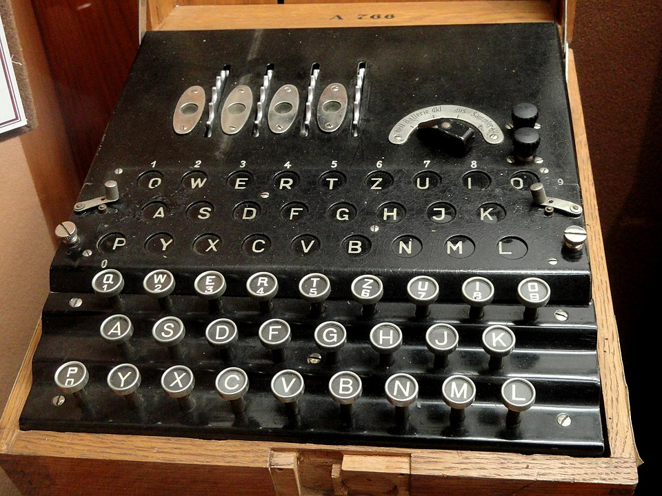

# Enigma D (Commercial Enigma / A26)

| Field | Value |
| ------- | ------- |
| Who | ChiMaAG (Chiffriermaschinen AG), Berlin; designer: Arthur Scherbius / Willi Korn |
| What | First Enigma with QWERTZ keyboard order and fully settable UKW; widely exported commercially; direct ancestor of all later Enigma machines |
| When | Introduced 1926; sold commercially through late 1920s and 1930s |
| Where | Manufactured in Berlin, Germany (52.5200°N, 13.4050°E); sold to UK, Sweden, Austria, Italy, Spain, and other countries |
| Related | [Arthur Scherbius](../profiles/arthur-scherbius.md), [Willi Korn](../profiles/willi-korn.md), [Enigma K Commercial](enigma-k-commercial.md) |



## Overview

The Enigma D (model A26, internal designator Ch.8) was the breakthrough commercial Enigma model of 1926. It was the first Enigma to adopt the **QWERTZ keyboard layout** (replacing the earlier
alphabetical layout) and the first to feature a fully **settable reflector (UKW) with 26 positions**. It became the direct mechanical ancestor of all subsequent Enigma machines, both commercial and
military. The GC&CS (British codebreakers) purchased serial A320 in 1926–1927, making it the machine on which Hugh Foss first theoretically analyzed Enigma's cryptographic properties in 1927.

## Technical Specifications

| Parameter | Value |
| ----------- | ------- |
| Official designation | Enigma D; model A26; internal: Ch.8 |
| Year introduced | 1926 |
| Rotor slots | 3 (removable; 6 possible orders) |
| Reflector | Fully settable UKW — 26 positions (first Enigma with this feature) |
| Plugboard | None |
| ETW | QWERTZUIOASDFGHJKPYXCVBNML (QWERTZ order — first Enigma with QWERTZ) |
| Ring setting (Ringstellung) | Note: ring attached to rotor body, not to letter ring — Ringstellung does NOT affect notch position (limitation fixed in later models) |
| Keyboard | QWERTZ order (first Enigma with this layout) |
| Features | Hinged top lid; rotors with letters (not numbers); 4-position power selector; spare bulbs in lid |
| Units produced | ~50–100 estimated (very rare) |

## Wiring

```text
ETW: QWERTZUIOASDFGHJKPYXCVBNML

I:   LPGSZMHAEOQKVXRFYBUTNICJDW  Notch: G  Turnover: Z (or Y on K)
II:  SLVGBTFXJQOHEWIRZYAMKPCNDU  Notch: G  Turnover: Z (or E on K)
III: CJGDPSHKTURAWZXFMYNQOBVLIE  Notch: G  Turnover: Z (or N on K)

UKW: IMETCGFRAYSQBZXWLHKDVUPOJN
```

**STAB (Kreuger, Sweden) Special Wiring** — rotors modified after delivery:

- I: PZ↔UV swapped
- II: JG↔CZ swapped
- III: AH↔QT swapped

## Historical Significance

Serial **A320** (purchased by GC&CS 1926–1927) is the machine on which **Hugh Foss** first demonstrated in 1927 that Enigma could theoretically be broken — the first known cryptanalytic study of any
Enigma machine. Foss's report was not acted upon immediately but established the British understanding of Enigma's structure. This same wiring knowledge later helped Knox break Spanish and Italian
Enigma K traffic in 1937.

## Known Surviving Machines

| Serial | Location |
| -------- | ---------- |
| A319 | Private collector, USA (rediscovered 2024) |
| A320 | GCHQ, UK |
| A343 | Known provenance — STAB/Ivar Kreuger, Sweden |
| A344 | Known |
| A345 | Known |

## Sources

- Crypto Museum: <https://cryptomuseum.com/crypto/enigma/d/index.htm>
- Crypto Museum wiring: <https://cryptomuseum.com/crypto/enigma/wiring.htm#13>
