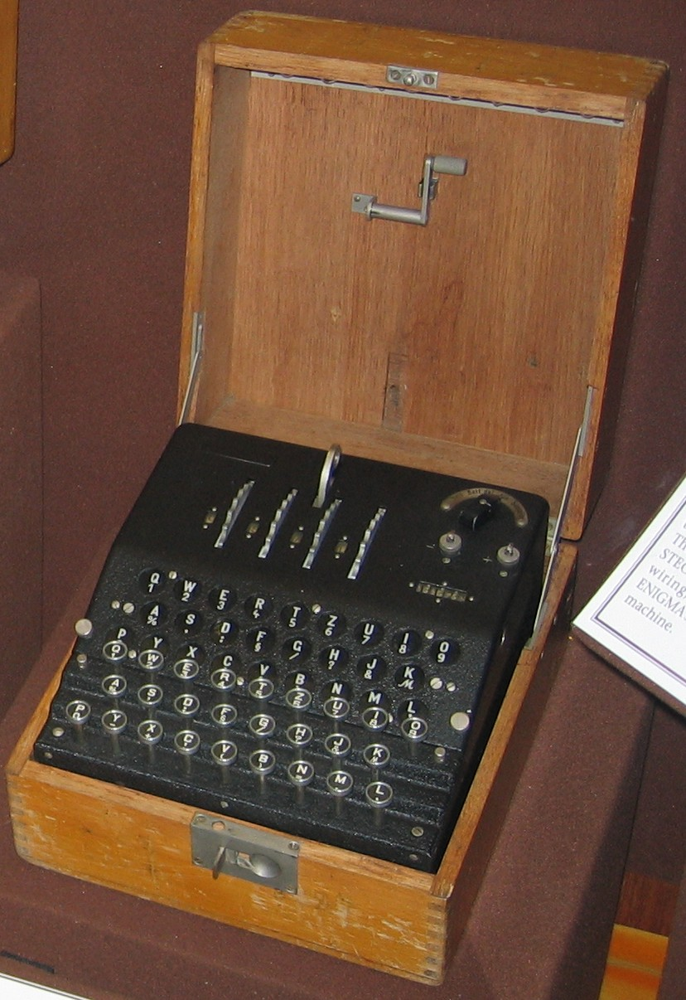

# Enigma G (Abwehr Enigma / G31)

| Field | Value |
| ------- | ------- |
| Who | ChiMaAG / Heimsoeth und Rinke (H&R) designer; Konski und Krüger (K&K) manufacturer |
| What | Cogwheel-driven Zählwerk Enigma used by German Abwehr (military intelligence); no plugboard — making it cryptographically weaker than military Enigma I |
| When | Introduced ~1931; used throughout WWII until broken by Dilly Knox 8 December 1941 |
| Where | Manufactured in Berlin, Germany (52.5200°N, 13.4050°E); used globally by Abwehr agents |
| Related | [Dilly Knox](../profiles/dilly-knox.md), [Arthur Scherbius](../profiles/arthur-scherbius.md), [Enigma I Wehrmacht](enigma-i-Wehrmacht.md), [Zählwerk A28](enigma-zählwerk-a28.md) |



## Overview

The Enigma G (G31) was the Abwehr (German military intelligence) variant of the Enigma machine, based on the Zählwerk (counter/cogwheel) design pioneered by the Zählwerk A28. Unlike the military
Enigma I, the G31 had **no plugboard** and used an irregular cogwheel-driven stepping mechanism rather than the standard ratchet. These features made it paradoxically weaker than the Enigma I, and it
was broken by Dilly Knox at Bletchley Park on 8 December 1941 — enabling the Double-Cross System that turned every German agent in the UK.

## Technical Specifications

| Parameter | Value |
| ----------- | ------- |
| Official designation | Enigma G; model G31; internal: Ch.15a |
| BP codename | "11-15-17 machine" (after notch counts on rotors I/II/III) |
| Popular name | Abwehr Enigma |
| Rotor slots | 3 (from standard set; also 5-rotor version Ch.15b for Hungarian Army) |
| Notch counts | I: 17 notches; II: 15 notches; III: 11 notches (also optional IV: ~9; V: ~7) |
| Reflector | Driven UKW — settable AND moves during encipherment (unique feature) |
| Plugboard | None |
| ETW | QWERTZUIOASDFGHJKPYXCVBNML |
| Stepping | Irregular cogwheel-driven; no double-stepping anomaly |
| Counter | 4-digit mechanical counter (increments per key press) |
| Crank | Yes — for corrections |
| Transit case | 25 × 27 × 16.5 cm (smaller than Enigma K) |
| Battery | Two 4.5V flat batteries in parallel |
| Units produced | ~350 (per Willi Korn's personal notes) |

## Variants by Internal Designator

| Designator | Description |
| ------------ | ------------- |
| Ch.15a | Standard (majority of surviving machines) |
| Ch.15b | With 28-pin socket for Enigma H29 printer; e.g. G111 (Hungarian Army) — comes with 5 rotors |
| Ch.15c | Fixed UKW + plugboard (2 prototypes only; no confirmed survivors) |

## Rotor Wiring (Standard G31)

```text
ETW: QWERTZUIOASDFGHJKPYXCVBNML

Standard commercial wiring:
I:   LPGSZMHAEOQKVXRFYBUTNICJDW  17 notches
II:  SLVGBTFXJQOHEWIRZYAMKPCNDU  15 notches
III: CJGDPSHKTURAWZXFMYNQOBVLIE  11 notches
UKW: IMETCGFRAYSQBZXWLHKDVUPOJN
```

## Known Surviving Machines and Their Wiring

### G111 (Hungarian Army, Ch.15b)

```text
I:   WLRHBQUNDKJCZSEXOTMAGYFPVI  (17 notches)
II:  TFJQAZWMHLCUIXRDYGOEVBNSKP  (15 notches)
V:   QTPIXWVDFRMUSLJOHCANEZKYBG  (7 notches)
```

### G228 (Abwehr "Green" network / Grün)

```text
I:   JDZLYKXVOUCMRAGTSBIWQHPENF
II:  SKQXFDVNGMUETJBRZLAHYWIODP
III: GRMKJBSAIXHWDQUYOEZVPNLFCT
UKW: RULQMZJSYGOCETKWDAHNBXPVIF  ← Rewired UKW
```

### G260 (Abwehr; spy Johann Becker, Argentina)

```text
I:   RCSPBLKQAUMHWYTIFZVGOJNEXD
II:  WCMIBVPJXAROSGNDLZKEYHUFQT
III: FVDHZELSQMAXOKYIWPGCBUJTNR
UKW: IMETCGFRAYSQBZXWLHKDVUPOJN (standard)
```

### G312 (Bletchley Park collection)

```text
I:   DMTWSILRUYQNKFEJCAZBPGXOHV
II:  HQZGPJTMOBLNCIFDYAWVEUSRKX
III: UQNTLSZFMREHDPXKIBVYGJCWOA
UKW: RULQMZJSYGOCETKWDAHNBXPVIF  ← Rewired UKW
```

## Intelligence Significance

Breaking the Abwehr Enigma on **8 December 1941** (by Dilly Knox and his team at BP, including Mavis Lever/Batey) was arguably the most strategically important single cryptographic break of WWII:

- Enabled the **Double-Cross System** (XX Committee): MI5 turned all German agents in the UK into double agents, feeding false intelligence to Berlin
- **Operation Fortitude**: Before D-Day, all German agent traffic to Berlin was read — confirming Hitler believed the invasion would land at Pas-de-Calais, not Normandy. This kept Panzer reserves in
  the wrong location on 6 June 1944.
- The ISK (Illicit Signals Knox) section produced 140,800 decrypts from Abwehr Enigma traffic

## Where to See Surviving Machines

| Serial | Location |
| -------- | ---------- |
| G219 | Crypto Museum, Netherlands (restored, on display) |
| G228 | Glen Miranker collection, USA (ex-Argentina, 2015) |
| G260 | NCM/NSA Museum, Fort Meade, Maryland, USA (ex-Becker spy case, Argentina) |
| G312 | Bletchley Park Museum, UK — famously stolen 2000, recovered 2000 |
| G274 | Private collection (Günter Hütter, Austria) |
| G111 | Private collector (auction Hermann Historica München 2009, restored 2018) |

## Sources

- Crypto Museum: <https://cryptomuseum.com/crypto/enigma/g/index.htm>
- Crypto Museum G111: <https://cryptomuseum.com/crypto/enigma/g/g111.htm>
- Wikipedia: Enigma machine
- Hamer/Sullivan/Weierud, *Cryptologia* (1998)
