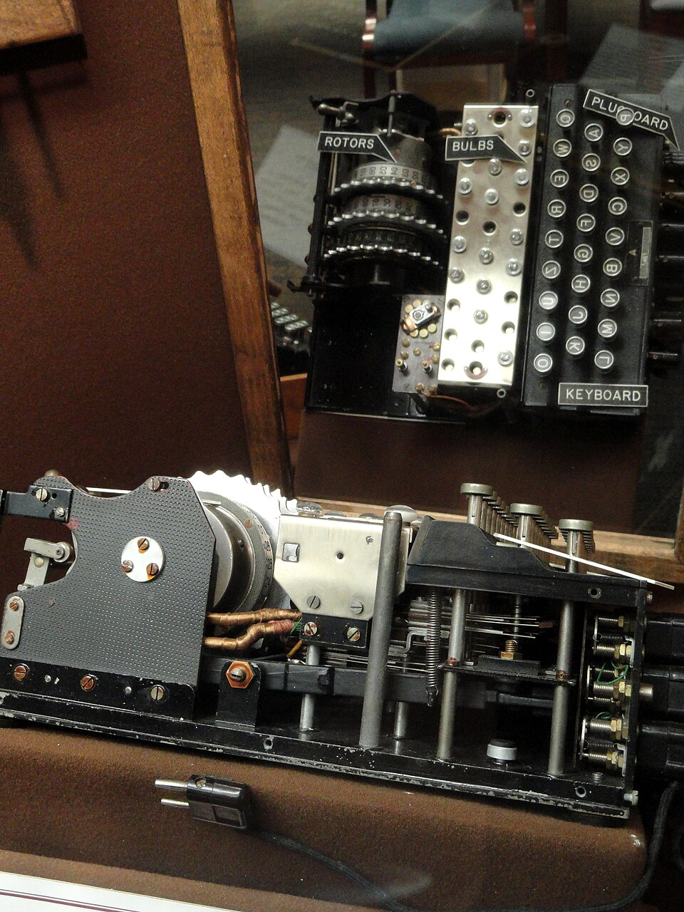
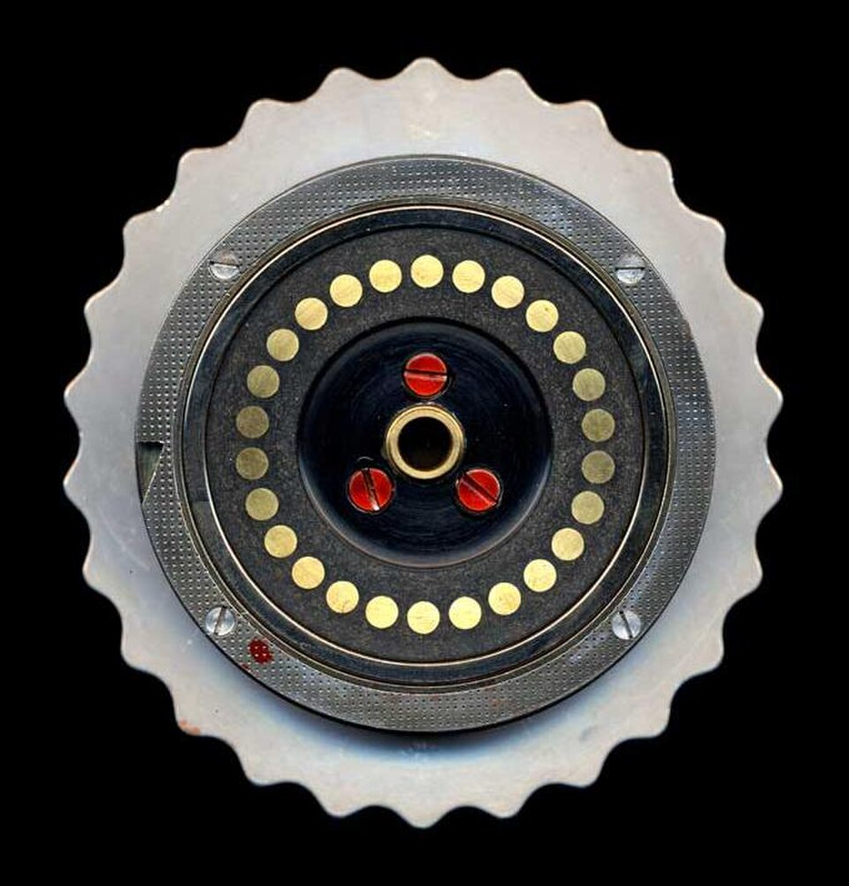
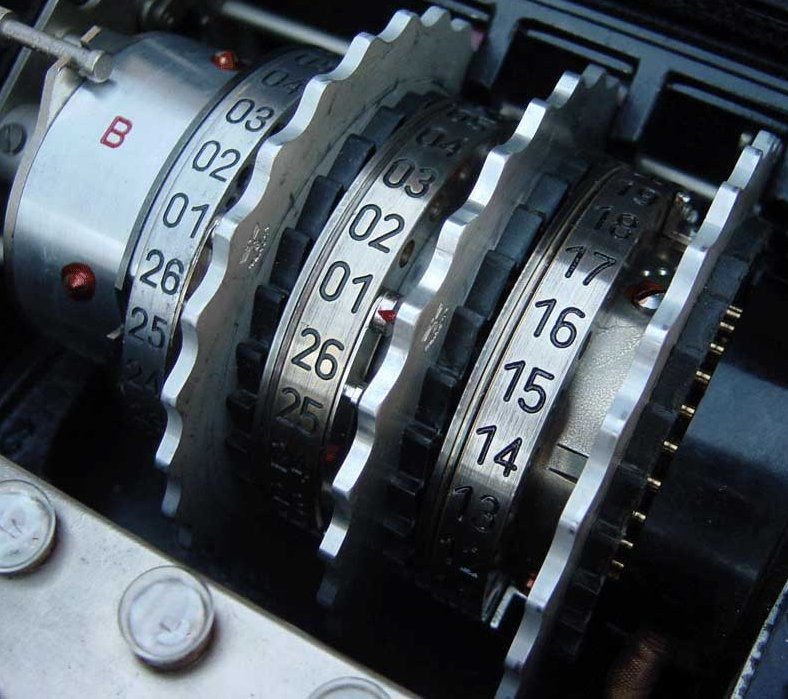

# Enigma I (Wehrmacht Enigma)

| Field | Value |
| ------- | ------- |
| Who | Arthur Scherbius (original design); ChiMaAG / Heimsoeth und Rinke (manufacturer) |
| What | Military 3-rotor Enigma with plugboard; primary encryption machine of German Army and Luftwaffe in WWII |
| When | Prototype 1927 (Ch.11a); production model introduced 1930; used throughout WWII until 1945 |
| Where | Manufactured in Berlin, Germany (52.5200°N, 13.4050°E); deployed worldwide |
| Related | [Arthur Scherbius](../profiles/arthur-scherbius.md), [Marian Rejewski](../profiles/marian-rejewski.md), [Gordon Welchman](../profiles/gordon-welchman.md), [Enigma M3](enigma-m3-naval.md) |








## Overview

The Enigma I, known as the Wehrmacht Enigma or Heeresmaschine (Army Machine), was the standard encryption device of the German Army (Heer) and Air Force (Luftwaffe) throughout World War II. It was
the principal target of Allied codebreakers at Bletchley Park and the source of the majority of ULTRA intelligence.

## Technical Specifications

| Parameter | Value |
| ----------- | ------- |
| Official designation | Enigma I (Roman numeral 1) |
| Factory designators | Ch.11a (1927 prototype) → Ch.11f (production) |
| Rotor slots | 3 (moving cipher rotors) |
| Available rotors | I, II, III (from 1930); IV, V added 15 December 1938 |
| Rotor order choices | Initially 6 (from 3 rotors); from Dec 1938: 60 (from 5 rotors) |
| Reflector (UKW) | Fixed (not operator-settable); UKW-A (pre-WWII), UKW-B (standard WWII), UKW-C (late war), UKW-D (field-rewirable, Luftwaffe from Jan 1944) |
| Plugboard (Steckerbrett) | Yes — 10 cable pairs standard (up to 13); exclusive to military Enigmas |
| Entry wheel (ETW) | ABCDEFGHIJKLMNOPQRSTUVWXYZ (alphabetical) |
| Keyboard layout | QWERTZ |
| Alphabet positions | 26 per rotor (numbered 01–26) |
| Stepping mechanism | Regular Enigma stepping; 1 notch per rotor; double-stepping anomaly present |
| Total units produced | >20,000 (multiple manufacturers) |
| Dimensions | Approx. 340 × 280 × 150 mm |

## Rotor Wiring

```text
ETW: ABCDEFGHIJKLMNOPQRSTUVWXYZ  (alphabetical)

I:   EKMFLGDQVZNTOWYHXUSPAIBRCJ  Notch: Y  Turnover: Q
II:  AJDKSIRUXBLHWTMCQGZNPYFVOE  Notch: M  Turnover: E
III: BDFHJLCPRTXVZNYEIWGAKMUSQO  Notch: D  Turnover: V
IV:  ESOVPZJAYQUIRHXLNFTGKDCMWB  Notch: R  Turnover: J
V:   VZBRGITYUPSDNHLXAWMJQOFECK  Notch: H  Turnover: Z

UKW-A: EJMZALYXVBWFCRQUONTSPIKHGD  (pre-WWII)
UKW-B: YRUHQSLDPXNGOKMIEBFZCWVJAT  (standard WWII)
UKW-C: FVPJIAOYEDRZXWGCTKUQSBNMHL  (late war)
```

## Cryptographic Security

The Enigma I's theoretical keyspace with 5 rotors, plugboard (10 pairs), and ring settings was approximately **10^23** — far beyond any manual attack. Its exploitable weaknesses were:

1. **No letter encrypts to itself** (reflector property) — the single most important cryptanalytic exploit
2. **Double-stepping anomaly** — the middle rotor steps twice in one position cycle, reducing effective period from 17,576 to 16,900
3. **Predictable message formats** — weather reports, standard openings ("WETTER FÜR DIE NACHT…"), repeated stereotyped text provided cribs
4. **Operator errors** — reuse of indicator settings, lazy key choices (e.g. "CCC", "AAA"), known-plaintext from repeated messages

## Military Networks (Bletchley Codenames)

| BP Codename | Service | Broken |
| ------------- | --------- | -------- |
| RED | Luftwaffe general | Yes (primary ULTRA source) |
| BLUE | Luftwaffe operational | Yes |
| BROWN | Luftwaffe command | Yes |
| CHAFFINCH | Army | Yes |
| WASP | Army | Yes |

## Historical Significance

- First broken by **Marian Rejewski** (Polish Cipher Bureau) in **December 1932** using permutation group theory — 7 years before WWII
- At the Pyry conference (25 July 1939), Poland gave all their Enigma research to Britain and France — enabling all subsequent Bletchley Park work
- The British Bombe (first operational 18 March 1940) automated the breaking of daily Enigma settings
- ULTRA intelligence derived from Enigma I decrypts is estimated to have shortened WWII by 2–4 years (Sir Harry Hinsley)

## Special Variants

### Norway Enigma (Norenigma)

Post-war modification by Norwegian Police Security Service (Overvaakingspolitiet) after 1945. Rotors I–V and UKW fully rewired.

### Sondermaschine (S-series)

Late-war special wiring for unidentified intelligence unit. Machines marked with suffix 'S' (e.g. 1807 S, 17245 S, 17401 S, 19872 S).

## Optional Accessories

| Accessory | Function |
| ----------- | ---------- |
| Schreibmax (MZSE) | Printer attachment replacing lamp panel; prints to paper tape |
| Lesegerät MZL | External lamp panel |
| Enigma Uhr (UhrBox) | 40-position switch providing 40× more Steckerbrett combinations |
| UKW-D | Field-rewirable reflector (Luftwaffe, Jan 1944) |

## Surviving Examples

Major collections include: Imperial War Museum (London), GCHQ (UK), NSA/NCM (Fort Meade, Maryland, USA), Bletchley Park Museum, Deutsches Museum (Munich), Australian War Memorial, Science Museum
(London), and numerous private collectors. Several hundred machines survive worldwide.

## Sources

- Crypto Museum: <https://cryptomuseum.com/crypto/enigma/i/index.htm>
- Crypto Museum wiring: <https://cryptomuseum.com/crypto/enigma/wiring.htm#16>
- Wikipedia: Enigma machine — <https://en.wikipedia.org/wiki/Enigma_machine>
- Hinsley et al., *British Intelligence in the Second World War* (1979–1990)
