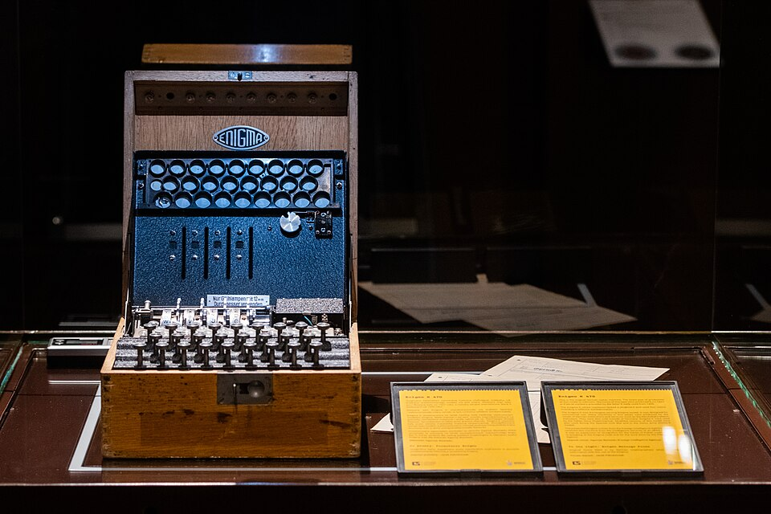

# Enigma K (Commercial Enigma / A27)

| Field | Value |
| ------- | ------- |
| Who | ChiMaAG (until 1934); Heimsoeth und Rinke (H&R) after 1934; manufactured by Konski und Krüger (K&K) |
| What | Commercial/diplomatic Enigma without plugboard; sold to Austria, Spain, Italy, Sweden, Croatia; broken by Dilly Knox and Mavis Lever in Spanish Civil War and WWII |
| When | Introduced 1927; sold commercially through 1940s; used in various nations into WWII |
| Where | Manufactured in Berlin-Tempelhof, Germany (52.4700°N, 13.3900°E); used across Europe |
| Related | [Dilly Knox](../profiles/dilly-knox.md), [Enigma D Commercial](enigma-d-commercial.md), [Swiss-K Enigma](enigma-k-swiss.md), [Enigma T Tirpitz](enigma-t-tirpitz.md), [Railway Enigma](enigma-k-railway.md) |



## Overview

The Enigma K (model A27, internal Ch.11b) was the principal commercial and diplomatic Enigma sold outside Germany throughout the late 1920s and 1930s. It was the base machine from which the Swiss-K,
Railway Enigma, Enigma KD, and Enigma T were all derived. Unlike the military Enigma I, it had no plugboard — but its wiring was used by multiple national armies, navies, and diplomatic services. The
Spanish Civil War (1936–1939) gave British codebreakers their first opportunity to break Enigma-encrypted operational traffic.

## Technical Specifications

| Parameter | Value |
| ----------- | ------- |
| Official designation | Enigma K; model A27; internal: Ch.11b |
| US codename | INDIGO |
| Year introduced | 1927 |
| Rotor slots | 3 (removable; 6 possible orders) |
| Reflector | Settable UKW; 26 positions |
| Plugboard | None |
| ETW | QWERTZUIOASDFGHJKPYXCVBNML |
| Notch design | Notch now attached to letter ring (unlike Enigma D) — Ringstellung now cryptographically significant |
| Keyboard | QWERTZ order; numbers 0–9 above upper lamp row |
| Dimensions | 300 × 280 × 155 mm (incl. wooden case) |
| Weight | 10.6 kg |
| Units produced | ~614 estimated (excluding 265 Swiss-K machines) |

## Wiring (Standard Commercial)

```text
ETW: QWERTZUIOASDFGHJKPYXCVBNML

I:   LPGSZMHAEOQKVXRFYBUTNICJDW  Notch: G  Turnover: Y
II:  SLVGBTFXJQOHEWIRZYAMKPCNDU  Notch: M  Turnover: E
III: CJGDPSHKTURAWZXFMYNQOBVLIE  Notch: V  Turnover: N

UKW: IMETCGFRAYSQBZXWLHKDVUPOJN
```

## Special Wiring Schemes (Spain/Italy)

### Scheme D (Italian Navy / Spanish Naval Attaché)

```text
I:   CIAHFQUYBXNUWJLVGEMSZKPDTR  Notch: G  Turnover: Y
II:  KEDXVBSQHNCZTRUFLOAYWIPMJG  Notch: M  Turnover: E
III: NUJPHWFMGDOBAVZQTXECLKYSIR  Notch: V  Turnover: N
UKW: IMETCGFRAYSQBZXWLHKDVUPOJN
```

### Scheme F (Condor Legion / Spain)

```text
I:   HFOTWPDURMCGXKLQEIVZAKBNAY  Notch: G  Turnover: Y
II:  MUHTASIPJYNCVKLOXFDZEGQBWR  Notch: M  Turnover: E
III: DKWOJVUNGLFTZCSYIBEARHXQPM  Notch: V  Turnover: N
UKW: IMETCGFRAYSQBZXWLHKDVUPOJN
```

## Major Users

| Country / Organisation | Variant/Scheme | Period |
| ------------------------ | --------------- | -------- |
| Austria (Army) | Standard commercial | 1930s |
| Spain (various forces) | Scheme D, F | Spanish Civil War 1936–1939 |
| Italy (Army, Air Force) | Standard | 1930s–WWII |
| Italy (Navy) | Scheme D | 1930s–1941 |
| Condor Legion (Nazi/Spain) | Scheme F | 1936–1939 |
| Sweden (STAB/Ivar Kreuger) | Modified | 1920s–1930s |
| Croatia | Standard | WWII |

## Breaking History

| Break | By | When | Method |
| ------- | ----- | ------ | -------- |
| Theoretical analysis (Enigma D/K) | Hugh Foss (GC&CS) | 1927 | Mathematical analysis of purchased A320 |
| Spanish Civil War traffic | Dilly Knox + Bodsworth (GC&CS) | 1937 | Cribs from stereotyped Spanish military messages |
| Italian Navy K (Battle of Cape Matapan) | Dilly Knox + Mavis Lever (ISK) | March 1941 | Repeated test message that violated "no letter encrypts to itself" rule |

The Italian Navy break in March 1941 directly contributed to the **Battle of Cape Matapan** (28 March 1941) — the Royal Navy ambushed Italian cruisers using advance intelligence from Enigma decrypts,
sinking 3 heavy cruisers and 2 destroyers.

## Sub-Variants

The Enigma K chassis (A27/Ch.11b) was the basis for:

- [Swiss-K Enigma](enigma-k-swiss.md) — 265 machines with Swiss modifications
- [Railway Enigma (Rocket I)](enigma-k-railway.md) — ~10 machines for German Reichsbahn
- [Enigma KD](enigma-kd.md) — Mil Amt variant with UKW-D
- [Enigma T (Tirpitz)](enigma-t-tirpitz.md) — Japanese liaison, 8 rotors

## Sources

- Crypto Museum: <https://cryptomuseum.com/crypto/enigma/k/index.htm>
- Crypto Museum wiring: <https://cryptomuseum.com/crypto/enigma/wiring.htm#29>
