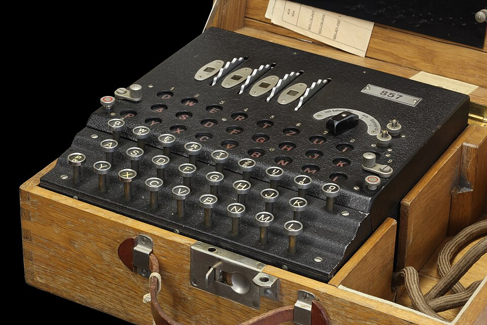

# Swiss-K Enigma

| Field | Value |
| ------- | ------- |
| Who | H&R (Germany, original design); Swiss Army and Air Force (operators); H. Bischhausen (Lesegerät); H. Stucki Transformatorenbau, Bern (PSU) |
| What | Swiss-modified Enigma K with rewired rotors; used by Swiss Army, Air Force, and Foreign Ministry; broken by Bletchley Park and France |
| When | 1939 (first batch); 1940 (main batch); decommissioned 1946; reused 1953 for UN Korea armistice |
| Where | Machines manufactured in Berlin (52.5200°N, 13.4050°E); PSU manufactured in Bern, Switzerland (46.9480°N, 7.4474°E); used throughout Switzerland |
| Related | [Enigma K Commercial](enigma-k-commercial.md), [Enigma D Commercial](enigma-d-commercial.md) |



## Overview

The Swiss Armed Forces purchased 265 Enigma K machines from Germany in 1939–1940 and immediately rewired all rotors after delivery, believing this would provide security against German code-breaking.
Ironically, British Bletchley Park broke Swiss diplomatic traffic from September 1939 (Colonel Tiltman), and French intelligence broke Swiss Army traffic — with the Swiss discovering the French break
in 1941. The machines were replaced by the Swiss-designed **NEMA** (Neue Maschine) in 1946.

## Technical Specifications

| Parameter | Value |
| ----------- | ------- |
| Base model | Enigma K (A27/Ch.11b) |
| Swiss Army units | 102 |
| Swiss Air Force units | 163 |
| Total | 265 |
| Rotor modifications | Swiss rewired all rotors (I, II, III) immediately after delivery |
| ETW | Unchanged: QWERTZUIOASDFGHJKPYXCVBNML |
| UKW | Unchanged commercial wiring: IMETCGFRAYSQBZXWLHKDVUPOJN |
| Stepping mechanism | Modified: rightmost rotor made stationary; middle rotor steps every key press |
| External lamp panel | Lesegerät added (wider Swiss wooden case) |
| PSU | Transformer added (H. Stucki, Bern) |
| Decommissioned | 1946 |
| Reused | 1953 — loaned to UN for Korea armistice monitoring communications |
| Successor | NEMA (Neue Maschine), introduced 1946 |

## Swiss Air Force Wiring (Only Known Service Wiring)

```text
ETW: QWERTZUIOASDFGHJKPYXCVBNML  (unchanged)

I:   PEZUOHXSCVFMTBGLRINQJWAYDK  Notch: G  Turnover: Y
II:  ZOUESYDKFWPCIQXHMVBLGNJRAT  Notch: M  Turnover: E
III: EHRVXGAOBQUSIMZFLYNWKTPDJC  Notch: V  Turnover: N

UKW: IMETCGFRAYSQBZXWLHKDVUPOJN  (unchanged)
```

> Note: Swiss Army and Foreign Ministry wiring is unknown — both were rewired separately from Air Force.

## Breaking History

| Break | By | When |
| ------- | ----- | ------ |
| Swiss diplomatic traffic | BP Colonel Tiltman | September 1939 |
| Swiss Army traffic | French intelligence | 1939–1941 |
| Swiss diplomatic (German) | German OKW/Chi | 1939–end of war |

The Swiss discovered the French break in 1941 — accelerating the decision to replace Enigma with NEMA.

## Surviving Machines

| Serial | Location |
| -------- | ---------- |
| K769 | Günter Hütter collection, Austria |
| K772 | RR Auctions, 2026 sale |
| K774 | Crypto Museum, Netherlands |
| K776 | Private collection, Switzerland |
| K779 | Glen Miranker collection, USA |
| K787 | Crypto Museum, Netherlands |

## Sources

- Crypto Museum: <https://cryptomuseum.com/crypto/enigma/k/swiss.htm>
- Ritter (1996); Landwehr (2020)
