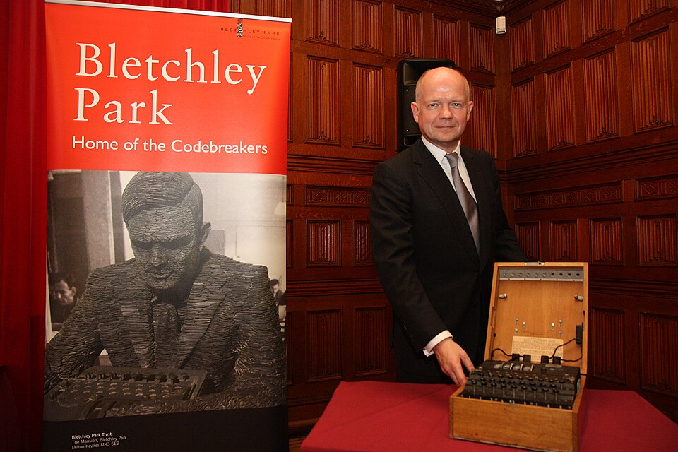

# Enigma M4 (Naval 4-Rotor)

| Field | Value |
| ------- | ------- |
| Who | Heimsoeth und Rinke (H&R) designer; Konski und Krüger (K&K) and Olympia (manufacturers) |
| What | German Kriegsmarine 4-rotor Enigma; used by U-boats (TRITON/SHARK procedure) and battleships (NEPTUN); caused 10-month Allied blackout Feb–Dec 1942 |
| When | Distributed from May 1941; activated 1 February 1942; used until end of WWII |
| Where | Manufactured in Berlin-Tempelhof, Germany (52.4700°N, 13.3900°E); deployed globally aboard U-boats and warships |
| Related | [Alan Turing](../profiles/alan-turing.md), [Hugh Alexander](../profiles/hugh-alexander.md), [Enigma M3](enigma-m3-naval.md), [Enigma I Wehrmacht](enigma-i-Wehrmacht.md) |



## Overview

The Enigma M4 was the German Kriegsmarine's most secure Enigma variant, adding a fourth non-rotating rotor to the standard three-rotor mechanism. Its introduction on 1 February 1942 caused a
catastrophic 10-month blackout at Bletchley Park during which Allied shipping losses in the Battle of the Atlantic were devastating — a period German U-boat crews called "the Second Happy Time."
Breaking the M4 required capturing key material from U-559 (October 1942) and the development of high-speed 4-rotor Bombes.

## Technical Specifications

| Parameter | Value |
| ----------- | ------- |
| Official designation | Enigma M4; internal: Ch.11g4 |
| Allied codenames | SHARK (U-boat/TRITON procedure); NEPTUN (battleship procedure) |
| Rotor slots | 4 (3 moving + 1 fixed Zusatzwalze) |
| Moving rotors | 3 from set of 8 (I–VIII); same as M3 |
| 4th rotor (Zusatzwalze) | Beta (β) or Gamma (γ) — fixed, does NOT rotate |
| Thin reflectors | UKW-b (thin UKW-B) and UKW-c (thin UKW-C) — physically thinner to fit 4th rotor |
| M3-compatible mode | Setting Zusatzwalze to position 'A' = fully compatible with M3 |
| Plugboard (Steckerbrett) | Yes |
| ETW | ABCDEFGHIJKLMNOPQRSTUVWXYZ |
| Case | Removable lid (not hinged) — practical in U-boat space |
| Total manufactured | 9,649 units (K&K: 6,199; Olympia: 3,450) |

## Rotor Wiring

```text
4th Rotor (Zusatzwalze):
Beta:  LEYJVCNIXWPBQMDRTAKZGFUHOS  (does not move; no notch)
Gamma: FSOKANUERHMBTIYCWLQPZXVGJD  (does not move; no notch)

Thin Reflectors:
UKW-b (thin): ENKQAUYWJICOPBLMDXZVFTHRGS
UKW-c (thin): RDOBJNTKVEHMLFCWZAXGYIPSUQ

Naval-Exclusive Rotors VI–VIII:
VI:   JPGVOUMFYQBENHZRDKASXLICTW  Notches: H+U (2 notches)  Turnover: Z+M
VII:  NZJHGRCXMYSWBOUFAIVLPEKQDT  Notches: H+U (2 notches)  Turnover: Z+M
VIII: FKQHTLXOCBJSPDZRAMEWNIUYGV  Notches: H+U (2 notches)  Turnover: Z+M
```

## The Activation and Blackout

- **September 1941**: M4 machines secretly distributed to U-boat commanders
- **1 February 1942**: TRITON procedure activated; all U-boat traffic moved to M4
- **Result**: Immediate and complete blackout at Bletchley Park — Hut 8 lost all U-boat intelligence
- **February–December 1942**: Allied shipping losses catastrophic (~6 million tons); this 10-month period coincided with peak U-boat success
- **30 October 1942**: HMS Petard captured documents from **U-559** (sinking in Mediterranean); Lt. Francis Fasson and AB Colin Grazier swam to the sinking submarine, retrieved the short signal book
  and Wetterkurzschlüssel. Both drowned when U-559 suddenly sank. Their sacrifice provided the critical short-signal cribs.
- **December 1942**: BP Hut 8 broke M4 using U-559 materials plus US 4-rotor Bombes. Regular reading resumed.

## Breaking the M4

**Key insight (December 1941)**: Before M4 activation, a U-boat accidentally sent a message with the 4th rotor in wrong position (simulating M3 mode), then retransmitted correctly — comparison
  revealed the 4th rotor did NOT rotate, allowing separate analysis.

**Capture materials**: U-559 documents provided short signal book and weather cipher, giving known-plaintext cribs for 4-rotor Bombe attacks.

**American contribution**: US Navy OP-20-G developed high-speed 4-rotor Bombes faster than British models — critical to breaking Shark.

## Optional Accessories

| Accessory | Function |
| ----------- | ---------- |
| Schreibmax | Printer replacing lamp panel; critical for silent/lights-out U-boat operation |
| Lesegerät (MZL) | External lamp panel |
| UKW-D | Field-rewirable reflector (Naval version available) |

## Surviving Examples

Several dozen survive. Notable: NSA/NCM Museum (Fort Meade, Maryland), Bletchley Park Museum, Deutsches Museum (Munich), and private collections. Machine M2990 retains its original Begleitbuch
(maintenance booklet).

## Sources

- Crypto Museum: <https://cryptomuseum.com/crypto/enigma/m4/index.htm>
- Crypto Museum wiring: <https://cryptomuseum.com/crypto/enigma/wiring.htm#21>
- Wikipedia: Enigma machine — <https://en.wikipedia.org/wiki/Enigma_machine>
- Wikipedia: Cryptanalysis of the Enigma — <https://en.wikipedia.org/wiki/Cryptanalysis_of_the_Enigma>
