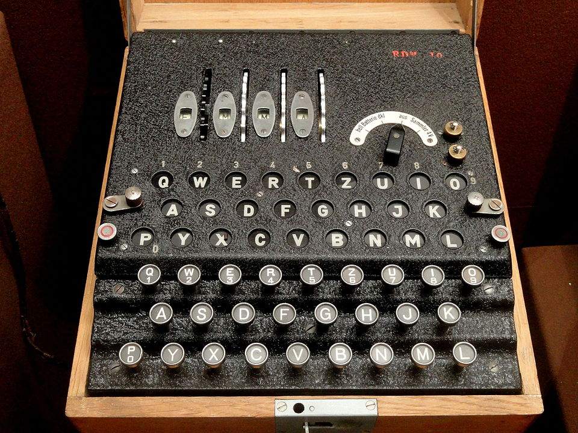

# Enigma T (Tirpitz)

| Field | Value |
| ------- | ------- |
| Who | Heimsoeth und Rinke (H&R) designer; Konski und Krüger (K&K) manufacturer; jointly operated by German Navy (Kriegsmarine) and Imperial Japanese Navy |
| What | 8-rotor Enigma variant for Japanese–German liaison communications; unique non-standard ETW; only Enigma known to have been used by two Axis powers |
| When | Agreement signed 11 September 1942; used from 1942 through WWII |
| Where | Manufactured in Berlin, Germany (52.5200°N, 13.4050°E); stations in Tokyo (35.6762°N, 139.6503°E), Berlin, Stockholm (59.3293°N, 18.0686°E), and Bern (46.9480°N, 7.4474°E) |
| Related | [Enigma K Commercial](enigma-k-commercial.md), [Enigma I Wehrmacht](enigma-i-Wehrmacht.md) |



## Overview

The Enigma T (codenamed TIRPITZ by Germany, TIRUPITSU by Japan) was a unique variant of the Enigma K designed for secure communication between the German Kriegsmarine and the Imperial Japanese Navy.
It has the distinction of being the only Enigma variant used by a non-German power in operational service. The machine features 8 available rotors (each with 5 turnover notches), a unique
non-standard entry wheel (the only Enigma with a non-QWERTZ, non-alphabetical ETW), and a specially wired reflector.

## Technical Specifications

| Parameter | Value |
| ----------- | ------- |
| Official designation | Enigma T; model A27 (modified); Ch.11b |
| German codename | TIRPITZ |
| Japanese codename | TIRUPITSU |
| US codename | OPAL; traffic designation JN-18; Japanese-German Joint Use Code No. 3 |
| Rotor slots | 3 from a set of 8 (I–VIII) |
| Notches per rotor | 5 (frequent stepping; all 5 sets are at specific positions) |
| Reflector | Settable UKW; uniquely wired for Japanese use |
| Plugboard | None |
| ETW | KZROUQHYAIGBLWVSTDXFPNMCJE ← THE ONLY NON-STANDARD ETW IN ALL ENIGMA |
| Alphabet positions | 26 |
| Optional UKW advance | Operator could advance UKW by 1 position manually after every 5th 5-letter group |
| Units ordered | 800 (Japan) + 400 initially (Germany) |
| Units delivered | ~300–400 estimated; ~70 captured near Lorient, France (August 1944) |
| Manufactured | Berlin, Germany (K&K / H&R) |
| Dimensions/Weight | 300 × 280 × 155 mm; 10.6 kg |

## Rotor Wiring

```text
ETW: KZROUQHYAIGBLWVSTDXFPNMCJE  ← UNIQUE (only non-standard ETW in all Enigma)

I:   KPTYUELOCVGRFQDANJMBSWHZXI  Notches: E,H,M,S,Y (5)  Turnover: W,Z,E,K,Q
II:  UPHZLWEQMTDJXCAKSOIGVBYFNR  Notches: E,H,N,T,Z (5)  Turnover: W,Z,F,L,R
III: QUDLYRFEKONVZAXWHMGPJBSICT  Notches: E,H,M,S,Y (5)  Turnover: W,Z,E,K,Q
IV:  CIWTBKXNRESPFLYDAGVHQUOJZM  Notches: E,H,N,T,Z (5)  Turnover: W,Z,F,L,R
V:   UAXGISNJBVERDYLFZWTPCKOHMQ  Notches: G,K,N,S,Z (5)  Turnover: Y,C,F,K,R
VI:  XFUZGALVHCNYSEWQTDMRBKPIOJ  Notches: F,M,Q,U,Y (5)  Turnover: X,E,I,M,Q
VII: BJVFTXPLNAYOZIKWGDQERUCHSM  Notches: G,K,N,S,Z (5)  Turnover: Y,C,F,K,R
VIII:YMTPNZHWKODAJXELUQVGCBISFR  Notches: F,M,Q,U,Y (5)  Turnover: X,E,I,M,Q

UKW: GEKPBTAUMOCNILJDXZYFHWVQSR
```

## Key Procedures

| Key List | Period |
| ---------- | -------- |
| TIRPITZ procedure | From 1 August 1943 |
| GARTENZAUN 1 | August–December 1943 |
| GARTENZAUN 2 | January 1944–end of war |

## Allied Cryptanalysis

JN-18 traffic was rarely intercepted in volume, making systematic cryptanalysis difficult. Analysis was primarily carried out by US Navy OP-20-G. Only 4 original messages were published (Weierud
2009), and a full cryptanalytic solution was published by Daniel Girard in *Cryptologia* (2016).

## Surviving Examples

| Serial | Location |
| -------- | ---------- |
| T47 | GCHQ, UK (internal collection) |
| T244 | Bletchley Park Museum, UK (donated by GCHQ, October 2007) |
| T209, T212, T214, T215, T216, T259, T314, T315, T318, T1436 | NSA/NCM Museum, Fort Meade, Maryland, USA |

## Sources

- Crypto Museum: <https://cryptomuseum.com/crypto/enigma/t/index.htm>
- Frode Weierud, *Cryptologia* (1999)
- Daniel Girard, *Cryptologia* (2016)
