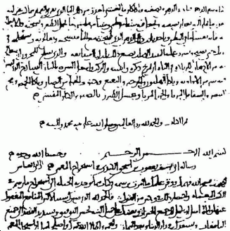

# Al-Kindi

| Field | Value |
| ------- | ------- |
| Who | Abū Yūsuf Yaʻqūb ibn ʼIsḥāq aṣ-Ṣabbāḥ al-Kindī (known as "Al-Kindi" and in medieval Europe as "Alkindus") |
| What | Arab polymath; author of *Risalah fī Istikhraj al-Mu'amma* (c. 850 AD) — the world's first systematic treatise on cryptanalysis; inventor of frequency analysis, the technique that broke every monoalphabetic cipher including the Caesar cipher |
| When | c. 801 AD – c. 873 AD |
| Where | Born: Kufa, Iraq (32.0327°N, 44.4029°E); primary work: Baghdad, Iraq — House of Wisdom (*Bayt al-Ḥikma*) (33.3152°N, 44.3661°E) |
| Related | [Julius Caesar](julius-caesar.md), [Leon Battista Alberti](leon-battista-alberti.md), [Al-Kindi frequency analysis](../timeline/al-kindi-frequency-analysis-850.md) |

## Biography

Al-Kindi was born around 801 AD in Kufa (present-day Iraq) into an aristocratic family from the tribe of Kinda. He was educated in Basra and then Baghdad, where he became the leading philosopher at
the **House of Wisdom** (*Bayt al-Ḥikma*) — the great Abbasid translation and research centre under the patronage of the caliphs Al-Mamun and Al-Mu'tasim. He is known as "the philosopher of the
Arabs" and wrote treatises covering philosophy, mathematics, astronomy, medicine, music theory, optics, and cryptography.

## *Risalah fī Istikhraj al-Mu'amma* (c. 850 AD)

Around 850 AD, Al-Kindi wrote a short treatise entitled ***Risalah fī Istikhraj al-Mu'amma*** — *"A Manuscript on Deciphering Cryptographic Messages"*. The manuscript was lost to Western scholarship
until it was rediscovered in the Sulaymaniyah Ottoman Archive in Istanbul in **1987**, though Arab scholars had referenced it for centuries.

### Frequency Analysis

The treatise's revolutionary contribution was the systematic description of **frequency analysis**:

> *"One way to solve an encrypted message, if we know its underlying language, is to find a different plaintext of the same language long enough to fill one sheet or so, and then we count the
occurrences of each letter… We look at the ciphertext we want to solve and we also classify its symbols. We find the most occurring symbol and assign the most frequent letter in the plaintext
language to it."*
> — Al-Kindi, trans. Ibrahim Al-Kadi (1992)

The insight is simple but profound: **every language has a characteristic letter frequency**. In Arabic, *alif* (ا) appears far more often than *tha* (ث). In English, *e* appears ~13% of the time and
*z* less than 0.1%. A monoalphabetic cipher (like Caesar's) preserves these frequencies exactly — only the symbols change. By counting symbol frequencies in the ciphertext and matching them to known
plaintext frequencies, the substitution can be deduced.

### Polyalphabetic Ciphers as a Response

Al-Kindi's technique was so powerful that it immediately motivated the search for ciphers it *could not* defeat. **Leon Battista Alberti** (1467) explicitly proposed the cipher disc as a response to
frequency analysis. The **Vigenère cipher** (1553/1586) used multiple cipher alphabets to flatten frequencies. The entire history of cryptography from 850 to 1920 is, in large part, the struggle
between frequency analysis (in ever more sophisticated forms) and polyalphabetic substitution (in ever more complex implementations). The Enigma machine's rotating rotors are, at their deepest level,
a mechanical answer to the same problem Al-Kindi posed.

## Legacy

- Al-Kindi's frequency analysis remained the dominant cryptanalytic technique for **over 700 years**
- Charles Babbage's 1854 attack on Vigenère and Friedrich Kasiski's published 1863 version used its generalisation (*index of coincidence*)
- The technique culminates in the **Kasiski test** and **Index of Coincidence** analysis — both used against Enigma indicator keys in WWII
- His manuscript directly inspired **cryptology as a formal discipline**

## Note on Imagery

> ℹ️ *No portrait of Al-Kindi survives. A modern imaginary drawing is used in some references — this is labelled clearly as a modern artistic representation, not a historical likeness.*

## Sources

- Al-Kindi (translated Ibrahim Al-Kadi). "Origins of Cryptology: The Arab Contributions" — *Cryptologia*, Vol. 16(2), 1992
- Wikipedia: <https://en.wikipedia.org/wiki/Al-Kindi>
- Singh, Simon. *The Code Book* (Doubleday, 1999), Chapter 2
- Kahn, David. *The Codebreakers* (Scribner, 1967/1996)
