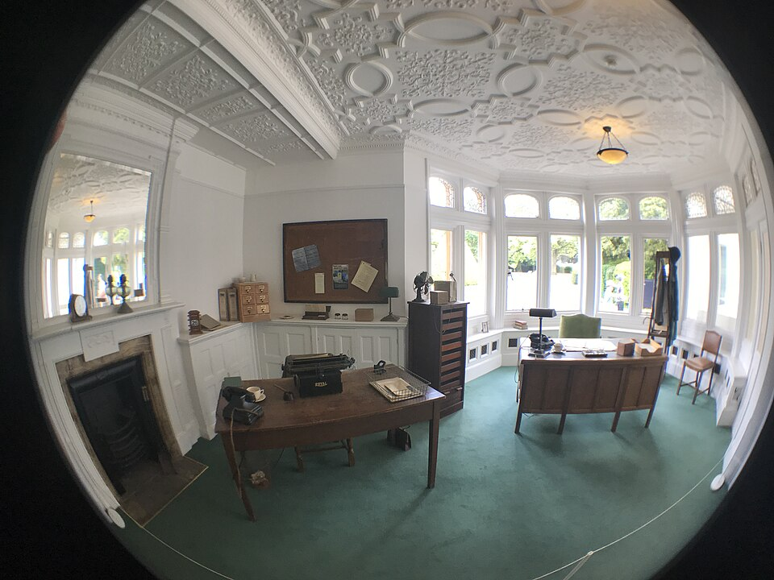

# Alastair Denniston

| Field | Value |
| ------- | ------- |
| Who | Commander Alastair Guthrie Denniston, CMG, CBE, RNVR |
| What | Head of the British Government Code and Cypher School (GC&CS) 1919–1942; founded Bletchley Park as the wartime SIGINT centre; recruited the civilian academic staff (chess players, mathematicians, crossword solvers) who broke Enigma |
| When | 1 December 1881 – 1 January 1961 |
| Where | Born: Greenock, Scotland (55.9440°N, 4.7570°W); GC&CS London HQ: Broadway Buildings, Westminster (51.4975°N, 0.1333°W); Bletchley Park: Milton Keynes, England (52.0015°N, 0.7404°W); transferred to Berkeley Street London from 1942 |
| Related | [Bletchley Park](../timeline/bletchley-park-1939.md), [Pyry conference](../timeline/pyry-conference-1939.md), [Alan Turing](alan-turing.md), [Edward Travis](edward-travis.md) |

## Biography

Alastair Denniston was born in Greenock, Scotland on 1 December 1881. He was educated at the University of Bonn and the Sorbonne in Paris, giving him German and French fluency that would define his
career. He played field hockey for Britain at the 1908 London Olympics (the GB team finished fourth).

During WWI he joined **Room 40** — the Admiralty's naval intelligence section that broke German naval codes. He was one of the very few Room 40 veterans retained in peacetime, and when the Government
Code and Cypher School (GC&CS) was established in **1919** as the successor to both Room 40 and the War Office's MI1(b), Denniston became its first operational head.

## Building Bletchley Park

In **August 1939**, recognising that war was imminent, Denniston took the defining action of his career: he moved GC&CS out of London to **Bletchley Park** — the Victorian country house in Milton
Keynes that would become Station X, the central Allied codebreaking establishment. He had acquired the property partly as a location outside the range of Luftwaffe bombers, and partly because it sat
astride the rail and phone links between Oxford and Cambridge — allowing rapid mobilisation of academic talent.

Denniston's greatest contribution to the war effort was arguably his **talent recruitment**. Breaking with the tradition of employing only retired military officers, he actively recruited:

- **Alan Turing** (Cambridge mathematician, recruited 1938 while still a fellow)
- **Gordon Welchman** (Cambridge algebraic geometry lecturer)
- **Hugh Alexander** (British chess champion)
- **Dilly Knox** (retained from Room 40)
- Dozens of crossword competition winners, classicists, and linguists

His famous August 1939 letter to likely recruits used the phrase *"a certain type of work"* as cover — yet enough understood to arrive at Bletchley when summoned.

## The Pyry Conference (25 July 1939)

Denniston personally led the British delegation to the **Pyry conference** in the Kabaty Woods near Warsaw, where the Polish Cipher Bureau handed over their Enigma research, Bombe designs, and two
working replica Enigma machines. He brought Dilly Knox and Humphrey Sandwith. This was one of the most significant intelligence transfers in history.

## Displacement and Legacy

By late 1941 Bletchley Park had grown far beyond its pre-war plans. The operation required management at a scale that exceeded Denniston's civilian administrative style. In **February 1942**, on
Churchill's insistence following the "Geese who laid the golden eggs" letter from Turing, Welchman, Alexander, and Milner-Barry, Denniston was **moved sideways** to head a new diplomatic section
(Berkeley Street, London) dealing with diplomatic ciphers — essentially a demotion. **Edward Travis** replaced him as head of BP.

Denniston's role in founding Bletchley and assembling its staff was not acknowledged in his lifetime. The Ultra secret was not declassified until 1974, thirteen years after his death on 1 January
1961.

> ⚠️ *No free portrait image is available — the only Denniston image used by Wikipedia is tagged non-free/fair-use and cannot be used here.*

## Sources

- Wikipedia: <https://en.wikipedia.org/wiki/Alastair_Denniston>
- Hinsley, F.H. et al. *British Intelligence in the Second World War*, Vol. 1–4 (HMSO, 1979–1990)
- Smith, Michael. *The Debs of Bletchley Park* (Aurum Press, 2015)
