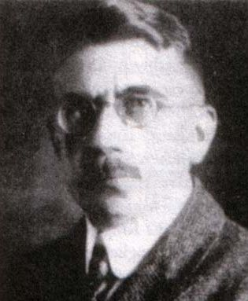

# Arthur Scherbius

| Field | Value |
| ------- | ------- |
| Who | Arthur Scherbius |
| What | German electrical engineer; inventor of the Enigma machine; filed first Enigma patent February 1918; co-founded Chiffriermaschinen AG (ChiMaAG) 1923 |
| When | 30 October 1878 – 13 May 1929 |
| Where | Born: Frankfurt am Main, Germany (50.1109°N, 8.6821°E); primary work: Berlin, Germany (52.5200°N, 13.4050°E); died: Berlin (Schloss Charlottenburg vicinity — horse-drawn carriage accident) |
| Related | [Hugo Koch](hugo-koch.md), [Willi Korn](willi-korn.md), [Enigma D Commercial](../configurations/enigma-d-commercial.md), [Enigma A and B](../configurations/enigma-a-and-b.md), [First Enigma Patent](../timeline/scherbius-enigma-patent.md) |

## Biography

Arthur Scherbius was born on 30 October 1878 in Frankfurt am Main. He studied electrical engineering in Munich and Hanover, earning his doctorate from the Technical University of Munich. He worked
briefly at the electrical firm Brown Boveri & Cie and later set up his own engineering consultancy in Berlin, where he filed numerous patents across diverse areas including turbines, electric motors,
and ceramic heating elements.

## The Enigma Invention

Scherbius's most consequential patent was filed on **23 February 1918** with the German Patent Office: German Patent **DE416219** — the first description of a rotor-based cipher machine. This
predates all other Enigma patents, including Hugo Koch's Netherlands patent of October 1919, which is sometimes erroneously called "the original." Scherbius independently developed the same rotor
concept Koch filed, but Scherbius filed first and is the unambiguous inventor of record.

Scherbius marketed his machine commercially under the name **"Enigma"** (from Greek: *ainigma*, "riddle"), first exhibiting it at the **International Postal Congress, Berne, 1923**. Early commercial
models (Enigma A and B) used 28-contact rotors; the later Enigma C and D settled on the standard 26-contact design.

## Chiffriermaschinen AG (ChiMaAG)

On **9 July 1923**, Scherbius and his business partner Richard Ritter co-founded **Chiffriermaschinen Aktiengesellschaft** (ChiMaAG) in Berlin, the company that manufactured and sold commercial
Enigma machines. The company's manufacturing was subcontracted to **Konski und Krüger (K&K)** in Berlin-Tempelhof. ChiMaAG was later renamed **Heimsoeth und Rinke (H&R)** in 1935 when new investors
took over following the company's financial difficulties after Scherbius's death.

Despite exhibiting at major international exhibitions and publishing technical papers, Scherbius failed to attract large commercial orders before his death. The German military did not adopt the
Enigma until 1926–1929 — after Scherbius had already died.

## Death

Arthur Scherbius died on **13 May 1929** in Berlin, aged 50, from injuries sustained when the horses drawing his carriage bolted and he was thrown from the vehicle. He did not live to see the Enigma
machine become one of the most widely used cipher devices in history.

## Key Inventions / Patents

| Patent | Date | Description |
| -------- | ------ | ------------- |
| DE416219 | 23 February 1918 | First Enigma patent — 3-rotor cipher machine with reflector |
| Multiple additional patents | 1918–1926 | Refinements to Enigma mechanism; printing variants |

## Sources

- Crypto Museum: <https://cryptomuseum.com/people/scherbius.htm>
- Wikipedia: <https://en.wikipedia.org/wiki/Arthur_Scherbius>
- German Patent Office records: DE416219
