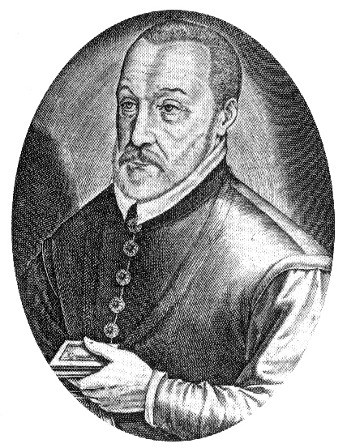

# Blaise de Vigenère

| Field | Value |
| ------- | ------- |
| Who | Blaise de Vigenère |
| What | French diplomat and cryptographer; published the repeating-key polyalphabetic cipher (1586) that is misnamed after him — the system was actually invented by Giovan Battista Bellaso in 1553; the "Vigenère cipher" dominated European cryptography until Babbage broke it in 1854 |
| When | 5 April 1523 – 19 February 1596 |
| Where | Born: Saint-Pourçain-sur-Sioule, France (46.3082°N, 3.2870°E); primary work: Paris, France — French court (48.8566°N, 2.3522°E); Rome, Italy (41.9028°N, 12.4964°E) |
| Related | [Giovan Battista Bellaso](giovan-battista-bellaso.md), [Johannes Trithemius](johannes-trithemius.md), [Charles Babbage](charles-babbage.md), [Friedrich Kasiski](friedrich-kasiski.md), [Vigenère cipher](../timeline/vigenere-cipher-1553.md) |

## Biography

Blaise de Vigenère was born in 1523 in Saint-Pourçain-sur-Sioule in the Auvergne region of France. He entered the service of the French crown as a diplomat and spent over two decades on missions to
Rome and other European courts. It was during a two-year residence in Rome (beginning 1549) that he encountered Italian cryptographic literature — including the works of Trithemius and Bellaso — and
became deeply interested in ciphers.

He retired from diplomacy at age 47 and spent the remaining decades of his life as a prolific author on topics ranging from alchemy and occultism to history and linguistics. He was also one of the
first Europeans to study ancient runes systematically.

## *Traicté des Chiffres* (1586)

In 1586 Vigenère published ***Traicté des Chiffres ou Secrètes Manières d'Escrire*** (*Treatise on Ciphers or Secret Methods of Writing*) — a comprehensive survey of then-known ciphers. Among the
methods he described was the repeating-key polyalphabetic cipher that Bellaso had first published in 1553.

Vigenère's version had one genuine innovation: the **autokey cipher**, where the plaintext itself (rather than a repeated keyword) serves as the subsequent key — making the key as long as the
message. This is theoretically stronger than the simple Vigenère, though it too was eventually broken. However, the *Traicté* was widely read by later generations of cryptographers who conflated
Vigenère's description with invention, and the cipher bears his name.

## "Le Chiffre Indéchiffrable"

The Vigenère cipher earned the nickname ***le chiffre indéchiffrable*** ("the indecipherable cipher") — and for nearly three centuries it lived up to that reputation. Multiple serious attempts to
break it failed, and it was used in various forms by diplomats, generals, and conspirators across Europe and America.

The Confederate States of America used a variant for high-level military dispatches during the Civil War (1861–1865) — with the keyword `MANCHESTER BLUFF` at one point. Union cryptanalysts repeatedly
broke Confederate Vigenère messages, often because the Confederacy reused keywords.

## Breaking the "Indecipherable"

The cipher's weakness was finally exposed by:

- **Charles Babbage** (c. 1854) — identified the method of finding the key length by looking for repeated sequences in the ciphertext (Kasiski test), then solved each monoalphabetic segment by
  frequency analysis. He did not publish his result.
- **Friedrich Kasiski** (1863) — independently published the same technique in *Die Geheimschriften und die Dechiffrirkunst*

The key insight: if the keyword is *n* letters long, every *n*th cipher letter was produced by the same key letter — meaning every *n*th letter formed a Caesar cipher that frequency analysis could
defeat independently.

## Cryptographic Legacy

The Vigenère cipher's 300-year career as the "indecipherable" standard demonstrates the historical pattern: a cipher is invented, declared unbreakable, and eventually broken — each break motivating a
more complex successor. The Enigma machine's rotors represent the fully mechanised endpoint of this progression: automatically advancing polyalphabetic substitution with a period of billions, making
naive frequency analysis completely impractical.

## Sources

- Wikipedia: <https://en.wikipedia.org/wiki/Blaise_de_Vigen%C3%A8re>
- Singh, Simon. *The Code Book* (Doubleday, 1999), Chapter 2
- Kahn, David. *The Codebreakers* (Scribner, 1967/1996)
