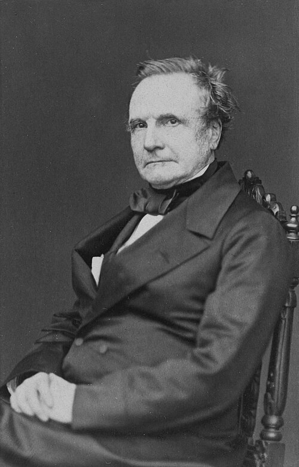

# Charles Babbage

| Field | Value |
| ------- | ------- |
| Who | Charles Babbage, FRS |
| What | British mathematician, inventor, and polymath; designed the first programmable mechanical computer (Difference Engine, Analytical Engine); secretly broke the Vigenère cipher c. 1854, thereby solving a problem that had defeated cryptanalysts for 300 years — but never published his solution |
| When | 26 December 1791 – 18 October 1871 |
| Where | Born: London, England (51.5074°N, 0.1278°W); primary work: London — Marylebone and Cambridge University (52.2053°N, 0.1218°E) |
| Related | [Blaise de Vigenère](blaise-de-vigenere.md), [Friedrich Kasiski](friedrich-kasiski.md), [Charles Wheatstone](charles-wheatstone.md), [Breaking the Vigenère](../timeline/babbage-vigenere-break-1854.md) |

## Biography

Charles Babbage was born in London on 26 December 1791. He studied mathematics at Cambridge (Peterhouse and Trinity College), where he co-founded the Analytical Society to reform English mathematics
by introducing Leibniz's superior continental notation over Newton's fluxions. He was appointed Lucasian Professor of Mathematics at Cambridge in 1828 — the same chair later held by Paul Dirac and
Stephen Hawking — though he never gave a single lecture.

Babbage's life was dominated by his efforts to build mechanical computing engines: the **Difference Engine** (1822, designed to tabulate polynomial functions) and the vastly more ambitious
**Analytical Engine** (1837 onwards — a general-purpose programmable computer with a mill, store, and punched-card input, a full century before electronic computers). Neither was completed in his
lifetime due to funding problems, engineering tolerances of the era, and disputes with his chief engineer Joseph Clement.

## Breaking the Vigenère (c. 1854)

Around 1854, Babbage was challenged by a correspondent — the amateur cryptographer John Hall Brock Thwaites — who claimed to have invented an unbreakable cipher. The cipher was, in essence, a
standard Vigenère. Babbage demolished it in correspondence and in doing so developed the general technique for breaking any repeating-key polyalphabetic cipher.

### The Method

Babbage identified that if a ciphertext contained **repeated sequences of letters**, those repetitions were almost certainly caused by the same segment of plaintext being encrypted by the same
segment of the keyword at different positions. The distances between repeated sequences would therefore be multiples of the keyword length. By:

1. Finding all repeated trigrams and longer sequences in the ciphertext
2. Calculating the distances between repetitions
3. Finding the greatest common divisor of those distances (= likely keyword length)
4. Splitting the ciphertext into *n* interleaved streams (each encrypted by one letter of the keyword)
5. Applying frequency analysis to each stream independently

...the keyword and hence the entire message could be recovered.

This technique — now called the **Kasiski test** or **Kasiski examination** — was simultaneously and independently discovered by German officer Friedrich Kasiski, who published it in **1863**.
Babbage never published his solution; it was found in his unpublished papers after his death.

## Why Babbage Matters to Enigma

The Kasiski test is the direct ancestor of several Bletchley Park techniques:

- **Banburismus** (Jack Good and Alan Turing): a Bayesian probabilistic test for aligning M3 Naval Enigma messages encrypted on the same day key — functionally analogous to Kasiski, adapted for a
  machine with no repeating period in the classical sense
- **Index of Coincidence**: developed by William Friedman (1922), directly extending Kasiski's idea to produce a statistical measure of language periodicity — used at BP to analyse traffic depths and
  find cribs

## Other Contributions

- **Ophthalmoscope** (invented, but credit went to Helmholtz who published first)
- **Cow-catcher** (the railway locomotive safety device)
- **Heliograph** (secret signalling by reflected light — ironically used for military communications before radio)
- **Actuarial tables** for life insurance
- First rigorous analysis of postal rates leading to the **Penny Post** (1840)

## Sources

- Wikipedia: <https://en.wikipedia.org/wiki/Charles_Babbage>
- Singh, Simon. *The Code Book* (Doubleday, 1999), Chapter 2
- Kahn, David. *The Codebreakers* (Scribner, 1967/1996)
