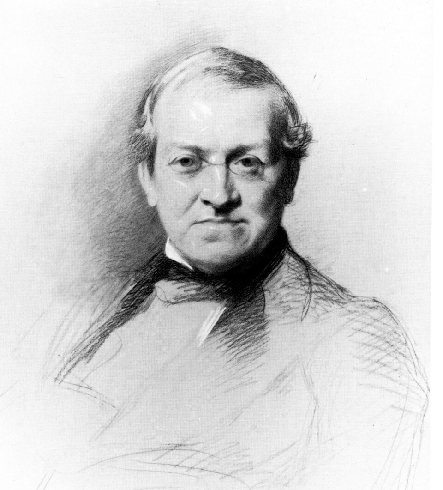

# Charles Wheatstone

| Field | Value |
| ------- | ------- |
| Who | Sir Charles Wheatstone, FRS, KCB |
| What | British physicist and inventor; invented the Playfair cipher (1854, misattributed to his friend Lord Playfair); pioneered electric telegraph technology; invented the concertina and stereoscope; a key figure in the Victorian-era transition from hand ciphers to electrical communications |
| When | 6 February 1802 – 19 October 1875 |
| Where | Born: Gloucester, England (51.8642°N, 2.2382°W); primary work: London — King's College, Strand (51.5115°N, 0.1160°W) |
| Related | [Charles Babbage](charles-babbage.md), [Friedrich Kasiski](friedrich-kasiski.md), [Playfair cipher](../timeline/playfair-cipher-1854.md) |



## Biography

Charles Wheatstone was born in Gloucester in 1802. He showed extraordinary mechanical aptitude from childhood and was apprenticed to a musical instrument maker in London. He taught himself science
and conducted experiments on acoustics that brought him to the attention of the scientific establishment.

In 1834 he was appointed Professor of Experimental Philosophy at King's College London — a post he held for over forty years. He was knighted in 1868 and elected a Fellow of the Royal Society. His
breadth of practical invention was remarkable even by Victorian standards.

## The Playfair Cipher (1854)

In 1854, Wheatstone invented a **digraphic cipher** — a substitution cipher that operates on *pairs of letters* rather than individual letters, defeating the simple frequency analysis used against
monoalphabetic ciphers.

The cipher uses a **5×5 key square** constructed from a keyword (omitting duplicate letters and usually treating I and J as the same):

```text
Example key: PLAYFAIR
K E Y S Q
U A R E B
C D F G H
I/J L M N O
T V W X Z
```

To encipher: split the plaintext into digraphs, then apply three rules based on whether the two letters are in the same row, same column, or form a rectangle in the grid.

### Why "Playfair"?

Wheatstone invented the cipher, but his friend **Lyon Playfair, 1st Baron Playfair** enthusiastically promoted it to the British government and military. The cipher is named after him — one of
history's most successful rebranding exercises. Wheatstone was reportedly amused rather than annoyed by this.

The cipher was adopted by the **British Army** and used extensively in the Second Boer War (1899–1902), WWI, and into WWII. It was the standard British Army field cipher for much of this period.

## Telegraph and Electrical Inventions

- **Wheatstone bridge** (1843): a circuit for precise electrical resistance measurement — despite being named after him, it was actually invented by Samuel Christie in 1833 and popularised by
  Wheatstone
- **Electric telegraph** (1837): co-invented with William Fothergill Cooke; their five-needle telegraph was the first practical electrical telegraph deployed commercially on railways in Britain
- **ABC telegraph** (1858): simplified pointing telegraph widely used in Victorian Britain
- **Stereoscope** (1838): demonstrated the principle of binocular 3D vision; the Victorian parlour stereoscope is his direct invention
- **Concertina** (1829): Wheatstone invented and manufactured the free-reed instrument

## Connection to Enigma

Wheatstone's significance in the Enigma lineage is indirect but real:

1. His telegraph work helped establish electrical communications as the backbone of military command and control — creating the *need* for automated encryption that the Enigma eventually filled
2. The Playfair cipher demonstrates that even pre-war British military cryptography recognised the inadequacy of monoalphabetic substitution and needed digraphic (and eventually polyalphabetic
  machine) solutions
3. King's College London, where he worked, would later be central to WWII British scientific mobilisation

## Sources

- Wikipedia: <https://en.wikipedia.org/wiki/Charles_Wheatstone>
- Singh, Simon. *The Code Book* (Doubleday, 1999)
- Kahn, David. *The Codebreakers* (Scribner, 1967/1996)
