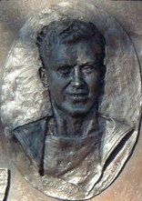

# Francis Fasson and Colin Grazier

| Field | Value |
| ------- | ------- |
| Who | Lieutenant Francis Anthony Blair Fasson, RN; Able Seaman Colin Grazier, RN |
| What | Royal Navy officer and rating who boarded the sinking U-559 on 30 October 1942, retrieving Enigma codebooks that enabled Bletchley Park to break the 4-rotor Naval Enigma (Shark) — ending a 10-month Atlantic communications blackout; both drowned when the submarine sank; both awarded the George Cross posthumously |
| When | Fasson: 29 March 1913 – 30 October 1942; Grazier: 22 January 1920 – 30 October 1942 |
| Where | Born: Fasson — Jedburgh, Scotland (55.4775°N, 2.5537°W); Grazier — Tamworth, England (52.6343°N, 1.6960°W); died: Mediterranean Sea, north of Port Said, Egypt — approx. 32.5°N, 32.5°E |
| Related | [Enigma M4 Naval](../configurations/enigma-m4-naval.md), [Alan Turing](alan-turing.md), [Hugh Alexander](hugh-alexander.md), [U-559 capture](../timeline/u559-capture-1942.md) |

## Background — The Shark Blackout

On **1 February 1942**, the German Navy (*Kriegsmarine*) upgraded its Atlantic U-boat communications from the 3-rotor Enigma M3 to the 4-rotor **Enigma M4** (codenamed "Shark" at Bletchley Park). Hut
8, which had been breaking Naval Enigma daily under Alan Turing and Hugh Alexander, was immediately blinded. The existing Bombes could not handle 4-rotor traffic; no cribs, no captures, nothing
worked.

For **ten months** — from February to December 1942 — the Royal Navy and Merchant Marine had no Ultra intelligence on U-boat positions. The consequences were catastrophic:

- The Battle of the Atlantic reached its most dangerous phase
- U-boat "wolfpacks" ravaged convoys with near-impunity
- Over **3.3 million tons of Allied shipping** were sunk in the first six months of 1942 alone

Breaking back into Shark required actual physical cryptographic material from a captured U-boat — specifically the short weather codebooks and current key lists that would allow Hut 8 to reconstruct
the 4-rotor settings.

## The Capture of U-559

On **30 October 1942**, HMS *Petard* (destroyer, Commander Mark Thornton, RN) was part of a surface hunting group that had detected and depth-charged **U-559** (Kapitänleutnant Hans Heidtmann) in the
eastern Mediterranean, north of Port Said, Egypt.

By the evening, U-559 was critically damaged and surfacing. The crew began abandoning ship and scuttling the vessel — but it was sinking slowly enough that there was a brief window to board her.

## The Boarding

**Lieutenant Francis Fasson** (First Lieutenant of *Petard*, aged 29) and **Able Seaman Colin Grazier** (aged 22) stripped off their clothes and swam to the U-boat without being ordered to. They were
  joined by **Canteen Assistant Tommy Brown** (aged 16 — the youngest person on the destroyer, and technically below the minimum age for a war zone).

The three men entered the sinking submarine. In the darkness, with seawater rising, Fasson and Grazier:

- Located the **cipher office** (the captain's cabin and radio room)
- Recovered **Short Weather Codebooks** (*Wetterkurzschlüssel*)
- Recovered the **Short Signal Codebooks** (*Kurzsignalheft*)
- Possibly recovered an **Enigma M4 key list** for the current period

They passed the materials up to Tommy Brown on the conning tower.

The submarine then **sank suddenly**. Fasson and Grazier did not get out in time. Both drowned. Tommy Brown survived.

## Impact on Bletchley Park

The codebooks recovered from U-559 reached Bletchley Park within days. They were exactly what Hut 8 needed:

- The short weather codes revealed the format of weather report messages — providing cribs for Banburismus
- Combined with new 4-rotor Bombes (the first of which became operational in late 1942) and American cryptanalytic support, Hut 8 **broke back into Shark in December 1942**

The Atlantic intelligence blackout — which had lasted 10 months and contributed to some of the worst Allied shipping losses of the war — was over.

## Recognition

**Francis Fasson** and **Colin Grazier** were both awarded the **George Cross** posthumously — Britain's highest civilian gallantry decoration, equivalent in status to the Victoria Cross.

**Tommy Brown** was awarded the George Medal. He was later killed in a house fire in 1945 while trying to rescue his sister.

### Memorials

- **Tamworth, Staffordshire**: A memorial bronze plaque to Colin Grazier is in St Editha's Church, Tamworth; a second memorial at the town's Ankerside shopping centre. An annual *Grazier Day* is held.
- **HMS Petard Memorial**: A memorial stone near Port Said commemorates the action.

## Sources

- Wikipedia (Fasson): <https://en.wikipedia.org/wiki/Francis_Fasson>
- Wikipedia (Grazier): <https://en.wikipedia.org/wiki/Colin_Grazier>
- Kahn, David. *Seizing the Enigma* (Houghton Mifflin, 1991)
- Sebag-Montefiore, Hugh. *Enigma: The Battle for the Code* (Weidenfeld & Nicolson, 2000)
