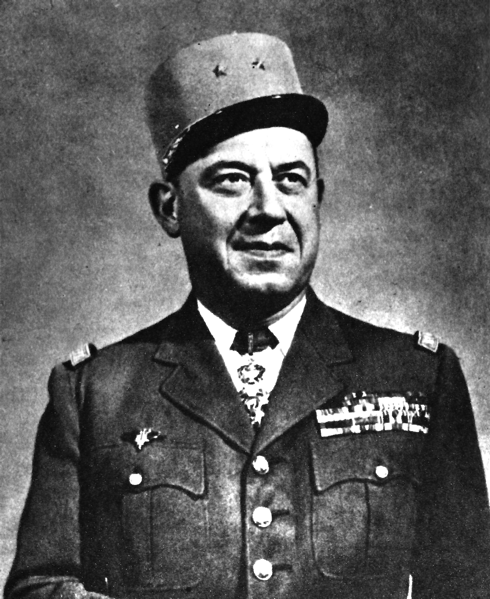

# Gustave Bertrand

| Field | Value |
| ------- | ------- |
| Who | Gustave Bertrand (General) |
| What | Head of French intelligence cryptology section (SR); obtained Enigma key materials from Hans-Thilo Schmidt ("Asché") and passed them to Polish Cipher Bureau; ran PC Bruno and Cadix stations during WWII |
| When | 4 January 1896 – 14 January 1976 |
| Where | Born: Lens, France (50.4311°N, 2.8314°E); primary work: Paris, France (48.8566°N, 2.3522°E); wartime: PC Bruno near Paris, then Cadix near Uzès, southern France (44.0100°N, 4.4200°E) |
| Related | [Marian Rejewski](marian-rejewski.md), [Hans-Thilo Schmidt](hans-thilo-schmidt.md), [Polish Enigma break](../timeline/polish-enigma-break-1932.md), [Pyry conference](../timeline/pyry-conference-1939.md) |

## Biography

Gustave Bertrand was a career French Army intelligence officer who rose to head the **Section d'Examen** (cryptological section) of the **Deuxième Bureau** (French military intelligence). He was
fluent in German and ran operations against German communications from the mid-1920s onward.

## Hans-Thilo Schmidt and the Enigma Materials

In late 1931, Bertrand made contact with a source within the German cipher establishment: **Hans-Thilo Schmidt**, a German Foreign Office cipher clerk and brother of a Wehrmacht general. Schmidt,
motivated primarily by money (and partly by bitterness at his inferior career position), agreed to sell French intelligence classified German cipher materials.

The materials Schmidt provided (between 1931 and 1941) included:

- Operating instructions for the Enigma machine (September 1931)
- Daily key settings for specific months
- Spare parts and circuit diagrams

French intelligence at the time did not consider the Enigma breakable and passed the materials to Britain — who also declined to pursue them seriously. **Bertrand, however, recognised their potential
value and passed the complete package to the Polish Cipher Bureau** through a meeting in Paris, November 1931.

The Polish mathematicians — Marian Rejewski, Jerzy Różycki, and Henryk Zygalski — used Schmidt's materials as the starting values for Rejewski's permutation group equations, enabling the
reconstruction of the complete Enigma rotor wirings by **December 1932**.

Bertrand thus served as the essential link between Schmidt's espionage and the Polish cryptanalytic breakthrough — and by extension, the foundation of Ultra and the entire Allied codebreaking effort.

## PC Bruno and Cadix

When war broke out, Bertrand organised:

- **PC Bruno** (September 1939): A joint French–Polish–Spanish codebreaking station at the Château de Vignolles, near Gretz-Armainvilliers, east of Paris. Rejewski, Różycki, and Zygalski worked here
  until France's fall.
- **Cadix** (October 1940 – November 1942): A secret station in the Château des Fouzes near Uzès in the Vichy free zone. Polish cryptanalysts continued working here on German hand ciphers after the
  Enigma machine itself was beyond their reach.

After German occupation of Vichy France in November 1942, Bertrand helped the Polish mathematicians escape over the Pyrenees.

## Post-War

Bertrand retired with the rank of General and published his memoir *Enigma* in 1973 — one of the first public accounts of the intelligence behind the Enigma break, predating Winterbotham's *The Ultra
Secret* (1974). His account credited the Poles' contribution and his own role in facilitating it.

He died on 14 January 1976 in France.

## Sources

- Wikipedia: <https://en.wikipedia.org/wiki/Gustave_Bertrand>
- Bertrand, Gustave. *Enigma, ou la plus grande énigme de la guerre 1939–1945* (1973)
- Kozaczuk, Władysław. *Enigma* (1984)
