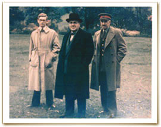

# Harry Hinsley

| Field | Value |
| ------- | ------- |
| Who | Sir Francis Harry Hinsley, OBE |
| What | British naval historian and cryptanalyst; junior Bletchley Park analyst who in August 1941 correctly identified that the German battleship Bismarck was about to break out into the Atlantic; post-war Regius Professor of History at Cambridge; author of the definitive official history *British Intelligence in the Second World War* |
| When | 26 November 1918 – 16 February 1998 |
| Where | Born: Walsall, England (52.5860°N, 1.9820°W); Bletchley Park: Milton Keynes, England (52.0015°N, 0.7404°W); post-war: St John's College, Cambridge (52.2097°N, 0.1172°E) |
| Related | [Alan Turing](alan-turing.md), [Alastair Denniston](alastair-denniston.md), [Ultra declassification](../timeline/ultra-declassification-1974.md) |

## Wartime Service

Harry Hinsley arrived at Bletchley Park in 1939, fresh from his undergraduate studies at St John's College, Cambridge — a scholarship boy from a modest background who had excelled in history. He was
assigned to the Naval Section, working on German naval traffic.

### The Bismarck Warning (May 1941)

Hinsley's most celebrated individual contribution came in **May 1941**. Analysis of Enigma-derived traffic patterns and naval message volumes led him to conclude that the German battleship
**Bismarck** and heavy cruiser *Prinz Eugen* were about to break out into the Atlantic. He sent a warning signal to the Admiralty Operational Intelligence Centre.

The warning was initially **dismissed by more senior Admiralty staff** — partly because Hinsley was very junior (in his early twenties) and partly because the Naval Intelligence hierarchy was
cautious about acting on Ultra intelligence. When the Bismarck did sail on 18–19 May 1941, its discovery and subsequent sinking by Royal Navy forces (27 May 1941) was delayed because the initial
Ultra warning had not been fully acted upon. Hinsley's assessment had been correct.

The episode became a key case study in the institutional difficulties of acting on SIGINT intelligence in a timely way — a theme he would later analyse extensively in his official history.

### Work at Bletchley

Hinsley spent the war in the Naval Section and later as a liaison analyst, developing a deep understanding of how SIGINT was processed, assessed, and (or not) acted upon by operational commands. This
experience — seeing both the raw intelligence and how it was used in decision-making — shaped his post-war historical work.

## Post-War Academic Career

After the war Hinsley returned to St John's College, Cambridge, where he became a fellow, tutor, and eventually **Regius Professor of Modern History** (1983–1988) and Vice-Chancellor of the
University (1981–1983).

He maintained complete secrecy about his Bletchley work until the Ultra declassification of 1974, at which point he became one of the most authoritative voices on wartime SIGINT history.

## *British Intelligence in the Second World War* (1979–1990)

Hinsley was commissioned to write the official history of British wartime intelligence. The result — a five-volume work co-authored with several colleagues — is the definitive academic account of
Ultra and British SIGINT operations:

- **Volume 1** (1979) — Intelligence organisation and the early war
- **Volume 2** (1981) — 1941–1943, North Africa, Atlantic campaign
- **Volume 3, Parts I & II** (1984, 1988) — 1943–1944, strategic deception, Overlord
- **Volume 4** (1990) — Counter-intelligence and security
- **Abridged single volume** (1993) — accessible summary

### The "Two to Four Years" Estimate

Hinsley's official history contains the most authoritative published estimate of Ultra's impact on the war's duration: he concluded that Ultra intelligence **shortened the war in Europe by at least
two years, and possibly as much as four years**. This estimate — based on detailed analysis of specific operations, supply chain interdiction, and strategic decisions where Ultra was decisive — has
been the baseline for all subsequent historical discussion.

He was knighted (KCB) in 1985 for his services to historical scholarship and intelligence history.

## Sources

- Wikipedia: <https://en.wikipedia.org/wiki/Harry_Hinsley>
- Hinsley, F.H. et al. *British Intelligence in the Second World War*, Vols. 1–4 (HMSO, 1979–1990)
- Budiansky, Stephen. *Battle of Wits* (Free Press, 2000)
