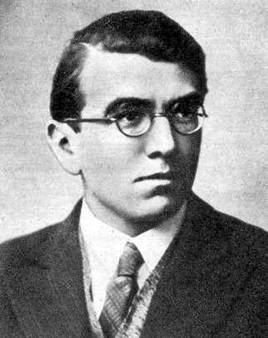

# Henryk Zygalski

| Field | Value |
| ------- | ------- |
| Who | Henryk Zygalski |
| What | Polish mathematician and cryptologist; invented the Zygalski sheets (perforated sheets) method for breaking Enigma; third member of the BS-4 team with Rejewski and Różycki; lived in exile in UK after the war |
| When | 15 July 1908 – 30 August 1978 |
| Where | Born: Poznań, Poland (52.4064°N, 16.9252°E); primary work: Warsaw, Poland — Cipher Bureau (52.2297°N, 21.0122°E); wartime exile: France, then UK; post-war: Guildford and Boxmoor, England |
| Related | [Marian Rejewski](marian-rejewski.md), [Jerzy Różycki](jerzy-rozycki.md), [Gustave Bertrand](gustave-bertrand.md), [Polish Enigma break](../timeline/polish-enigma-break-1932.md), [Pyry conference](../timeline/pyry-conference-1939.md) |

## Biography

Henryk Zygalski was born on 15 July 1908 in Poznań (then in the German partition of Poland). He studied mathematics at the University of Poznań, joining the same cohort and secret cryptology course
as Marian Rejewski and Jerzy Różycki. He joined the BS-4 section of the Polish Cipher Bureau in Warsaw from 1932.

## The Zygalski Sheets

Zygalski's principal cryptanalytic contribution was the invention of the **perforated sheets** method (Polish: *płachty Zygalskiego*) in 1938. When the German military changed its Enigma indicator
procedure in September 1938 — adding two more rotors to the available set (rotors IV and V) — the number of possible configurations increased dramatically and the existing *cyclometer* catalogue
became insufficient.

Zygalski's solution was an entirely manual but highly systematic technique:

- A large set of **perforated cardboard sheets** (26 × 13 sheets per rotor position, with holes punched at positions corresponding to Enigma "females" — coincidences in the repeated indicator
  structure)
- By overlaying multiple sheets aligned to specific rotor positions, a limited set of possible windows lit through — each window corresponding to a possible daily key
- This reduced the daily key space sufficiently for the other methods to complete the break

When Bletchley Park received the Polish research at the **Pyry conference (25 July 1939)**, Gordon Welchman immediately recognised the Zygalski sheets as critical and had British versions
manufactured. British sheets (nicknamed "Netz" sheets) were produced at Bletchley from late 1939, and the method contributed to early Bombe design.

## Wartime and Post-War Exile

- **September 1939**: Evacuated from Warsaw with Rejewski and Różycki; through Romania to France
- **1939–1942**: PC Bruno, then Cadix stations with Bertrand's team
- **November 1942**: After German occupation of Vichy France, Zygalski and Rejewski escaped over the Pyrenees into Spain; arrested and imprisoned in **Miranda de Ebro** for several months
- **July 1943**: Arrived in the UK; worked with the Polish Army cipher bureau in London — **Bletchley Park refused to share current work** with the Polish team, citing security concerns
- **Post-war**: Zygalski chose not to return to Communist Poland. He taught mathematics at the **Polish University College** in London, then at **Battersea Polytechnic** and **Guildford College of
  Technology**. He became a British citizen.
- **30 August 1978**: Died in Liss, Hampshire, England

## Recognition

Like Rejewski, Zygalski received minimal recognition during his lifetime despite having invented a critical technique that directly enabled Bletchley Park's early work. He died before the full story
of the Polish contribution was widely acknowledged. Poland posthumously awarded him the **Virtuti Militari** in 2002.

## Sources

- Wikipedia: <https://en.wikipedia.org/wiki/Henryk_Zygalski>
- Kozaczuk, Władysław. *Enigma* (1984)
- Erskine, Ralph & Smith, Michael (eds). *The Bletchley Park Codebreakers* (2011)
