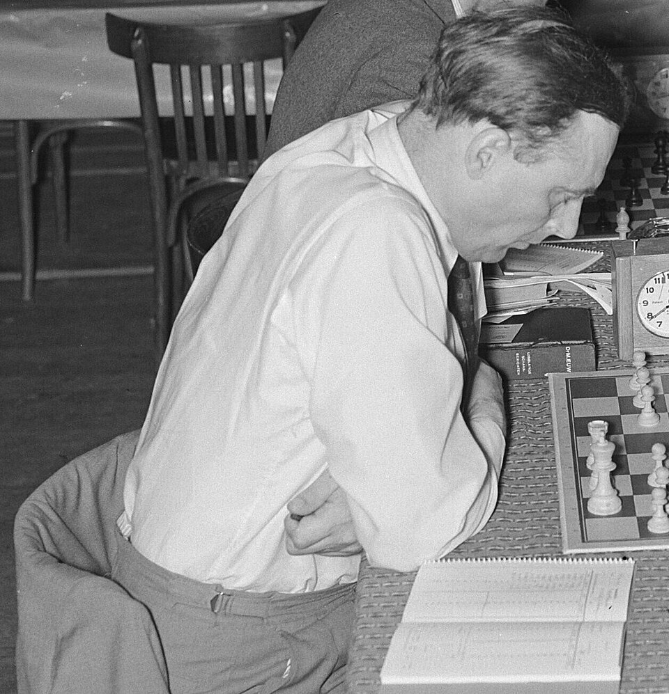

# Hugh Alexander

| Field | Value |
| ------- | ------- |
| Who | Conel Hugh O'Donel Alexander, CBE |
| What | British chess grandmaster and cryptanalyst; head of Hut 8 (Naval Enigma) at Bletchley Park after Alan Turing; broke the U-boat Enigma with Banburismus; post-war head of cryptanalysis at GCHQ for over 20 years |
| When | 19 April 1909 – 15 February 1974 |
| Where | Born: Cork, Ireland (51.8985°N, 8.4756°W); Bletchley Park: Milton Keynes, England (52.0015°N, 0.7404°W); post-war GCHQ: Cheltenham, England (51.9008°N, 2.0927°W) |
| Related | [Alan Turing](alan-turing.md), [Gordon Welchman](gordon-welchman.md), [Stuart Milner-Barry](stuart-milner-barry.md), [Enigma M4 Naval](../configurations/enigma-m4-naval.md) |

## Chess Career

Hugh Alexander was the dominant figure in British chess for two decades. He won the **British Chess Championship** twice (1938 and 1956) and represented England in five Chess Olympiads. He was
awarded the International Master title in 1950 and the Grandmaster title in 1990 (posthumously, for life achievement). He is considered one of the strongest players Britain has ever produced, though
his wartime service interrupted what might otherwise have been a world championship contender's career.

His chess ability — and more specifically the combination of tactical calculation, strategic pattern recognition, and probabilistic judgment required for top-level chess — made him ideally suited for
cryptanalytic work.

## Bletchley Park — Hut 8

Alexander arrived at Bletchley Park in February 1940 and was assigned to **Hut 8** — the section responsible for breaking German Naval Enigma (the Kriegsmarine's *Schlüssel M* — enigma with naval key
procedures). He worked under **Alan Turing** from the start.

### Banburismus

The central technique of Hut 8 was **Banburismus** — a Bayesian probabilistic method developed by Turing and refined collaboratively by the Hut 8 team including Alexander. Banburismus worked by:

1. Comparing intercepted Naval Enigma messages on the same day key, looking for positions at which the messages had an unusually high rate of coincident letters
2. Using the Index of Coincidence to score each alignment probabilistically
3. Building up a chain of overlapping alignments (a "chain" or "crib") from which the rotor settings could be deduced
4. Feeding confirmed settings to the Bombes for final key recovery

The technique was named after **Banbury** — the town where the long paper worksheets used for the alignment process (called *banburismus sheets*) were printed.

### Head of Hut 8 (1942–1944)

When Alan Turing moved to a wider advisory role in late 1942, Alexander succeeded him as **head of Hut 8**. Under his leadership:

- The team broke the **4-rotor Naval Enigma (Shark/M4)** in December 1942 after a 10-month blackout
- Hut 8 sustained continuous near-real-time breaking of U-boat traffic for the remainder of the war
- The section's work directly enabled routing Atlantic convoys around U-boat patrol lines, which historians credit with preventing Allied maritime defeat

Alexander was known as an exceptional manager as well as cryptanalyst — technically rigorous, fair, and able to maintain morale through the intense pressure of U-boat warfare.

## The "Geese" Letter

Alexander was one of the four signatories (with Turing, Welchman, and Milner-Barry) of the October 1941 letter to Churchill complaining about resource constraints at Bletchley Park — the letter that
immediately unlocked additional Bombe machines and WRNS staff.

## Post-War GCHQ

After the war, Alexander joined GCHQ and served as its **Head of Cryptanalysis** for over 20 years. In this role he contributed to Cold War-era signals intelligence and continued to represent Britain
internationally in chess. He was appointed CBE in 1955 for his intelligence work.

He wrote a widely admired book on chess (*How to Play Chess Endings*, 1973) and contributed chess columns to publications including the *Sunday Times*.

## Sources

- Wikipedia: <https://en.wikipedia.org/wiki/Conel_Hugh_O%27Donel_Alexander>
- Hodges, Andrew. *Alan Turing: The Enigma* (Burnett Books, 1983)
- Smith, Michael. *Station X* (Channel 4 Books, 1998)
