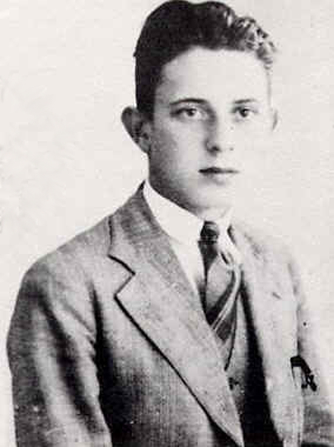

# Jerzy Różycki

| Field | Value |
| ------- | ------- |
| Who | Jerzy Witold Różycki |
| What | Polish mathematician and cryptologist; member of the three-person team (with Rejewski and Zygalski) that broke Enigma; invented the "clock" method for identifying rotor positions; died at sea 1942 |
| When | 24 July 1909 – 9 January 1942 |
| Where | Born: Oleksandrivka, Ukraine (then Russian Empire) (48.9700°N, 32.2600°E); primary work: Warsaw, Poland — Cipher Bureau (52.2297°N, 21.0122°E); died: Mediterranean Sea (approx. 38°N, 5°E) |
| Related | [Marian Rejewski](marian-rejewski.md), [Henryk Zygalski](henryk-zygalski.md), [Gustave Bertrand](gustave-bertrand.md), [Polish Enigma break](../timeline/polish-enigma-break-1932.md) |

## Biography

Jerzy Różycki was born on 24 July 1909 in Oleksandrivka (then part of the Russian Empire, now Ukraine) and grew up in Poland after independence. He studied mathematics at the University of Poznań,
where he joined the secret cryptology course run by the Polish Cipher Bureau alongside Marian Rejewski and Henryk Zygalski. He graduated in 1932 and joined the BS-4 section of the Cipher Bureau in
Warsaw.

## Contributions to Breaking Enigma

Różycki worked as part of the three-person BS-4 team under the direction of mathematician **Gwido Langer** throughout the 1930s. His specific contributions included:

### The "Clock" Method (Zegar)

Różycki devised the **clock method** (*metoda zegarowa*) — a technique for identifying which rotor was in the right-hand (fast-moving) position on any given day, using the statistical properties of
the 6-letter doubled indicators. By analysing the cycle lengths of repeated encrypted pairs, he could narrow the daily rotor selection.

### Collaboration with Rejewski and Zygalski

The three mathematicians worked as a tightly integrated team. While Rejewski led the initial theoretical breakthrough (1932) and Zygalski developed the perforated sheet method (Zygalski sheets),
Różycki contributed ongoing cryptanalytic techniques and collaborated on the daily breaking of Enigma traffic throughout the mid-1930s.

## Wartime and Death

When German forces invaded Poland in September 1939, the Cipher Bureau was evacuated. Różycki, Rejewski, and Zygalski made their way through Romania to France, where they joined **Gustave Bertrand's
PC Bruno** station at the Château de Vignolles, near Paris. After France fell in June 1940, they continued working at the **Cadix** station in the Vichy zone of southern France.

On **9 January 1942**, Różycki was returning from an assignment in Algiers aboard the French passenger ship ***Lamoricière***. The ship sank in a storm in the Mediterranean Sea, approximately between
Algeria and the Balearic Islands. Jerzy Różycki drowned; he was 32 years old.

Of the three mathematicians who broke Enigma, Różycki was the only one who did not survive the war.

## Legacy

A statue of the three Polish codebreakers — Rejewski, Różycki, and Zygalski — stands in **Bydgoszcz**, the hometown of Rejewski. A second monument at the **Poznań Enigma cipher bureau
reconstruction** site also commemorates all three. In 2002, Poland posthumously awarded Różycki the **Virtuti Militari** (Poland's highest military decoration).

## Sources

- Wikipedia: <https://en.wikipedia.org/wiki/Jerzy_R%C3%B3%C5%BCycki>
- Kozaczuk, Władysław. *Enigma* (1984)
- Erskine, Ralph & Smith, Michael (eds). *The Bletchley Park Codebreakers* (2011)
