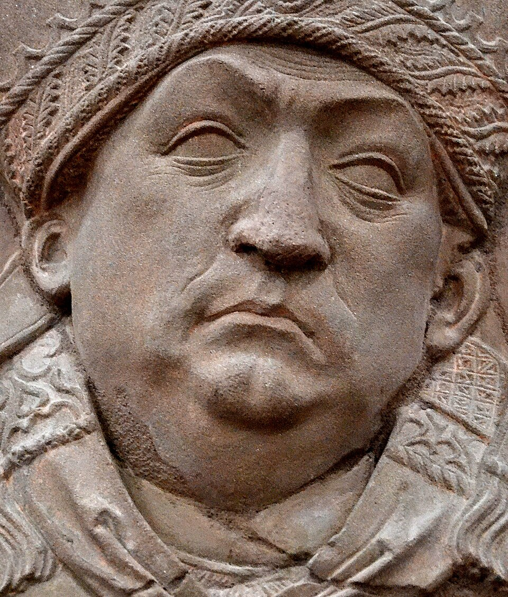

# Johannes Trithemius

| Field | Value |
| ------- | ------- |
| Who | Johannes Trithemius (born Johann Heidenberg) |
| What | German Benedictine abbot and cryptographer; author of *Polygraphia* (published 1518, written c. 1508) — the first printed book on cryptography; inventor of the tabula recta (progressive key substitution tableau) that became the foundation of the Vigenère cipher |
| When | 1 February 1462 – 13 December 1516 |
| Where | Born: Trittenheim, Rhineland (49.8290°N, 6.9097°E); primary work: Sponheim Abbey, Germany (49.8833°N, 7.5500°E); later: Würzburg, Germany (49.7950°N, 9.9300°E) |
| Related | [Leon Battista Alberti](leon-battista-alberti.md), [Giovan Battista Bellaso](giovan-battista-bellaso.md), [Blaise de Vigenère](blaise-de-vigenere.md), [Trithemius tableau](../timeline/trithemius-polygraphia-1508.md) |



## Biography

Johannes Trithemius was born Johann Heidenberg in 1462 in the town of Trittenheim on the Moselle River (he took his Latin surname from his birthplace). After an unhappy childhood he wandered to the
Benedictine monastery at Sponheim in 1482, initially seeking shelter from a snowstorm, and never left — becoming its abbot two years later at the age of 21.

Under his leadership Sponheim Abbey grew from poverty to become one of the great libraries of Germany, with over 1,600 volumes — a remarkable collection in the manuscript age. Trithemius was a
prolific scholar of theology, history, and magic (his *Steganographia* caused significant controversy), but his lasting cryptographic contribution was the *Polygraphia*.

## *Polygraphia* (written c. 1508, published 1518)

*Polygraphia* is the first printed book on cryptography, published posthumously in 1518 (Trithemius died in 1516). It introduced the concept of the **tabula recta** — a square table of shifted
  alphabet rows:

```text
Row 1 (key A): A B C D E F G H I J K L M N O P Q R S T U V W X Y Z
Row 2 (key B): B C D E F G H I J K L M N O P Q R S T U V W X Y Z A
Row 3 (key C): C D E F G H I J K L M N O P Q R S T U V W X Y Z A B
...
Row 26 (key Z): Z A B C D E F G H I J K L M N O P Q R S T U V W X Y
```

Trithemius's original method used the rows *progressively*: the first letter of a message was enciphered using Row 1, the second using Row 2, and so on — cycling back to Row 1 after Row 26. This was
a fixed, keyless polyalphabetic cipher: the key was always "ABCDEFGHIJKLMNOPQRSTUVWXYZ" repeated.

### Significance

While Trithemius's progressive method is easily broken once the cycle length is known (it is simply known-cycle polyalphabetic substitution), the *tabula recta* square itself became the canonical
tool for all subsequent Vigenère-type ciphers. Vigenère's 1553 improvement was to let the *keyword* select which row of Trithemius's table to use for each position — turning the fixed progressive key
into a variable secret key.

The tabula recta is also the framework used to describe Enigma's rotor substitutions in cryptanalytic literature — each rotor's wiring defines one row of a tabula recta, and the stepping mechanism
determines which row is applied at each character position.

## *Steganographia* (written c. 1499, published 1606)

Trithemius also wrote *Steganographia* — ostensibly a book on summoning spirits, but the first two volumes are actually a disguised treatise on **steganography** (hiding messages inside other
messages). The "angel summons" are actually instructions for embedding secret messages in ordinary Latin prayers. The third volume genuinely concerns magic and caused the book to be placed on the
Index of Prohibited Books in 1609.

## Sources

- Wikipedia: <https://en.wikipedia.org/wiki/Johannes_Trithemius>
- Singh, Simon. *The Code Book* (Doubleday, 1999), Chapter 2
- Kahn, David. *The Codebreakers* (Scribner, 1967/1996)
