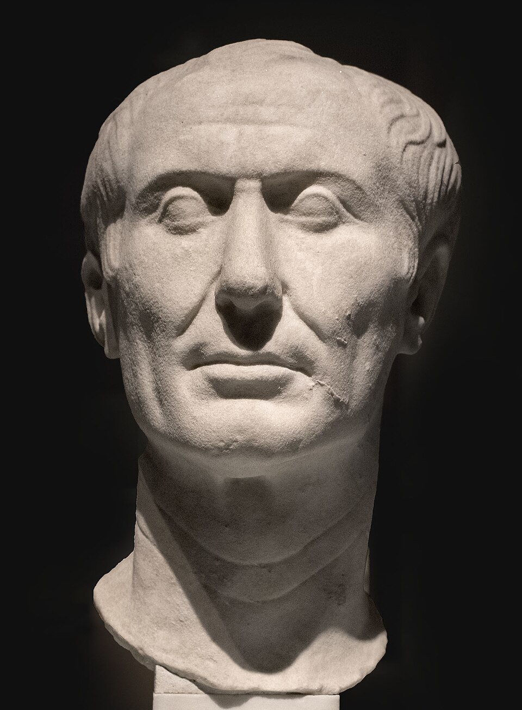

# Julius Caesar

| Field | Value |
| ------- | ------- |
| Who | Gaius Julius Caesar |
| What | Roman general, statesman, and dictator; inventor of the Caesar cipher (ROT-N substitution) — the earliest recorded systematic use of alphabetic encryption in military communications |
| When | 12 July 100 BC – 15 March 44 BC |
| Where | Born: Rome, Italy (41.9028°N, 12.4964°E); military campaigns: Gaul (France), Britain, Egypt, Pontus (Turkey); assassinated: Rome, Italy |
| Related | [Julius Caesar cipher](../timeline/caesar-cipher-50bc.md), [Leon Battista Alberti](leon-battista-alberti.md) |



## The Caesar Cipher

The cipher named after Caesar is a **substitution cipher** in which each letter of the plaintext is replaced by a letter a fixed number of positions down the alphabet. With a shift of 3 (the shift
Caesar reportedly used most often):

```text
Plain:  A B C D E F G H I J K L M N O P Q R S T U V W X Y Z
Cipher: D E F G H I J K L M N O P Q R S T U V W X Y Z A B C
```

So the word `ATTACK` becomes `DWWDFN`.

Suetonius records the cipher explicitly in *The Twelve Caesars* (c. AD 121): *"If he had anything confidential to say, he wrote it in cipher, that is, by so changing the order of the letters of the
alphabet, that not a word could be made out."* The same source states Caesar used a shift of three. Aulus Gellius (c. AD 150) confirms this.

The cipher was used in Caesar's military dispatches to trusted officers. Its security rested entirely on the assumption that opponents would not recognise or think to apply a systematic alphabetic
shift — a form of security through obscurity that proved adequate against opponents of the first century BC but is trivially broken today.

## Cryptographic Significance

The Caesar cipher represents the conceptual seed from which all subsequent Western cryptography grew:

1. **Monoalphabetic substitution**: The idea that a systematic transformation (shift) creates a cipher alphabet maps directly to the rotor wirings inside the Enigma machine — each rotor is, at its
  core, a monoalphabetic substitution. The key innovation of Enigma was making that substitution change with every keypress.
2. **Key concept**: The "shift" value is the key. This separation of algorithm (substitute alphabetically) from key (how many positions) is a foundational principle of all modern cryptography.
3. **First documented break**: Al-Kindi's 9th-century treatise on frequency analysis was written specifically to defeat monoalphabetic ciphers like Caesar's — the first recorded cryptanalysis.

## Historical Context

Caesar likely adopted the cipher from Greek practice — the Spartans used the **scytale** (a transposition device) several centuries earlier. Caesar's innovation was to apply it to Roman legionary
communications systematically, giving it military doctrinal status rather than ad hoc use.

After Caesar's death, Augustus used a variant with a shift of one, and — according to Suetonius — never wrapped around the alphabet (Z became AA instead of A), showing that even in antiquity, cipher
variations were made to prevent known-plaintext attacks.

## Sources

- Suetonius. *The Twelve Caesars*, c. AD 121 (translated A.S. Kline)
- Kahn, David. *The Codebreakers* (Scribner, 1967/1996)
- Wikipedia: <https://en.wikipedia.org/wiki/Caesar_cipher>
- Singh, Simon. *The Code Book* (Doubleday, 1999)
