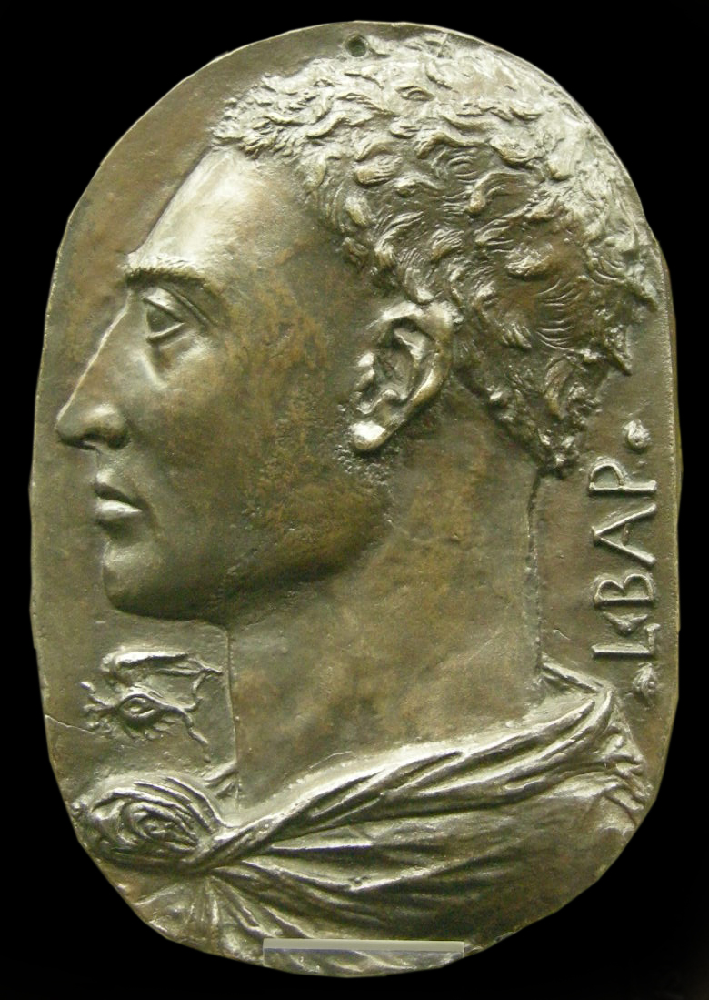

# Leon Battista Alberti

| Field | Value |
| ------- | ------- |
| Who | Leon Battista Alberti |
| What | Italian Renaissance humanist, architect, and cryptographer; inventor of the polyalphabetic cipher and the cipher disc (c. 1467) — described as the "Father of Western Cryptography"; his cipher disc concept is the direct mechanical ancestor of the Enigma rotor |
| When | 14 February 1404 – 25 April 1472 |
| Where | Born: Genoa, Italy (44.4056°N, 8.9463°E); primary work: Florence and Rome, Italy — Vatican (41.9022°N, 12.4533°E) |
| Related | [Julius Caesar](julius-caesar.md), [Al-Kindi](al-kindi.md), [Johannes Trithemius](johannes-trithemius.md), [Blaise de Vigenère](blaise-de-vigenere.md), [Alberti cipher](../timeline/alberti-cipher-1467.md) |

## Biography

Leon Battista Alberti was one of the great polymaths of the Italian Renaissance. Born in Genoa in 1404, he was trained in law, mathematics, and philosophy at the University of Bologna. He worked at
the Papal Chancery in Rome and is today best known as the architect of some of the finest Renaissance buildings in Italy — the Tempio Malatestiano in Rimini and the Palazzo Rucellai in Florence. He
also wrote the first printed book on architecture (*De re aedificatoria*, 1452) and the first printed book on painting (*Della Pittura*, 1435).

## *De Cifris* (c. 1467)

Around 1467, Alberti wrote ***De Cifris*** (*On Ciphers*) — the first systematic text on Western cryptography since classical antiquity. It was written for his friend Leonardo Dato, Pontifical
Secretary to Pope Paul II, who had asked him to analyse the ciphers then in common use.

### The Cipher Disc

Alberti's central invention was the **cipher disc** (*formula*): two concentric rotating discs, each bearing the letters of the alphabet arranged around the rim. The outer disc held the standard
alphabet; the inner disc held a scrambled alphabet. By rotating the inner disc to a new starting position at intervals during encipherment, the cipher alphabet changed — making frequency analysis
vastly more difficult.

This was the world's first **polyalphabetic cipher** — using multiple substitution alphabets within the same message. Each position of the inner disc represented a different cipher alphabet, and by
changing the disc position periodically (Alberti suggested after every few words), the sender could defeat simple frequency analysis.

### Connection to the Enigma Machine

The conceptual chain from Alberti's cipher disc to the Enigma rotor is direct:

1. **Alberti disc**: manually rotate a disc to change the substitution alphabet
2. **Trithemius tableau**: advance through a pre-set table of alphabets systematically
3. **Vigenère cipher**: use a keyword to index which alphabet to apply at each position
4. **Scherbius/Koch rotor**: replace the manual disc with an electrical wiring disc that *automatically* advances with each keypress

The Enigma rotor is essentially an electromechanical cipher disc that rotates automatically — solving the operational problem of manually advancing an Alberti-style disc under wartime conditions.

## Other Contributions

*De Cifris* also contains early discussion of:

- **Frequency analysis** (referencing the Arab tradition) and how his disc defeats it
- **Codes vs. ciphers** — the distinction between replacing whole words (codes) and replacing letters (ciphers)
- **Null characters** — inserting meaningless characters to obscure message length

## Legacy

Alberti's cipher disc concept was the foundation on which all subsequent polyalphabetic cipher systems were built. The **Vigenère cipher** (1553), which dominated European diplomacy and military
communications until the mid-19th century, is essentially Alberti's disc extended to a systematic keyword method. The disc mechanism was reinvented physically in the American Civil War (the
**Confederate cipher disc**), in WWI (the **M-94** cylinder), and electronically in the Enigma rotors.

## Sources

- Wikipedia: <https://en.wikipedia.org/wiki/Leon_Battista_Alberti>
- Singh, Simon. *The Code Book* (Doubleday, 1999), Chapter 2
- Kahn, David. *The Codebreakers* (Scribner, 1967/1996)
- Alberti, Leon Battista. *De Cifris* (c.1467); facsimile in *Albertiana* journal
