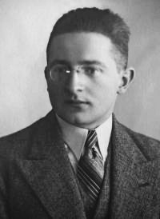

# Marian Rejewski

| Field | Value |
| ------- | ------- |
| Who | Marian Adam Rejewski |
| What | Polish mathematician and cryptologist; first person to break Enigma (December 1932) using permutation group theory; reconstructed complete Enigma wiring from message traffic alone |
| When | 16 August 1905 – 13 February 1980 |
| Where | Born: Bydgoszcz, Poland (53.1235°N, 18.0084°E); primary work: Warsaw, Poland — Cipher Bureau (52.2297°N, 21.0122°E); wartime exile: France then UK; post-war: Bydgoszcz, Poland |
| Related | [Jerzy Różycki](jerzy-rozycki.md), [Henryk Zygalski](henryk-zygalski.md), [Gustave Bertrand](gustave-bertrand.md), [Hans-Thilo Schmidt](hans-thilo-schmidt.md), [Polish Enigma break](../timeline/polish-enigma-break-1932.md), [Pyry conference](../timeline/pyry-conference-1939.md) |

## Biography

Marian Rejewski was born on 16 August 1905 in Bydgoszcz, then part of the German Empire (Province of Posen), to Józef Rejewski, a tobacco merchant. He studied mathematics at Poznań University, where
he joined a secret cryptology course run by the Polish Cipher Bureau. He graduated in 1929 and continued with postgraduate studies in statistics at Göttingen (1929–1930), then returned to Warsaw to
work full-time for the Cipher Bureau's BS-4 section (German affairs) from September 1932.

## Breaking Enigma

### The Problem

When Rejewski began working on Enigma, the Polish Cipher Bureau had already been collecting intercepted German Enigma traffic since 1928. They had also purchased a commercial Enigma D from a German
company — but the German military had modified the machine (different wiring, plugboard). No amount of classical frequency analysis could break the military Enigma.

### The Mathematical Breakthrough

Rejewski's insight was to apply **permutation group theory** — a branch of abstract algebra — to the structure of the Enigma indicator system. German Enigma procedure at the time required operators
to transmit the message key **twice** (e.g., if the key was `ABD`, the operator sent `ABDABD`, encrypted at the day's ground settings). This repeated 6-letter indicator created a mathematical
structure: a set of **six permutations** whose cycle structure could be analysed statistically.

By treating each letter position as a permutation on 26 elements and using the theory of **characteristic cycles**, Rejewski was able to reconstruct the complete wiring of all three Enigma rotors —
**without ever seeing the machine** — using only the patterns of encrypted traffic.

### Hans-Thilo Schmidt's Contribution

Critically, French intelligence had been receiving German Enigma operating materials from **Hans-Thilo Schmidt** ("Asché") — a German Foreign Office cipher clerk who sold key lists and operating
documents to France. These materials were passed to Poland by **Gustave Bertrand** (French intelligence). Schmidt's documents gave Rejewski the daily key settings for specific dates — providing the
starting values that made his permutation equations solvable. Without Schmidt's treachery, Rejewski's mathematical approach may not have succeeded in the timeframe it did.

### The Result — December 1932

By **December 1932**, Rejewski had reconstructed the complete wiring of the three Enigma rotors (I, II, III). He subsequently deduced the reflector wiring and the entry wheel. This was one of the
most remarkable achievements in the history of cryptanalysis: breaking a machine cipher using pure mathematics and statistical reasoning, without physical access to the target machine.

He then built the **"cyclometer"** (1934) — a device to build a catalogue of Enigma wheel characteristics, enabling faster daily key recovery. From this, the concept of the **Bomba** (1938) was
developed — a machine that tested multiple wheel orders simultaneously, reducing break time to minutes.

## Wartime and Exile

- **15 September 1939**: As German forces advanced, the Cipher Bureau was evacuated east, then through Romania to France
- **October 1939**: Rejewski, Różycki, and Zygalski joined Gustave Bertrand's **PC Bruno** station near Paris
- **June 1940**: Following France's fall, evacuated to Algiers, then back to France (Vichy zone, **Cadix** station near Uzès)
- **January 1942**: Jerzy Różycki drowned when the passenger ship *Lamoricière* sank in the Mediterranean
- **November 1942**: After German occupation of Vichy France, Rejewski and Zygalski escaped over the Pyrenees into Spain — were arrested, imprisoned in Miranda de Ebro for several months
- **July 1943**: Arrived in the UK; assigned to the Polish Army cipher bureau in London — **but Bletchley Park refused to share its work with them**, fearing a security breach; they spent the war
  breaking hand ciphers (double transposition SS traffic, *Doppelkassettenverfahren*)
- **1946**: Returned to Poland; lived in Bydgoszcz working as an accountant to avoid Communist-era attention
- **1967**: First published a paper revealing his cryptanalytic work (Polish mathematical journal); the West was largely unaware
- **1973**: Met with Bletchley Park historian **Gordon Welchman** (first direct contact with British codebreakers)
- **13 February 1980**: Died in Warsaw

## Recognition

Rejewski received almost no recognition during his lifetime despite breaking Enigma seven years before Bletchley Park — and enabling the entire Ultra programme by demonstrating the machine was
breakable. Post-war Communist Poland suppressed acknowledgement of intelligence cooperation with the West. His rehabilitation came largely posthumously.

A statue of Rejewski (with Różycki and Zygalski) stands in **Bydgoszcz**; a second is at the **Poznań Enigma cipher bureau reconstruction site**.

## Sources

- Wikipedia: <https://en.wikipedia.org/wiki/Marian_Rejewski>
- Rejewski, Marian. "How Polish Mathematicians Deciphered the Enigma." *Annals of the History of Computing*, 3(3), 1981
- Kozaczuk, Władysław. *Enigma: How the German Machine Cipher Was Broken* (1984)
