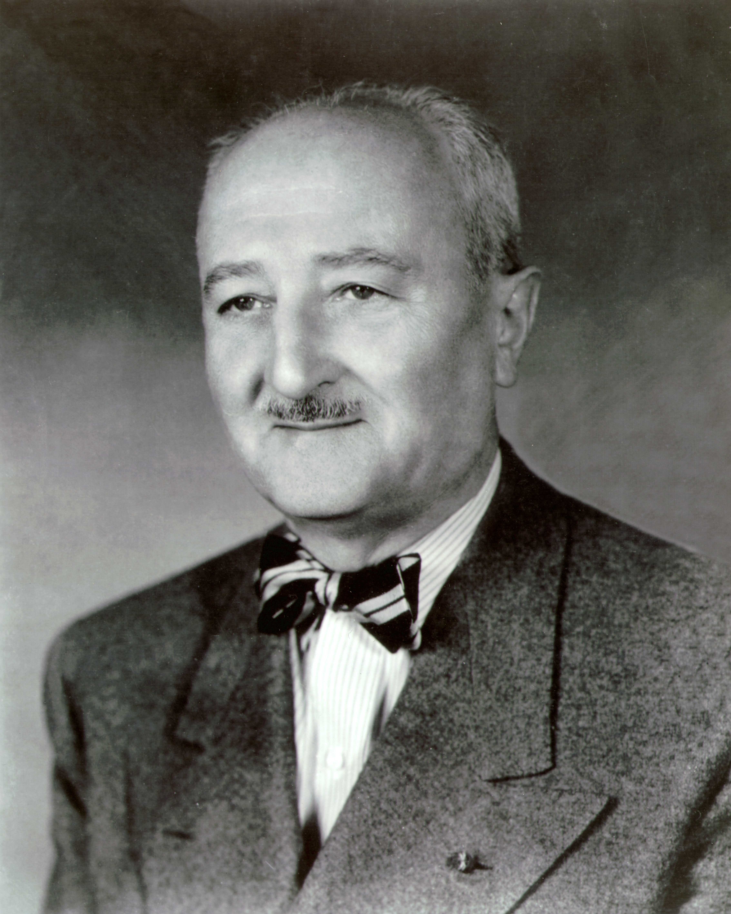

# William Friedman

| Field | Value |
| ------- | ------- |
| Who | William Frederick Friedman |
| What | Russian-born American cryptologist; chief cryptanalyst of the US Army Signal Intelligence Service; broke the Japanese Purple cipher (1940); co-designed SIGABA with Frank Rowlett; coined the word "cryptanalysis"; considered the father of modern American cryptology |
| When | 24 September 1891 – 2 November 1969 |
| Where | Born: Kishinev, Russia (now Chișinău, Moldova) (47.0105°N, 28.8638°E); primary work: Arlington Hall, Virginia, USA (38.8799°N, 77.1142°W); later: National Security Agency, Fort Meade, Maryland (39.1075°N, 76.7702°W) |
| Related | [SIGABA](../configurations/sigaba.md), [Purple cipher](../configurations/purple.md), [Frank Rowlett](frank-rowlett.md) |

## Early Life and Career

William Friedman was born Wolfe Fredrik Friedman in 1891 in Kishinev (then Russian Empire, now Moldova) into a Jewish family. His family emigrated to the United States when he was young and he grew
up in Pittsburgh. He studied genetics at Cornell University and took a post-graduate position with George Fabyan's Riverbank Laboratories in Geneva, Illinois — a private research estate — to work on
plant genetics.

At Riverbank he met **Elizebeth Smith** (later Elizebeth Friedman), whom he married in 1917. Riverbank was conducting private research into alleged Baconian ciphers in Shakespeare's plays, and
Friedman was drawn into cryptographic work — discovering a natural aptitude that would define the rest of his career.

## The Index of Coincidence (1920)

In 1920 Friedman published the monograph **"The Index of Coincidence and Its Applications in Cryptanalysis"** — one of the most influential papers in the history of cryptology. The **Index of
Coincidence (IC)** is a statistical measure of how close a text's letter frequency distribution is to random versus a natural-language distribution. It provided:

- A rigorous method for determining whether a cipher is monoalphabetic or polyalphabetic
- A way to estimate the key period of a repeating polyalphabetic cipher (generalising Kasiski's test)
- A probabilistic framework for cryptanalysis that underpinned all subsequent statistical attacks

The IC was used directly at Bletchley Park — Gordon Welchman and others applied it to Enigma traffic analysis.

Friedman also coined the word **"cryptanalysis"** (the breaking of ciphers) to distinguish it from "cryptography" (the creation of ciphers).

## Breaking Purple (1940)

The **Purple machine** (*97-shiki O-bun In-ji-ki*) was the Japanese Foreign Ministry's most secret cipher machine from 1939. It used telephone stepping switches (not rotors) to produce polyalphabetic
substitution, and its traffic included the most sensitive Japanese diplomatic communications — including pre-war negotiations and Axis alliance correspondence.

Friedman led the US Army Signal Intelligence Service team that broke Purple in **September 1940** — without ever having seen the physical machine. The team deduced the logical structure of the
stepping switches and the wiring from ciphertext alone, then built a replica. The operation, codenamed **MAGIC**, provided American intelligence with Japanese Foreign Ministry traffic throughout the
war, including intelligence related to (though not explicit warning of) the Pearl Harbor attack.

The mental strain of leading the Purple attack contributed to Friedman suffering a nervous breakdown in 1941, from which he took several months to recover.

## SIGABA

Working with **Frank Rowlett** from the mid-1930s, Friedman contributed to the design of the SIGABA (ECM Mark II) — the American strategic cipher machine that was never broken during WWII. His
theoretical grounding in cipher machine vulnerabilities directly informed the irregular stepping mechanism that made SIGABA vastly more secure than Enigma.

## Post-War Legacy

After the war Friedman served as a senior cryptologist at the newly formed **National Security Agency (NSA)**, helping to establish its theoretical and methodological foundations. He was awarded the
**National Security Medal** in 1955 — the US intelligence community's highest honour.

He and Elizebeth Friedman both wrote extensively on cryptologic history in their later years. He died in 1969; Elizebeth in 1980.

> ℹ️ *William Friedman's portrait is available via NSA historical archives but licence status for reproduction is uncertain. Not included in image set.*

## Sources

- Wikipedia: <https://en.wikipedia.org/wiki/William_F._Friedman>
- Fagone, Jason. *The Woman Who Smashed Codes* (Dey Street Books, 2017)
- Rowlett, Frank B. *The Story of Magic* (Aegean Park Press, 1998)
- Kahn, David. *The Codebreakers* (Scribner, 1967/1996)
