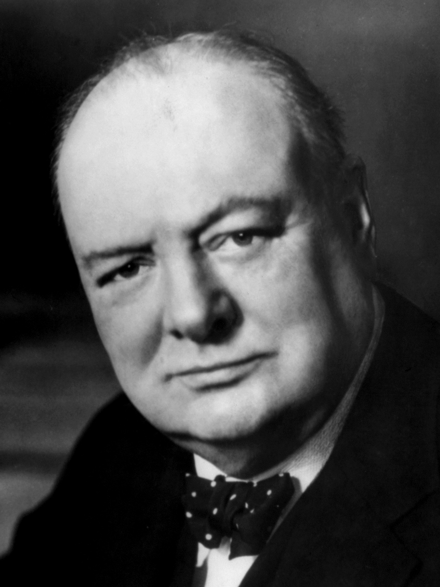

# Winston Churchill

| Field | Value |
| ------- | ------- |
| Who | Sir Winston Leonard Spencer-Churchill, KG, OM, CH, TD, FRS, PC |
| What | British Prime Minister 1940–1945 and 1951–1955; the political champion of Bletchley Park; personally directed that Ultra intelligence resources receive top priority; his "Action This Day" directive in October 1941 directly accelerated the Bombe programme; recipient of Ultra intelligence throughout the war |
| When | 30 November 1874 – 24 January 1965 |
| Where | Born: Blenheim Palace, Oxfordshire, England (51.8414°N, 1.3617°W); 10 Downing Street, London (51.5034°N, 0.1276°W); visited Bletchley Park: September 1941 |
| Related | [Alastair Denniston](alastair-denniston.md), [Alan Turing](alan-turing.md), [Edward Travis](edward-travis.md), [Bletchley Park](../timeline/bletchley-park-1939.md), [Ultra declassification](../timeline/ultra-declassification-1974.md) |

## Churchill and Ultra Intelligence

Winston Churchill's relationship with Bletchley Park and Ultra intelligence was both deeply personal and operationally decisive. He had a lifelong fascination with intelligence — having himself been
a war correspondent who was captured and escaped during the Boer War — and he grasped the significance of Ultra with unusual speed and clarity.

### Personal Briefing Arrangements

From mid-1940 onwards, Churchill received a personal Ultra briefing every morning. His intelligence chief, **Desmond Morton**, delivered a daily summary of the most significant decrypts. Churchill
insisted on seeing original Enigma transcripts, not just summaries — which sometimes caused concern among intelligence officers about the handling chain.

He referred to Ultra intelligence as **"my golden eggs"** and to the Bletchley codebreakers as **"the geese that laid the golden eggs but never cackled"** — a phrase that became the Bletchley Park
staff's unofficial motto.

### Bletchley Park Visit (6 September 1941)

Churchill visited Bletchley Park in person on **6 September 1941** — one of very few such visits by a serving Prime Minister. He addressed the assembled staff, calling them *"the geese who laid the
golden eggs and never cackled"*, and was given a demonstration of the Bombes. His impression of the assembled eccentric academics, chess players, and crossword solvers was reportedly one of
astonishment — he later told General Stewart Menzies (head of SIS): *"I know I told you to leave no stone unturned to get staff, but I had no idea you had taken me so literally."*

### "Action This Day" — October 1941

On **21 October 1941**, four senior Bletchley cryptanalysts — Alan Turing, Gordon Welchman, Hugh Alexander, and Stuart Milner-Barry — bypassed their chain of command and wrote directly to Churchill
complaining about resource shortages: insufficient Bombe machines, WRNS operators, and administrative support. Milner-Barry personally delivered the letter to Downing Street.

Churchill's response was immediate and characteristic. He scrawled on the letter: **"ACTION THIS DAY. Make sure they have all they want on extreme priority and report to me that this has been done."**

The result was a rapid expansion of the Bombe programme — the number of machines doubled within months — and a substantial increase in WRNS staffing at Bletchley. This single directive arguably
shortened the war's most dangerous phase.

### Ultra Security

Churchill was obsessively security-conscious about Ultra. He insisted that no operational decision based on Ultra could be taken in a way that would reveal to Germany that Enigma had been broken.
This led to the famous — and historically contested — claim that he allowed the Coventry bombing raid of 14 November 1940 to proceed without warning the city, in order to protect the Ultra secret.
Historians now largely reject this specific claim (the intelligence available did not specify Coventry clearly), but it illustrates the extent to which Churchill took the cover-story requirement
seriously.

## Post-War

Churchill maintained absolute secrecy about Bletchley Park and Ultra throughout his post-war political career. The Ultra secret was not declassified until 1974 — nine years after his death. He never
publicly acknowledged the contribution of the Bletchley codebreakers.

> 📷 *Image used: LOC LC-USZ62-49656 — public domain US Government photograph. The Karsh "Roaring Lion" portrait (1941) is under copyright until 2072 and must NOT be used.*

## Sources

- Wikipedia: <https://en.wikipedia.org/wiki/Winston_Churchill>
- Hinsley, F.H. *British Intelligence in the Second World War*, Vol. 1 (HMSO, 1979)
- Lewin, Ronald. *Ultra Goes to War* (Hutchinson, 1978)
- Smith, Michael. *Station X* (Channel 4 Books, 1998)
