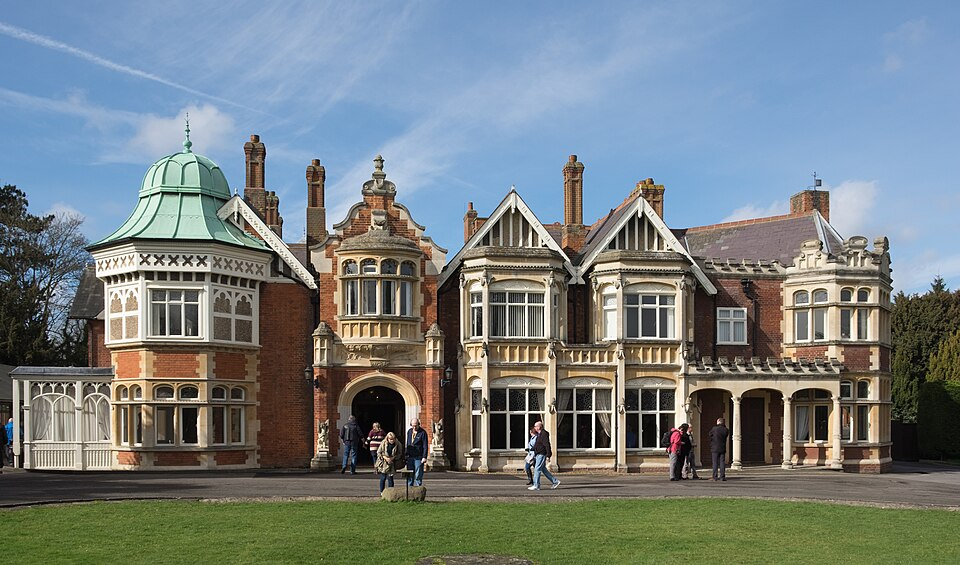

# Bletchley Park Established (August 1939)

| Field | Value |
| ------- | ------- |
| Who | Alastair Denniston (director); Government Code and Cypher School (GC&CS) |
| What | Relocation of British signals intelligence organisation GC&CS from London to Bletchley Park — a Victorian country house 50 miles north of London — as the wartime codebreaking centre; within months would grow from ~150 to thousands of staff and become the operational centre of the entire Allied signals intelligence effort |
| When | August 1939 (initial move); full wartime operations from September 1939 |
| Where | Bletchley Park, Bletchley, Buckinghamshire, England (51.9975°N, 0.7406°W) |
| Related | [Alastair Denniston](../profiles/alastair-denniston.md), [Alan Turing](../profiles/alan-turing.md), [Gordon Welchman](../profiles/gordon-welchman.md), [Dilly Knox](../profiles/dilly-knox.md), [Pyry conference](pyry-conference-1939.md), [First Bombe operational](bombe-operational-1940.md) |

## The Move

In August 1939, with war clearly imminent, GC&CS moved its operations from **Broadway Buildings, London** to **Bletchley Park** — a country estate in Buckinghamshire that had been purchased by MI6 as
an emergency wartime signals intelligence base. The site was codenamed **Station X** (the tenth of a series of MI6 locations).

The initial staff of approximately **150 cryptanalysts and linguists** was a tiny fraction of what would come. By 1945, Bletchley Park employed over **10,000 staff** — the majority of them women
serving in the WRNS, ATS, and WAAF.

## Why Bletchley Park

The location was chosen for several reasons:

- Far enough from London to be outside the range of Luftwaffe tactical bombing
- On the main **Oxford–Cambridge rail line** — enabling easy recruitment from both universities
- Close to the main **Post Office telecommunications trunk** — essential for intercepted signal routing
- Large enough grounds to build multiple huts and a post-war-scale installation

## The Huts

Bletchley Park operated through a system of numbered wooden huts, each responsible for a different task:

| Hut | Function |
| ----- | ---------- |
| 6 | Decrypting Army and Air Force Enigma |
| 3 | Translating and analysing Army/Air Force decrypts |
| 8 | Decrypting Naval Enigma (Alan Turing's section) |
| 4 | Naval intelligence and analysis |
| 7 | Japanese and Italian codes |
| 11 | Bombe operation |

## Staffing and Recruitment

Bletchley Park was staffed by an extraordinary mixture of mathematicians, linguists, chess champions, crossword enthusiasts, classicists, and intelligence officers. Recruitment was largely informal
in the early years — Denniston and colleagues contacted academics personally. The famous **"crossword test"** (published in *The Daily Telegraph*) was used as a screening mechanism from 1942.

Notable early recruits included **Alan Turing**, **Gordon Welchman**, **Dilly Knox**, **Hugh Alexander**, **Stuart Milner-Barry**, and **Mavis Lever** (later Batey).

## Secrecy

The Official Secrets Act bound all staff. The existence of Bletchley Park, its methods, and all its results were kept secret for 30 years after the war ended. Most veterans told no one — not spouses,
not family — until the **1974 publication** of F.W. Winterbotham's *The Ultra Secret* first revealed the programme's existence.

## Sources

- Smith, Michael. *Station X: The Codebreakers of Bletchley Park* (Channel 4 Books, 1998)
- Hinsley, F.H. et al. *British Intelligence in the Second World War* (HMSO, 1979)
- Wikipedia: <https://en.wikipedia.org/wiki/Bletchley_Park>
