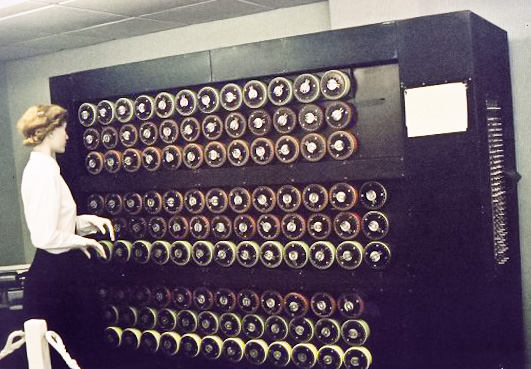

# First Bombe Becomes Operational (March 1940)

| Field | Value |
| ------- | ------- |
| Who | Alan Turing (designer); Gordon Welchman (critical crib/diagonal board improvement); Harold Keen (engineer, British Tabulating Machine Company) |
| What | The first operational Bombe — codenamed *Victory* — goes live at Bletchley Park, mechanically testing rotor configurations against predicted plaintext to recover daily Enigma keys; by war's end ~210 Bombes are operating around the clock |
| When | March 1940 (*Victory*); August 1940 (*Agnus Dei*, first with Welchman's diagonal board) |
| Where | Bletchley Park, Buckinghamshire, England (51.9975°N, 0.7406°W); later also Wavendon, Adstock, Gayhurst and other outstations |
| Related | [Alan Turing](../profiles/alan-turing.md), [Gordon Welchman](../profiles/gordon-welchman.md), [Harold Keen](../profiles/harold-keen.md), [Bletchley Park](bletchley-park-1939.md), [U-110 capture](u110-capture-1941.md), [Polish Bomba](polish-enigma-break-1932.md), [Luftwaffe Red break](luftwaffe-red-break-1940.md) |

## Background — The Polish Bomba

The Bletchley Bombe was a direct intellectual descendant of the Polish **Bomba kryptologiczna** designed by Rejewski and Różycki in 1938. The Polish Bomba exploited the **doubled message indicator**
weakness — operators enciphered the 3-letter message key twice at the start of every message. It was a set of six interconnected Enigma-equivalent machines that tested possible rotor starting
positions.

In May 1940, Germany changed its key-setting procedure, eliminating the doubled indicator. The Polish Bombas became obsolete overnight. Bletchley needed a new approach.

## Turing's Design

Turing's Bombe worked on a fundamentally different principle: **crib-based testing**. A *crib* was a stretch of plaintext that the analyst believed corresponded to a known stretch of ciphertext — for
example, weather reports always began with `WETTER` ("weather"), daily situation reports often contained `KEINE BESONDEREN EREIGNISSE` ("nothing to report"), or test messages sometimes contained
operators' names.

Given a crib, Turing's method derived a set of **logical chains**: if letter X at position N encrypts to letter Y, then the Enigma's state at position N has a specific property — which constrains
other properties — which constrains further properties. These chains could be tested mechanically.

The Bombe tested **all 17,576 starting positions** of three rotors in sequence, checking whether the assumed crib was consistent. Inconsistent positions caused an electrical contradiction that
triggered the machine to stop and record the candidate position for analysis.

## Welchman's Diagonal Board

The first Bombe (*Victory*) worked but was too slow — it found too many false positives. In August 1940, **Gordon Welchman** added the **diagonal board** (*Brettspiel*): a cross-wiring panel that
propagated additional constraints through the plugboard relationships simultaneously. This reduced false positives by approximately **90%** and made the Bombe operationally practical.

Turing reportedly told Welchman the diagonal board was "such a good idea that I'm almost jealous I didn't think of it myself."

## Scale

- March 1940: 1 Bombe (*Victory*)
- August 1940: 2nd Bombe with diagonal board (*Agnus Dei*)
- December 1941: ~16 Bombes
- November 1943: ~170 Bombes
- End of war 1945: approximately **210 Bombes**

Each Bombe was 7 feet tall, 6.5 feet wide, and 2 feet deep; weighed approximately 1 tonne; and contained the equivalent of 36 Enigma machines wired in parallel, driven by 10 hp motors.

## The American Naval Bombes

After the US entered the war in December 1941, the National Cash Register Company (NCR) in Dayton, Ohio produced an improved **US Navy Bombe** under Joseph Desch's direction. By 1945, NCR had built
**121 US Navy Bombes** — larger and faster than the British models.

## Sources

- Welchman, Gordon. *The Hut Six Story* (McGraw-Hill, 1982)
- Hinsley, F.H. et al. *British Intelligence in the Second World War* (HMSO, 1979)
- Wikipedia: <https://en.wikipedia.org/wiki/Bombe>
