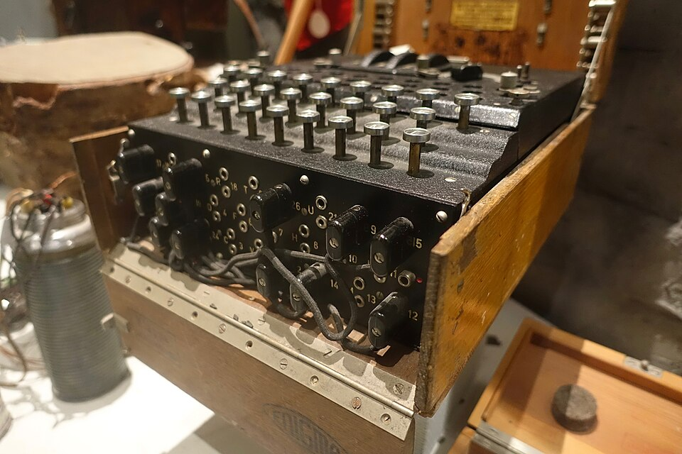

# Wehrmacht Adopts Enigma I (1928–1932)

| Field | Value |
| ------- | ------- |
| Who | German Army (*Reichswehr*, later *Wehrmacht*); German Air Force (*Luftwaffe*, from 1935) |
| What | The German Army begins adopting the Enigma I cipher machine with plugboard (*Steckerbrett*) for all sensitive communications — creating the standard military Enigma that would be used throughout WWII; the plugboard adds a step-change in security that the Polish Cipher Bureau would take four years to defeat |
| When | 1928 (Army trials); 1930 (Army-wide deployment); 1935 (Luftwaffe adoption) |
| Where | German Army headquarters, Berlin (52.5200°N, 13.4050°E) |
| Related | [Enigma I Wehrmacht](../configurations/enigma-i-Wehrmacht.md), [Enigma military adoption 1926](enigma-military-adoption-1926.md), [Polish break 1932](polish-enigma-break-1932.md) |

## The Plugboard Innovation

The Enigma I differed from the naval Enigma C (1926) in one crucial respect: the **Steckerbrett** (plugboard). The plugboard sat between the keyboard and the entry wheel (ETW), swapping pairs of
letters **before** the signal entered the rotor stack — and **after** it returned.

With 6 plugboard pairs (the initial setting), the plugboard alone added approximately **100 billion** additional possible configurations (C(26,2) × C(24,2) × C(22,2) × C(20,2) × C(18,2) × C(16,2) /
6! ≈ 100,391,791,500). With 10 pairs (used from 1938), the number of plugboard configurations alone exceeded **150 trillion**.

This made the Polish attack methods of 1928–1932 inadequate on their own — Rejewski's mathematical approach was required to reconstruct the wiring, and even then, recovering daily keys took
significant time.

## The Army's Requirements

The Wehrmacht Enigma I was specified to meet Army requirements:

- **Portable**: fit in a wooden carrying case
- **Battery operated**: no external power required
- **3 rotors from 3** (later 3 from 5 from 1938)
- **Plugboard** with at least 6 pairs
- **Lamp board** output (not typewriter print)
- **Standard QWERTZ keyboard**

The resulting machine weighed approximately **12 kg** (26 lb) with its case and could be operated by a two-man team (one keying, one reading the lamp board and recording).

## The Luftwaffe

When the Luftwaffe was formally established as a service in 1935, it adopted the same Enigma I standard as the Army, using the same rotors (I, II, III) but different key settings and operating
procedures. Luftwaffe traffic was often the easiest Enigma to break at Bletchley Park because Luftwaffe operators had poor security discipline — using predictable cribs and stereotyped message
formats.

## Sources

- Sebag-Montefiore, Hugh. *Enigma: The Battle for the Code* (Weidenfeld & Nicolson, 2000)
- Wikipedia: <https://en.wikipedia.org/wiki/Enigma_machine#Wehrmacht_Enigma>
